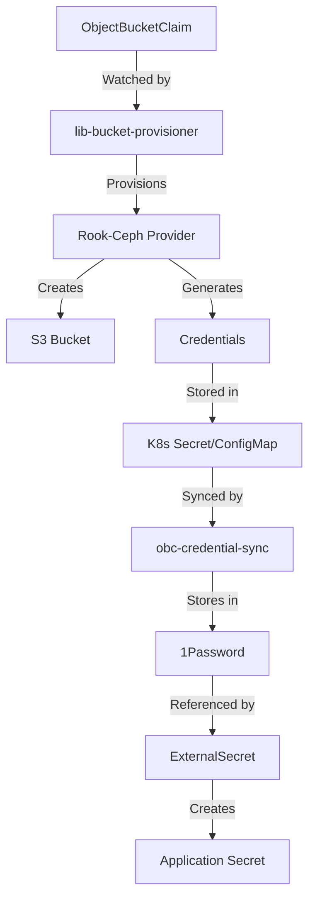

# Automated S3 Bucket Provisioning with ObjectBucketClaims

This guide explains the automated S3 bucket provisioning system using ObjectBucketClaims (OBC) in the Anton Kubernetes cluster.

## Overview

The cluster now supports fully automated S3 bucket provisioning through:
- **ObjectBucketClaim (OBC)** resources for declarative bucket management
- **lib-bucket-provisioner** controller for automatic provisioning
- **Credential synchronization** to 1Password via External Secrets Operator
- **GitOps integration** for version-controlled bucket configurations

## Quick Start

To provision a new S3 bucket:

```yaml
apiVersion: objectbucket.io/v1alpha1
kind: ObjectBucketClaim
metadata:
  name: myapp-bucket
  namespace: default
spec:
  storageClassName: ceph-bucket
```

This automatically:
1. Creates an S3 bucket in Rook-Ceph
2. Generates access credentials
3. Creates Secret and ConfigMap with connection details
4. Syncs credentials to 1Password (with automation script)

## Architecture



## Components

### 1. lib-bucket-provisioner

The OBC controller that watches for ObjectBucketClaim resources and coordinates provisioning:
- Deployed in `storage` namespace
- Watches all namespaces for OBC resources
- Handles lifecycle management (create/delete)

### 2. Rook-Ceph Provider

The storage provider that actually creates buckets:
- Implements the `rook-ceph.rook.io/bucket` provisioner
- Creates buckets in the `storage` CephObjectStore
- Generates unique credentials per bucket

### 3. Credential Sync Automation

The `obc-credential-sync.ts` script provides:
- Automatic detection of new OBC resources
- Credential extraction from generated secrets
- 1Password synchronization
- ExternalSecret manifest generation

## Usage Examples

### Basic Bucket

```yaml
apiVersion: objectbucket.io/v1alpha1
kind: ObjectBucketClaim
metadata:
  name: app-data
  namespace: production
spec:
  storageClassName: ceph-bucket
```

### Bucket with Lifecycle Rules

```yaml
apiVersion: objectbucket.io/v1alpha1
kind: ObjectBucketClaim
metadata:
  name: logs-bucket
  namespace: monitoring
spec:
  storageClassName: ceph-bucket
  additionalConfig:
    lifecycleConfiguration:
      rules:
        - id: expire-old-logs
          status: Enabled
          prefix: logs/
          expiration:
            days: 30
```

### Bucket with Custom Name

```yaml
apiVersion: objectbucket.io/v1alpha1
kind: ObjectBucketClaim
metadata:
  name: backup-bucket
  namespace: velero
spec:
  bucketName: velero-backups-prod  # Specific bucket name
  storageClassName: ceph-bucket
```

## Accessing Bucket Credentials

After provisioning, credentials are available in multiple ways:

### 1. Direct from OBC Secrets

```bash
# Get connection details
kubectl get configmap <obc-name> -n <namespace> -o yaml

# Get credentials
kubectl get secret <obc-name> -n <namespace> -o yaml
```

### 2. Via 1Password Integration

After running the sync script:
```bash
# Sync all OBC credentials to 1Password
./scripts/obc-credential-sync.ts

# Watch mode for automatic sync
./scripts/obc-credential-sync.ts --watch
```

### 3. Application Configuration

```yaml
apiVersion: v1
kind: Pod
metadata:
  name: s3-app
spec:
  containers:
  - name: app
    image: myapp:latest
    env:
    - name: AWS_ACCESS_KEY_ID
      valueFrom:
        secretKeyRef:
          name: myapp-bucket  # OBC-generated secret
          key: AWS_ACCESS_KEY_ID
    - name: AWS_SECRET_ACCESS_KEY
      valueFrom:
        secretKeyRef:
          name: myapp-bucket
          key: AWS_SECRET_ACCESS_KEY
    - name: BUCKET_NAME
      valueFrom:
        configMapKeyRef:
          name: myapp-bucket  # OBC-generated configmap
          key: BUCKET_NAME
    - name: BUCKET_ENDPOINT
      value: "http://rook-ceph-rgw-storage.storage.svc.cluster.local:80"
```

## Migration from Manual Buckets

To migrate existing manually-created buckets:

1. **Create OBC for existing bucket**:
   ```yaml
   apiVersion: objectbucket.io/v1alpha1
   kind: ObjectBucketClaim
   metadata:
     name: existing-bucket
     namespace: app-namespace
   spec:
     bucketName: existing-bucket-name  # Match existing name
     storageClassName: ceph-bucket
   ```

2. **Update application to use OBC credentials**:
   - Change from manual secrets to OBC-generated secrets
   - Update endpoint URLs if needed

3. **Remove manual CephObjectStoreUser**:
   ```bash
   kubectl delete cephobjectstoreuser <username> -n storage
   ```

## Troubleshooting

### Check OBC Status

```bash
# List all OBCs
kubectl get objectbucketclaims -A

# Describe specific OBC
kubectl describe obc <name> -n <namespace>

# Check provisioner logs
kubectl logs -n storage deployment/lib-bucket-provisioner
```

### Common Issues

1. **OBC stuck in Pending**:
   - Check lib-bucket-provisioner is running
   - Verify StorageClass exists: `kubectl get storageclass ceph-bucket`
   - Check Rook-Ceph health: `kubectl -n storage exec deploy/rook-ceph-tools -- ceph status`

2. **Credentials not syncing to 1Password**:
   - Run sync script manually: `./scripts/obc-credential-sync.ts`
   - Check 1Password Connect is accessible
   - Verify ExternalSecret configuration

3. **Bucket not accessible**:
   - Verify endpoint URL in ConfigMap
   - Check network policies allow access
   - Test with s3cmd or AWS CLI

## Best Practices

1. **Use descriptive names**: OBC names should reflect their purpose
2. **Set lifecycle policies**: Configure automatic cleanup for temporary data
3. **Monitor usage**: Check bucket metrics in Ceph dashboard
4. **Regular credential rotation**: Use ExternalSecret refresh intervals
5. **Document bucket purposes**: Add labels and annotations

## Advanced Configuration

### Bucket Policies

Apply custom S3 bucket policies through additionalConfig:

```yaml
spec:
  additionalConfig:
    bucketPolicy:
      Version: "2012-10-17"
      Statement:
        - Sid: "ReadOnlyPublic"
          Effect: "Allow"
          Principal: "*"
          Action: ["s3:GetObject"]
          Resource: ["arn:aws:s3:::mybucket/*"]
```

### CORS Configuration

Enable CORS for web applications:

```yaml
spec:
  additionalConfig:
    corsConfiguration:
      corsRules:
        - allowedMethods: ["GET", "PUT", "POST", "DELETE"]
          allowedOrigins: ["https://app.example.com"]
          allowedHeaders: ["*"]
          maxAgeSeconds: 3600
```

### Replication

Enable cross-cluster replication (requires multi-site Ceph):

```yaml
spec:
  additionalConfig:
    replicationConfiguration:
      role: "arn:aws:iam::123456789012:role/replication-role"
      rules:
        - id: "ReplicateAll"
          priority: 1
          status: "Enabled"
          destination:
            bucket: "arn:aws:s3:::destination-bucket"
```

## Monitoring

Monitor bucket usage through:

1. **Ceph Dashboard**: https://ceph-dashboard.tailscale/
2. **Prometheus Metrics**: 
   ```promql
   # Bucket size
   ceph_bucket_size{bucket="mybucket"}
   
   # Request rate
   rate(ceph_bucket_requests_total{bucket="mybucket"}[5m])
   ```
3. **Grafana Dashboards**: Import S3 monitoring dashboards

## Security Considerations

1. **Credential Storage**: All credentials stored in 1Password
2. **Network Isolation**: Buckets only accessible within cluster by default
3. **Encryption**: Enable bucket encryption through Ceph configuration
4. **Access Logging**: Configure S3 access logs for audit trails
5. **RBAC**: Limit who can create ObjectBucketClaims

## Future Enhancements

- [ ] Automated backup policies
- [ ] Multi-tenancy with quotas
- [ ] Bucket usage alerts
- [ ] Self-service UI for bucket management
- [ ] Integration with backup solutions