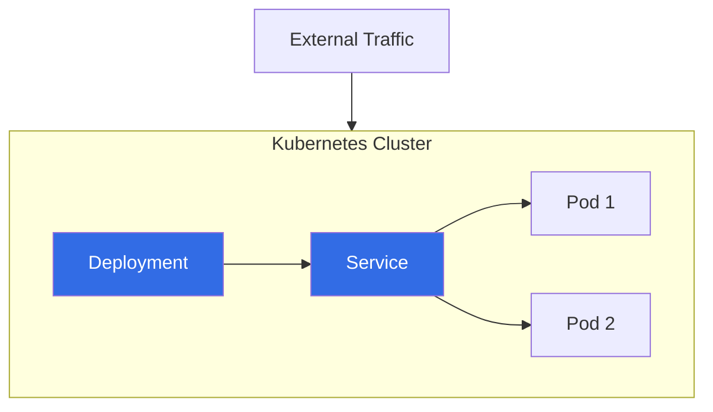
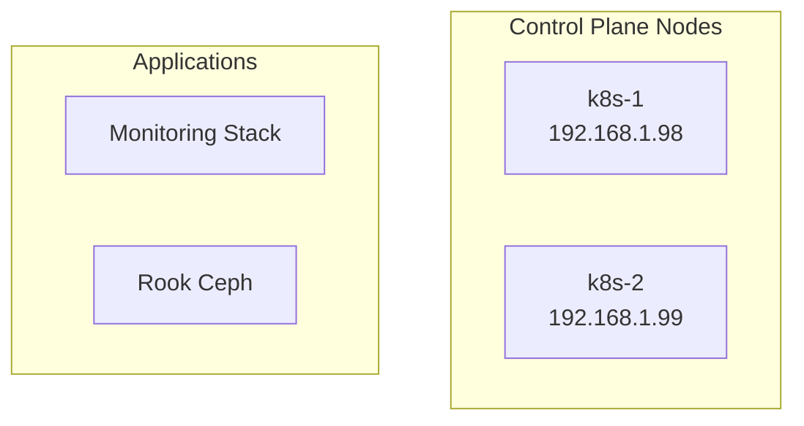
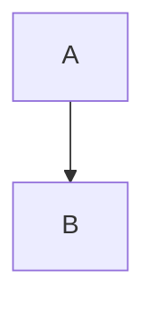

# CLAUDE.md

This file provides guidance to Claude Code (claude.ai/code) when working with code in this repository.

## Project Overview

This is a Docusaurus-based documentation site for the Anton Kubernetes homelab cluster. It generates static documentation with Mermaid diagram support for visualizing Kubernetes architecture and workflows.

**Key Technologies:**
- **Docusaurus 3.8.1** - Modern static site generator
- **Bun** - Package manager and runtime
- **TypeScript** - Type checking support
- **Mermaid** - Diagram generation (@docusaurus/theme-mermaid)
- **GitHub Pages** - Deployment target

## Development Commands

```bash
# Install dependencies
bun install

# Start development server (auto-reload)
bun start

# Production build
bun run build

# Serve built site locally
bun run serve

# Type checking
bun run typecheck

# Clear Docusaurus cache
bun run clear

# Deploy to GitHub Pages
bun run deploy                    # HTTPS
USE_SSH=true bun run deploy      # SSH
```

## Architecture

### Directory Structure
```
docs/
├── docs/               # Documentation pages (auto-sidebar)
├── src/css/           # Custom styles
├── static/img/        # Static assets
├── docusaurus.config.ts  # Main configuration
├── sidebars.ts        # Sidebar config (auto-generated)
└── package.json       # Bun scripts and dependencies
```

### Configuration
- **Base URL**: `/anton/` (for GitHub Pages wcygan.github.io/anton)
- **Docs root**: `/` (docs serve as homepage)
- **Auto-sidebar**: Generated from docs/ folder structure
- **Mermaid**: Enabled with theming support

## Mermaid Diagram Guidelines

### Kubernetes Architecture Diagrams

**Basic Flowchart Structure:**


### Node Shapes for K8s Resources
- **Deployments/Apps**: `[Rectangle]`
- **Services**: `([Stadium/Pill])`
- **Databases**: `[("Cylinder")]` or `NodeName@{shape: cyl}`
- **External**: `{{Hexagon}}`
- **Pods**: `(Round)`

### Diagram Direction
- **Cluster topology**: `flowchart TD` (top-down)
- **Data flow**: `flowchart LR` (left-right)
- **Network flow**: `flowchart TD`

### Styling Patterns
```mermaid
classDef node fill:#e1f5fe
classDef ingress fill:#fff3e0
classDef app fill:#f3e5f5

class k8s1,k8s2,k8s3 node
class nginx ingress
class monitoring,storage app
```

### Subgraphs for Logical Grouping


### Best Practices
1. **Keep diagrams simple** - Focus on key relationships
2. **Use consistent node shapes** - Map to Kubernetes resource types
3. **Group related components** - Use subgraphs for namespaces/clusters
4. **Add IP addresses** - For node identification (format: `node<br/>IP`)
5. **Use semantic colors** - Blue for K8s, orange for ingress, purple for apps

## Content Creation

### Page Structure
```markdown
---
sidebar_position: 1
slug: /
---

# Page Title

Content with Mermaid diagrams...


```

### File Organization
- Place `.md` files in `docs/` directory
- Sidebar auto-generates from folder structure
- Use `sidebar_position` for ordering
- Set `slug: /` for homepage

## Deployment

**Target**: GitHub Pages at `wcygan.github.io/anton`

The site auto-deploys via:
1. Build static files with `bun run build`
2. Deploy to `gh-pages` branch with `bun run deploy`
3. GitHub Pages serves from `gh-pages` branch

**Prerequisites**:
- GitHub repository: `wcygan/anton`
- GitHub Pages enabled
- Proper `organizationName` and `projectName` in config