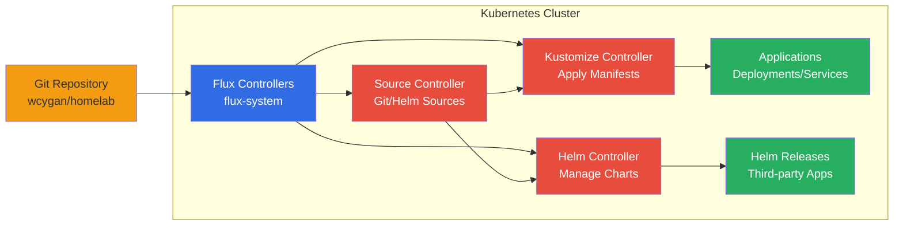

# GitOps

GitOps is the foundation of the Anton cluster's deployment strategy, using Flux v2 to manage all applications and configurations through Git repositories.

## Architecture Overview



## Flux Components

### Core Controllers
- **Source Controller**: Manages Git repositories and Helm repositories
- **Kustomize Controller**: Applies Kubernetes manifests with Kustomize
- **Helm Controller**: Manages Helm chart installations and upgrades
- **Notification Controller**: Sends alerts and notifications

### Current Version
- **Flux**: v2.6.4
- **Distribution**: flux-v2.6.4

## Repository Structure

The cluster configuration follows GitOps principles with everything defined in the Git repository:

```
kubernetes/
├── flux-system/          # Flux bootstrap configuration
├── apps/                 # Application deployments
│   ├── cert-manager/
│   ├── monitoring/
│   ├── storage/
│   └── network/
└── infrastructure/       # Core infrastructure components
    ├── controllers/
    └── configs/
```

## Key Principles

### Declarative Configuration
- All desired state defined in Git
- No manual `kubectl apply` commands
- Configuration drift automatically corrected

### Pull-Based Deployment
- Flux pulls changes from Git
- No external push access to cluster
- Enhanced security posture

### Reconciliation Loop
- Continuous monitoring of Git repositories
- Automatic application of changes
- Self-healing infrastructure

## Status Commands

```bash
# Check Flux system status
flux get all -A

# View Flux version and components
flux version

# Check specific resource types
flux get sources git
flux get kustomizations
flux get helmreleases

# Force reconciliation
flux reconcile kustomization apps --with-source
```

## Health Monitoring

```bash
# Check Flux controller pods
kubectl get pods -n flux-system

# View controller logs
kubectl logs -n flux-system deployment/source-controller
kubectl logs -n flux-system deployment/kustomize-controller
kubectl logs -n flux-system deployment/helm-controller

# Check system status
flux check

# View reconciliation status
flux get all -A --status-selector ready=false
```

## Troubleshooting

```bash
# Suspend problematic resource
flux suspend kustomization <name> -n flux-system

# Resume suspended resource
flux resume kustomization <name> -n flux-system

# Describe resource for detailed status
flux describe kustomization <name> -n flux-system

# Force source refresh
flux reconcile source git flux-system --with-source
```

The GitOps approach ensures that the cluster state always matches what's defined in Git, providing auditability, reproducibility, and simplified operations through declarative configuration management.