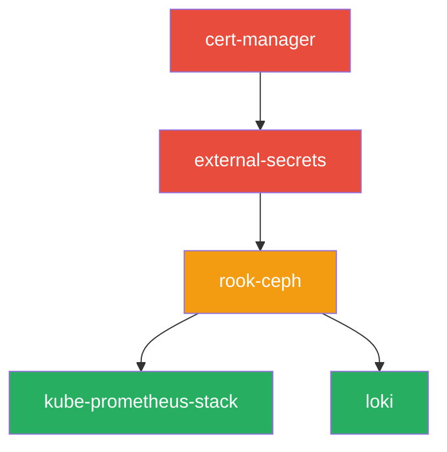

# Repository Structure

The Anton cluster follows established GitOps patterns with a well-organized repository structure that separates concerns and enables scalable management.

## Directory Layout

```
homelab/
├── kubernetes/
│   ├── flux-system/           # Flux bootstrap and core config
│   │   ├── gotk-components.yaml
│   │   ├── gotk-sync.yaml
│   │   └── kustomization.yaml
│   ├── apps/                  # Application deployments
│   │   ├── cert-manager/
│   │   ├── database/
│   │   ├── external-secrets/
│   │   ├── monitoring/
│   │   ├── network/
│   │   └── storage/
│   └── infrastructure/        # Infrastructure components
│       ├── controllers/
│       └── configs/
├── scripts/                   # Automation and tooling
└── docs/                     # Documentation
```

## Application Structure Pattern

Each application follows a consistent structure:

```
kubernetes/apps/{namespace}/{app-name}/
├── ks.yaml                    # Flux Kustomization
└── app/
    ├── kustomization.yaml     # Kustomize configuration
    ├── helmrelease.yaml       # Helm chart deployment
    └── values.yaml           # Chart values (optional)
```

### Example: Monitoring Stack

```
kubernetes/apps/monitoring/kube-prometheus-stack/
├── ks.yaml                    # Flux Kustomization for monitoring
└── app/
    ├── kustomization.yaml     # Includes namespace and resources
    ├── helmrelease.yaml       # Prometheus stack deployment
    └── dashboards/           # Custom Grafana dashboards
        ├── cluster-overview.json
        └── storage-health.json
```

## Flux Kustomization Pattern

### Standard Kustomization (ks.yaml)
```yaml
apiVersion: kustomize.toolkit.fluxcd.io/v1
kind: Kustomization
metadata:
  name: app-name
  namespace: flux-system
spec:
  interval: 30m
  # Note: retryInterval field was removed in Flux v2 - use interval and timeout instead
  path: "./kubernetes/apps/namespace/app-name/app"
  prune: true
  sourceRef:
    kind: GitRepository
    name: flux-system
    namespace: flux-system
  dependsOn:
    - name: dependency-name
      namespace: flux-system
```

### Critical Intervals
- **Critical services**: 5m (cert-manager, external-secrets)
- **Core infrastructure**: 15m (storage, networking)
- **Applications**: 30m-1h (monitoring, logging)

## Dependency Management

### Dependency Chain Example


### Dependencies Configuration
```yaml
dependsOn:
  - name: cert-manager
    namespace: flux-system
  - name: external-secrets
    namespace: flux-system
```

## Namespace Organization

### Core Namespaces
- **flux-system**: Flux controllers and GitOps resources
- **cert-manager**: TLS certificate management
- **external-secrets**: Secret management with 1Password
- **storage**: Rook-Ceph storage system
- **monitoring**: Prometheus and Grafana stack
- **network**: Ingress controllers and networking

### Application Namespaces
- **database**: PostgreSQL and other databases
- **kubeai**: AI/ML workloads
- **registry**: Container registry services
- **system-health**: Health monitoring tools

## Source References

### Git Repository Reference
```yaml
sourceRef:
  kind: GitRepository
  name: flux-system
  namespace: flux-system  # Always flux-system for Git sources
```

### Helm Repository Reference
```yaml
sourceRef:
  kind: HelmRepository
  name: prometheus-community
  namespace: flux-system  # Always flux-system for Helm sources
```

## Validation Commands

```bash
# Validate repository structure
deno task validate

# Check for syntax errors in manifests
kubectl apply --dry-run=client -f kubernetes/

# Validate Flux Kustomizations
flux get kustomizations -A

# Check dependencies
kubectl get kustomizations -n flux-system -o yaml | grep -A5 dependsOn
```

## Best Practices

### File Naming
- **Flux resources**: Use `ks.yaml` for Kustomizations
- **Applications**: Use `helmrelease.yaml` for Helm charts
- **Configs**: Use descriptive names (e.g., `prometheus-values.yaml`)

### Namespace Declaration
- Always specify `namespace` in `kustomization.yaml`
- Use consistent namespace naming
- Avoid namespace collisions

### Version Pinning
```yaml
# Pin Helm chart versions for stability
spec:
  chart:
    spec:
      version: "45.7.1"  # Specific version, not latest
```

This structure ensures maintainable, scalable GitOps operations while providing clear separation of concerns and dependency management.