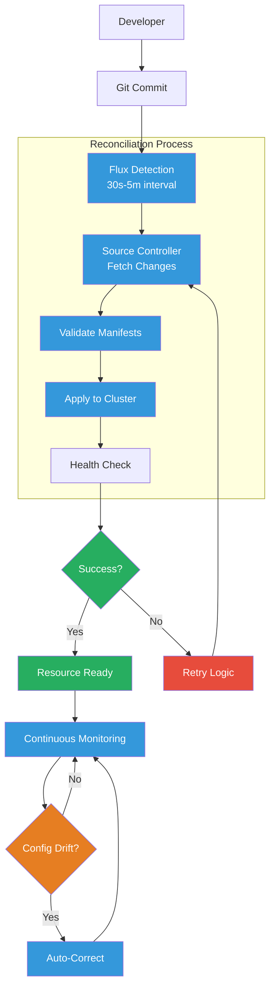
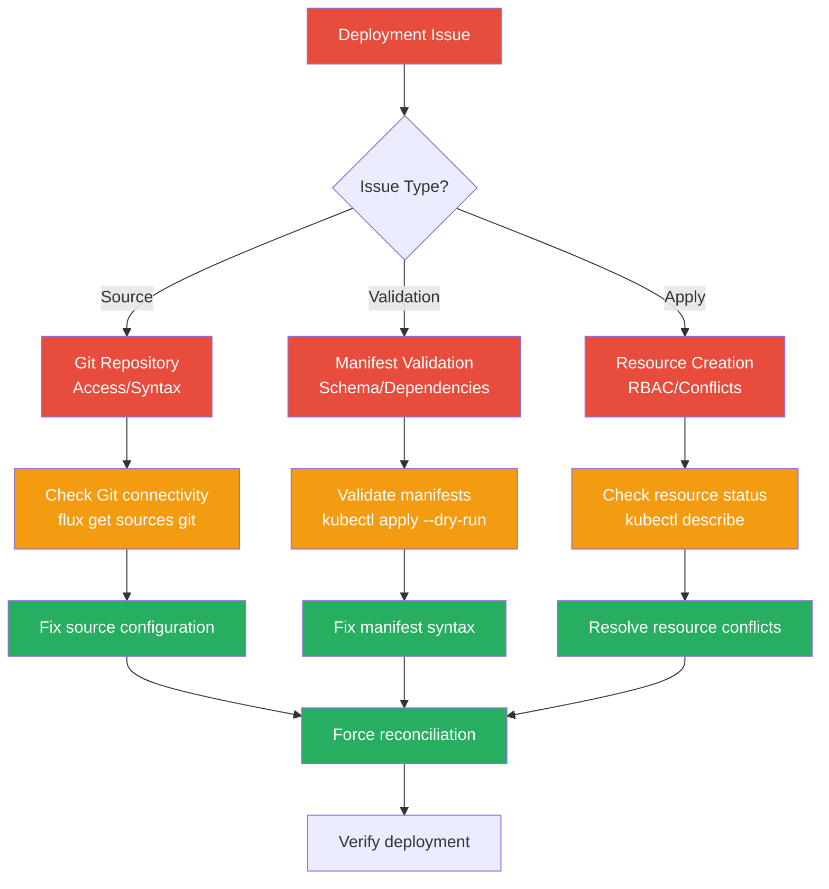

# Deployment Workflow

The GitOps workflow in the Anton cluster follows a systematic approach to deploying and managing applications through Git-driven automation.

## Deployment Process



## Application Deployment

### 1. Pre-Deployment Checklist

```bash
# Verify Helm chart exists
helm search repo prometheus-community/kube-prometheus-stack --versions

# Check dependencies are ready
flux get kustomizations -A | grep -E "(cert-manager|external-secrets)"

# Validate manifests locally
deno task validate
```

### 2. Create Application Structure

```bash
mkdir -p kubernetes/apps/monitoring/new-app/{app,config}
```

### 3. Define Flux Kustomization

```yaml
# kubernetes/apps/monitoring/new-app/ks.yaml
apiVersion: kustomize.toolkit.fluxcd.io/v1
kind: Kustomization
metadata:
  name: new-app
  namespace: flux-system
spec:
  interval: 30m
  path: "./kubernetes/apps/monitoring/new-app/app"
  prune: true
  sourceRef:
    kind: GitRepository
    name: flux-system
    namespace: flux-system
  dependsOn:
    - name: cert-manager
      namespace: flux-system
```

### 4. Application Configuration

```yaml
# kubernetes/apps/monitoring/new-app/app/kustomization.yaml
apiVersion: kustomize.config.k8s.io/v1beta1
kind: Kustomization
namespace: monitoring  # REQUIRED: Must specify namespace
resources:
  - helmrelease.yaml
```

### 5. Commit and Deploy

```bash
# Commit changes
git add kubernetes/apps/monitoring/new-app/
git commit -m "feat: add new-app to monitoring namespace"

# Force reconciliation (optional)
flux reconcile kustomization new-app --with-source
```

## Monitoring Deployments

### Real-time Status

```bash
# Watch all Flux resources
flux get all -A --watch

# Monitor specific application
watch "flux get kustomization new-app -n flux-system"

# Check resource health
kubectl get pods -n monitoring -l app=new-app
```

### Deployment Verification

```bash
# Check Flux resource status
flux describe kustomization new-app -n flux-system

# Verify Helm release
helm list -n monitoring

# Check application pods
kubectl get pods -n monitoring -w
```

## Troubleshooting Workflow

### 1. Identify Issues

```bash
# Find failed resources
flux get all -A --status-selector ready=false

# Check recent events
kubectl get events -A --sort-by='.lastTimestamp' | tail -20
```

### 2. Investigation Process



### 3. Common Fixes

```bash
# Suspend problematic resource
flux suspend kustomization new-app -n flux-system

# Fix configuration in Git
git add kubernetes/apps/monitoring/new-app/
git commit -m "fix: resolve new-app configuration issue"

# Resume deployment
flux resume kustomization new-app -n flux-system

# Force fresh deployment
flux reconcile kustomization new-app --with-source
```

## Rollback Procedures

### Git-based Rollback

```bash
# Revert to previous commit
git revert <commit-hash>

# Or reset to known good state
git reset --hard <good-commit>

# Push changes
git push origin main

# Force Flux reconciliation
flux reconcile source git flux-system
```

### Helm Rollback

```bash
# Check Helm release history
helm history new-app -n monitoring

# Rollback to previous version
helm rollback new-app 1 -n monitoring

# Or suspend Flux temporarily
flux suspend helmrelease new-app -n monitoring
helm rollback new-app 1 -n monitoring
flux resume helmrelease new-app -n monitoring
```

## Maintenance Operations

### Updating Applications

```bash
# Update Helm chart version
# Edit helmrelease.yaml to new version
git commit -m "feat: update new-app to v2.0.0"

# Monitor upgrade progress
flux get helmreleases -A --watch
```

### Cleanup Operations

```bash
# Remove application (marks for deletion)
git rm -r kubernetes/apps/monitoring/new-app/
git commit -m "feat: remove new-app from monitoring"

# Verify cleanup
kubectl get all -n monitoring -l app=new-app
```

The GitOps workflow ensures consistent, auditable deployments while providing robust rollback capabilities and comprehensive monitoring of the deployment process.