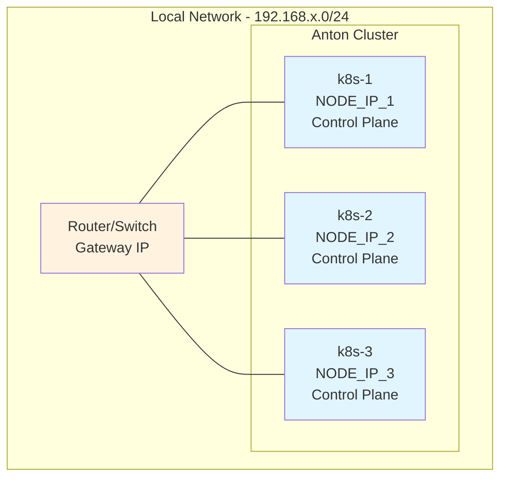

# Hardware

The Anton cluster runs on three MS-01 mini PCs, providing a compact yet powerful foundation for the Kubernetes homelab.

## Node Specifications

### MS-01 Mini PCs
- **CPU**: Intel N100 (4-core, 4-thread)
- **RAM**: 16GB DDR4 per node
- **Storage**: 2x 1TB NVMe SSDs per node (6TB total raw)
- **Network**: Gigabit Ethernet
- **Power**: ~10W per node under load

### Cluster Topology



## Storage Configuration

### Distributed Storage
- **Total Capacity**: 6x 1TB NVMe SSDs
- **Replication**: 3-way replication across nodes
- **Usable Space**: ~2TB (with replication overhead)
- **Storage Classes**: Ceph Block, Ceph Filesystem, Ceph Bucket

### Per-Node Layout
```
Each MS-01 Node:
├── System Disk: 1TB NVMe (Talos Linux)
└── Data Disk: 1TB NVMe (Ceph OSD)
```

## Power and Environmental

### Power Consumption
- **Idle**: ~6W per node (18W total)
- **Load**: ~10W per node (30W total)
- **Maximum**: ~15W per node (45W total)

### Physical Layout
- **Form Factor**: Compact mini PCs
- **Cooling**: Passive cooling with heat sinks
- **Noise**: Silent operation
- **Placement**: Desktop/shelf mounting

## Network Architecture

### Internal Networking
- **Pod Network**: 10.244.0.0/16 (Cilium)
- **Service Network**: 10.96.0.0/12
- **Node Network**: 192.168.x.0/24 (private subnet)

### Connectivity
- **Uplink**: Gigabit Ethernet per node
- **Inter-node**: Full mesh connectivity
- **External Access**: Cloudflare Tunnel

## Monitoring Commands

```bash
# Check node status and resources
kubectl get nodes -o wide

# View node resource usage
kubectl top nodes

# Check node conditions
kubectl describe nodes

# View hardware info (requires privileged access)
kubectl get nodes -o yaml | grep -A5 "system-info"
```

## Node Management

### Talos Commands
```bash
# Check node status
talosctl health

# View system resources
talosctl usage

# Check disk usage
talosctl df

# View system logs
talosctl logs
```

### Hardware Monitoring
```bash
# Check storage usage across nodes
kubectl get pv

# View node resource allocation
kubectl describe node k8s-1

# Check cluster resource summary
kubectl cluster-info
```

The MS-01 hardware provides an excellent balance of performance, power efficiency, and cost for a homelab Kubernetes cluster, delivering enterprise-grade features in a compact form factor.