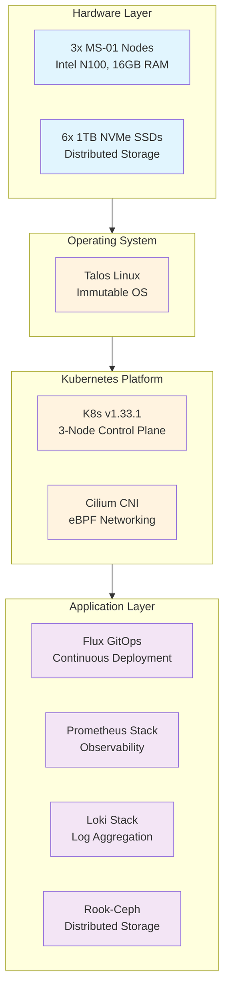

# Infrastructure

The Anton cluster is built on modern infrastructure principles with a focus on automation, reliability, and observability. This section covers the core technologies that power the cluster.

## Architecture Overview



## Core Components

### Infrastructure Layer
- **[Hardware](./hardware)** - MS-01 nodes with NVMe storage
- **[Storage](./storage/)** - Rook-Ceph distributed storage system
- **[Networking](./networking/)** - Cilium, NGINX, and Cloudflare integration
- **[Secrets](./secrets)** - External Secrets with 1Password integration

### Platform Services
- **[GitOps](./gitops/)** - Flux-based continuous deployment
- **[Monitoring](./monitoring/)** - Prometheus, Grafana, and AlertManager
- **[Logging](./logging/)** - Loki stack with S3 backend

## Key Features

- **Immutable Infrastructure**: Talos Linux with API-driven management
- **GitOps-First**: All deployments managed through Git
- **High Availability**: 3-node control plane with distributed storage
- **Observability**: Comprehensive monitoring and logging
- **Secure by Default**: eBPF networking and encrypted storage

## Quick Status Commands

```bash
# Cluster health
kubectl get nodes -o wide

# Core namespaces
kubectl get pods -A | grep -E "(flux-system|storage|monitoring|network)"

# Storage status
kubectl get pvc -A

# Ingress controllers
kubectl get ingressclass
```