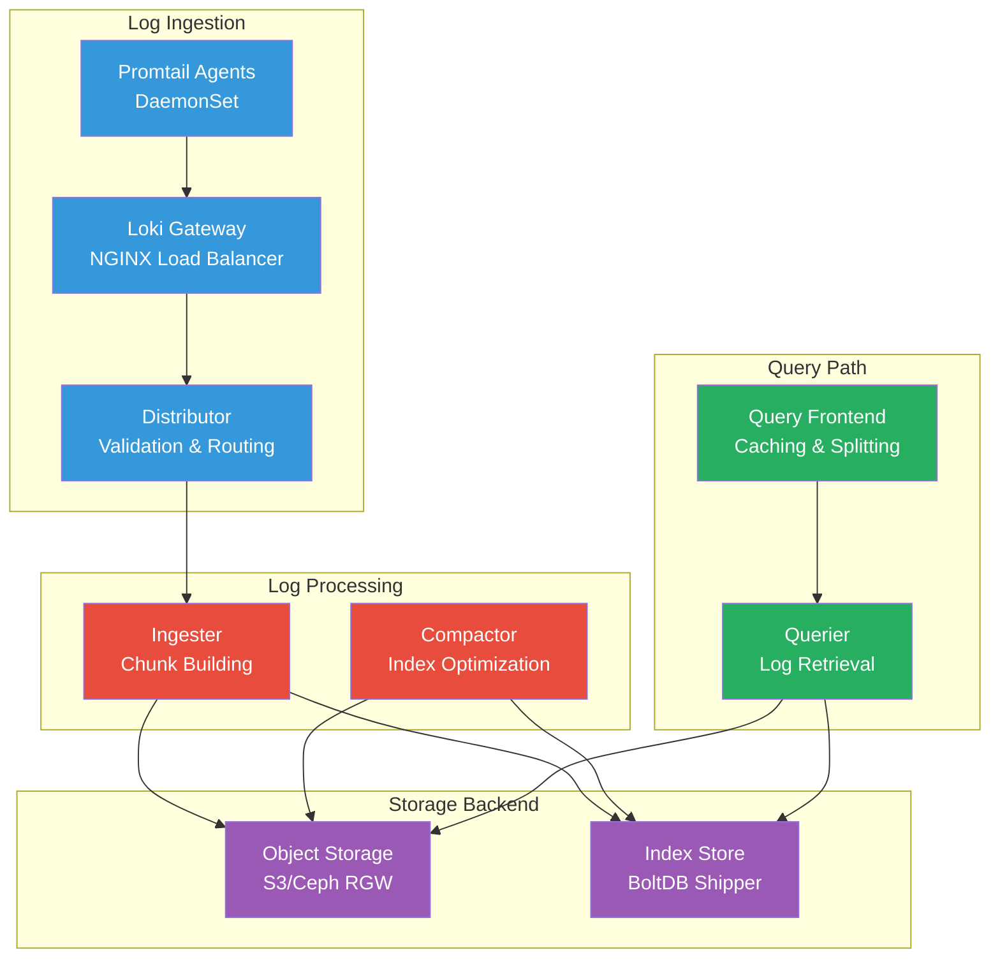

# Loki

Loki serves as the core log aggregation system in the Anton cluster, providing horizontally scalable log storage and querying capabilities with minimal resource overhead.

## Architecture



## Components Deep Dive

### Distributor

The distributor receives log streams and performs validation and routing:

```yaml
# Distributor configuration
distributor:
  ring:
    kvstore:
      store: memberlist
    heartbeat_timeout: 1m
    heartbeat_period: 5s
```

**Functions:**
- Validates log entries and metadata
- Normalizes timestamps
- Routes logs to appropriate ingesters
- Implements rate limiting and tenant isolation

### Ingester

Ingesters build chunks from log streams and manage the write path:

```yaml
# Ingester configuration
ingester:
  lifecycler:
    ring:
      kvstore:
        store: memberlist
      replication_factor: 1
    heartbeat_period: 5s
    
  chunk_idle_period: 1h
  max_chunk_age: 1h
  chunk_target_size: 1048576  # 1MB chunks
  chunk_retain_period: 30s
```

**Functions:**
- Builds compressed chunks from log streams
- Maintains in-memory chunks before flushing
- Creates and maintains the index
- Handles log stream replication

### Querier

Queriers handle the read path for log queries:

```yaml
# Querier configuration
querier:
  query_timeout: 1m
  tail_max_duration: 1h
  extra_query_delay: 0s
  
  engine:
    timeout: 3m
    max_look_back_period: 30s
```

**Functions:**
- Processes LogQL queries
- Retrieves chunks from storage
- Decompresses and filters log lines
- Merges results from multiple sources

### Query Frontend

The query frontend provides caching and query optimization:

```yaml
# Query frontend configuration
query_range:
  cache_results: true
  max_retries: 5
  parallelise_shardable_queries: true
  
frontend:
  max_outstanding_per_tenant: 100
  compress_responses: true
```

**Functions:**
- Caches query results
- Splits large queries into smaller chunks
- Implements query retry logic
- Provides query queuing and rate limiting

## Storage Configuration

### Object Storage (S3)

```yaml
# S3 storage configuration for chunks
storage_config:
  aws:
    s3: s3://loki-chunks
    region: us-east-1
    access_key_id: ${S3_ACCESS_KEY}
    secret_access_key: ${S3_SECRET_KEY}
    s3forcepathstyle: true
    endpoint: http://s3-gateway-service.storage.svc.cluster.local
```

### Index Storage

```yaml
# BoltDB shipper configuration
storage_config:
  boltdb_shipper:
    active_index_directory: /loki/boltdb-shipper-active
    cache_location: /loki/boltdb-shipper-cache
    cache_ttl: 24h
    shared_store: s3
```

## Schema Configuration

```yaml
# Schema evolution configuration
schema_config:
  configs:
    - from: 2020-10-24
      store: boltdb-shipper
      object_store: aws
      schema: v11
      index:
        prefix: index_
        period: 24h
```

## LogQL Query Language

### Stream Selectors

```logql
# Basic stream selection
{namespace="monitoring"}
{job="loki", level="error"}

# Regular expression matching
{namespace=~"kube-.*"}
{pod!~"test-.*"}

# Multiple label matching
{namespace="monitoring", pod=~"prometheus-.*", level!="debug"}
```

### Line Filters

```logql
# Contains text
{namespace="monitoring"} |= "error"

# Does not contain
{namespace="monitoring"} != "debug"

# Regular expression
{namespace="monitoring"} |~ "error|ERROR|Error"

# Chained filters
{namespace="monitoring"} |= "error" |~ "database"
```

### Parser Expressions

```logql
# JSON parser
{namespace="monitoring"} | json

# Logfmt parser
{namespace="monitoring"} | logfmt

# Regular expression parser
{namespace="monitoring"} | regexp "(?P<level>\\w+) (?P<message>.*)"

# Pattern parser
{namespace="monitoring"} | pattern "<level> <timestamp> <message>"
```

### Metric Queries

```logql
# Count log lines per second
rate({namespace="monitoring"}[5m])

# Count by level
sum by (level) (rate({namespace="monitoring"}[5m]))

# Quantiles of numeric values
quantile_over_time(0.95, {job="nginx"} | json | unwrap duration [5m])

# Aggregations over time
avg_over_time({job="app"} | json | unwrap response_time [5m])
```

## Performance Tuning

### Chunk Configuration

```yaml
# Optimize chunk size and retention
ingester:
  chunk_target_size: 1572864    # 1.5MB for better compression
  chunk_idle_period: 30m        # Earlier flush for recent queries
  max_chunk_age: 2h            # Balance memory vs storage
  chunk_retain_period: 15s      # Faster query response
```

### Query Optimization

```yaml
# Query limits and timeouts
limits_config:
  enforce_metric_name: false
  reject_old_samples: true
  reject_old_samples_max_age: 168h
  max_query_length: 12000h
  max_query_parallelism: 32
  max_streams_per_user: 10000
  max_line_size: 256000
```

### Caching Configuration

```yaml
# Enable result caching
query_range:
  cache_results: true
  max_retries: 5
  
# Cache configuration
chunk_store_config:
  chunk_cache_config:
    enable_fifocache: true
    fifocache:
      max_size_items: 1024
      validity: 24h
```

## Operational Commands

### Health Monitoring

```bash
# Check all Loki components
kubectl get pods -n monitoring -l app.kubernetes.io/name=loki

# Check component health endpoints
kubectl port-forward -n monitoring svc/loki-gateway 3100:80
curl http://localhost:3100/ready
curl http://localhost:3100/metrics

# View ingester ring status
curl http://localhost:3100/ring

# Check ruler status (if enabled)
curl http://localhost:3100/ruler/ring
```

### Configuration Management

```bash
# View current configuration
kubectl get configmap -n monitoring loki-config -o yaml

# Reload configuration (if supported)
curl -X POST http://localhost:3100/-/reload

# Validate configuration
loki -config.file=loki.yaml -verify-config
```

### Storage Operations

```bash
# Check chunk storage
kubectl exec -n storage -c toolbox deployment/rook-ceph-tools -- \
  s3cmd ls s3://loki-chunks/fake/

# Monitor storage usage
kubectl exec -n storage -c toolbox deployment/rook-ceph-tools -- \
  s3cmd du s3://loki-chunks/

# Check index files
kubectl exec -n monitoring loki-ingester-0 -- \
  ls -la /loki/boltdb-shipper-active/
```

### Performance Analysis

```bash
# Check ingestion rate
curl "http://localhost:3100/metrics" | grep loki_distributor_ingester_appends_total

# Monitor query performance
curl "http://localhost:3100/metrics" | grep loki_query_frontend_queries_total

# Check chunk utilization
curl "http://localhost:3100/metrics" | grep loki_ingester_chunks_created_total

# Monitor memory usage
kubectl top pod -n monitoring -l app.kubernetes.io/name=loki
```

### Troubleshooting

```bash
# Check ingester logs for issues
kubectl logs -n monitoring -l app.kubernetes.io/component=ingester

# View distributor health
kubectl logs -n monitoring -l app.kubernetes.io/component=distributor

# Check query performance
kubectl logs -n monitoring -l app.kubernetes.io/component=querier | grep -i slow

# Verify S3 connectivity
kubectl exec -n monitoring loki-ingester-0 -- \
  curl -I http://s3-gateway-service.storage.svc.cluster.local
```

## Best Practices

### Label Strategy
- **Keep labels low cardinality**: Avoid high-cardinality labels like request IDs
- **Use structured logging**: Prefer parsing over labeling for high-cardinality data
- **Consistent labeling**: Use standard labels across applications

### Query Optimization
- **Time range bounds**: Always specify appropriate time ranges
- **Use filters early**: Apply line filters before parsing
- **Avoid large result sets**: Use sampling for large queries

### Storage Efficiency
- **Compression**: Use appropriate compression settings
- **Retention policies**: Implement tiered retention
- **Index optimization**: Regular compaction for better query performance

Loki provides efficient log storage and querying capabilities while maintaining the simplicity and cost-effectiveness that makes it ideal for Kubernetes environments.