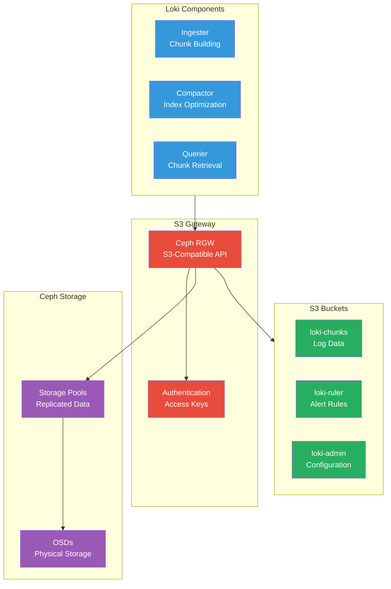

# S3 Integration

The Anton cluster's Loki logging system leverages S3-compatible object storage provided by Rook-Ceph for scalable, durable log storage with cost-effective long-term retention.

## Architecture



## Ceph RGW Configuration

### RadosGW Deployment

The Rook-Ceph operator deploys RadosGW (Rados Gateway) to provide S3-compatible API:

```yaml
# CephObjectStore configuration
apiVersion: ceph.rook.io/v1
kind: CephObjectStore
metadata:
  name: ceph-objectstore
  namespace: storage
spec:
  metadataPool:
    failureDomain: host
    replicated:
      size: 3
  dataPool:
    failureDomain: host
    replicated:
      size: 3
  gateway:
    instances: 2
    port: 80
    resources:
      requests:
        cpu: 500m
        memory: 1Gi
      limits:
        cpu: 1000m
        memory: 2Gi
```

### Service Endpoint

```yaml
# Service exposing RGW
apiVersion: v1
kind: Service
metadata:
  name: s3-gateway-service
  namespace: storage
spec:
  ports:
    - port: 80
      protocol: TCP
      targetPort: 80
  selector:
    app: rook-ceph-rgw
    ceph_daemon_id: ceph-objectstore
```

## S3 Bucket Configuration

### Bucket Creation

```bash
# Create S3 buckets for Loki
kubectl exec -n storage -c toolbox deployment/rook-ceph-tools -- \
  s3cmd mb s3://loki-chunks

kubectl exec -n storage -c toolbox deployment/rook-ceph-tools -- \
  s3cmd mb s3://loki-ruler

kubectl exec -n storage -c toolbox deployment/rook-ceph-tools -- \
  s3cmd mb s3://loki-admin
```

### Bucket Policies

```json
{
  "Version": "2012-10-17",
  "Statement": [
    {
      "Effect": "Allow",
      "Principal": {
        "AWS": "arn:aws:iam:::user/loki"
      },
      "Action": [
        "s3:GetObject",
        "s3:PutObject",
        "s3:DeleteObject"
      ],
      "Resource": "arn:aws:s3:::loki-chunks/*"
    },
    {
      "Effect": "Allow", 
      "Principal": {
        "AWS": "arn:aws:iam:::user/loki"
      },
      "Action": "s3:ListBucket",
      "Resource": "arn:aws:s3:::loki-chunks"
    }
  ]
}
```

## Loki S3 Configuration

### Storage Configuration

```yaml
# Loki storage configuration for S3
storage_config:
  aws:
    # S3 endpoint and bucket
    endpoint: http://s3-gateway-service.storage.svc.cluster.local:80
    region: us-east-1
    bucketnames: loki-chunks
    s3forcepathstyle: true
    
    # Authentication
    access_key_id: ${S3_ACCESS_KEY}
    secret_access_key: ${S3_SECRET_KEY}
    
    # Performance tuning
    insecure: false
    sse_encryption: false
    http_config:
      idle_conn_timeout: 90s
      response_header_timeout: 0s
      insecure_skip_verify: false
      
  # BoltDB shipper for index
  boltdb_shipper:
    active_index_directory: /loki/boltdb-shipper-active
    cache_location: /loki/boltdb-shipper-cache
    shared_store: aws
    cache_ttl: 24h
```

### Chunk Configuration

```yaml
# Chunk storage settings optimized for S3
chunk_store_config:
  max_look_back_period: 0s
  
# Compactor configuration for S3 optimization
compactor:
  working_directory: /loki/compactor
  shared_store: aws
  compaction_interval: 10m
  retention_enabled: true
  retention_delete_delay: 2h
  retention_delete_worker_count: 150
```

## Authentication Setup

### S3 User Creation

```bash
# Create Loki S3 user in Ceph
kubectl exec -n storage -c toolbox deployment/rook-ceph-tools -- \
  radosgw-admin user create --uid=loki --display-name="Loki Log Storage"

# Generate access keys
kubectl exec -n storage -c toolbox deployment/rook-ceph-tools -- \
  radosgw-admin key create --uid=loki --key-type=s3
```

### Secret Management

```yaml
# Kubernetes secret for S3 credentials
apiVersion: v1
kind: Secret
metadata:
  name: loki-s3-secret
  namespace: monitoring
type: Opaque
stringData:
  access-key-id: YOUR_S3_ACCESS_KEY
  secret-access-key: YOUR_S3_SECRET_KEY
```

### External Secrets Integration

```yaml
# External Secret for 1Password integration
apiVersion: external-secrets.io/v1
kind: SecretStore
metadata:
  name: 1password-secret-store
  namespace: monitoring
spec:
  provider:
    onepassword:
      connectHost: http://onepassword-connect:8080
      vaults:
        secrets: 1

---
apiVersion: external-secrets.io/v1
kind: ExternalSecret
metadata:
  name: loki-s3-credentials
  namespace: monitoring
spec:
  secretStoreRef:
    name: 1password-secret-store
    kind: SecretStore
  target:
    name: loki-s3-secret
  data:
    - secretKey: access-key-id
      remoteRef:
        key: loki-s3-access-key-id
    - secretKey: secret-access-key
      remoteRef:
        key: loki-s3-secret-key
```

## Performance Optimization

### Chunk Optimization

```yaml
# Optimize chunk size for S3 storage
ingester:
  chunk_target_size: 1572864    # 1.5MB optimal for S3
  chunk_encoding: snappy        # Fast compression
  chunk_idle_period: 30m        # Balance upload frequency
  max_chunk_age: 2h            # Maximum chunk age before flush
```

### Upload Configuration

```yaml
# S3 upload optimization
storage_config:
  aws:
    # Multipart upload settings
    s3:
      multipart_size: 64MB       # Chunk size for multipart uploads
      max_concurrent_uploads: 10  # Concurrent upload streams
      
    # HTTP client tuning  
    http_config:
      timeout: 30s
      keep_alive: 30s
      max_idle_conns: 100
      max_idle_conns_per_host: 10
```

### Caching Strategy

```yaml
# Enable caching for S3 objects
chunk_store_config:
  cache_lookups_older_than: 0s
  
  chunk_cache_config:
    enable_fifocache: true
    fifocache:
      max_size_items: 2048
      validity: 24h
      
  write_dedupe_cache_config:
    enable_fifocache: true  
    fifocache:
      max_size_items: 1024
      validity: 24h
```

## Monitoring and Operations

### Storage Monitoring

```bash
# Check S3 bucket usage
kubectl exec -n storage -c toolbox deployment/rook-ceph-tools -- \
  s3cmd du s3://loki-chunks --human-readable

# List recent uploads
kubectl exec -n storage -c toolbox deployment/rook-ceph-tools -- \
  s3cmd ls s3://loki-chunks/fake/ | tail -20

# Check bucket policy
kubectl exec -n storage -c toolbox deployment/rook-ceph-tools -- \
  s3cmd info s3://loki-chunks
```

### Performance Metrics

```bash
# Monitor S3 operation metrics
curl "http://localhost:3100/metrics" | grep -E "(s3|aws)"

# Check chunk upload rates
curl "http://localhost:3100/metrics" | grep loki_ingester_chunks_flushed_total

# Monitor S3 errors
kubectl logs -n monitoring -l app.kubernetes.io/name=loki | grep -i "s3\|aws"
```

### Health Checks

```bash
# Test S3 connectivity
kubectl exec -n monitoring loki-ingester-0 -- \
  curl -I http://s3-gateway-service.storage.svc.cluster.local

# Verify bucket access
kubectl exec -n storage -c toolbox deployment/rook-ceph-tools -- \
  s3cmd ls s3://loki-chunks/

# Check RadosGW status
kubectl get pods -n storage -l app=rook-ceph-rgw
```

## Troubleshooting

### Common Issues

```bash
# S3 authentication errors
kubectl logs -n monitoring -l app.kubernetes.io/name=loki | grep -i "AccessDenied\|InvalidAccessKey"

# Connection timeouts
kubectl logs -n monitoring -l app.kubernetes.io/name=loki | grep -i "timeout\|connection"

# Upload failures
kubectl logs -n monitoring -l app.kubernetes.io/name=loki | grep -i "upload\|put.*failed"

# Check RGW logs for server-side issues
kubectl logs -n storage -l app=rook-ceph-rgw
```

### Recovery Procedures

```bash
# Restart Loki components if S3 issues persist
kubectl rollout restart deployment/loki-gateway -n monitoring
kubectl rollout restart deployment/loki-distributor -n monitoring

# Clear local cache if needed
kubectl exec -n monitoring loki-ingester-0 -- \
  rm -rf /loki/boltdb-shipper-cache/*

# Test bucket connectivity
kubectl run s3-test --image=amazon/aws-cli --rm -it -- \
  aws s3 ls s3://loki-chunks --endpoint-url=http://s3-gateway-service.storage.svc.cluster.local
```

## Security Considerations

### Access Control
- **Minimal Permissions**: Grant only required S3 permissions
- **Secret Management**: Use External Secrets for credential management
- **Network Policies**: Restrict S3 access to authorized pods

### Data Protection
- **Encryption**: Enable S3 server-side encryption if required
- **Retention Policies**: Implement appropriate data retention
- **Backup**: Regular backup of critical configuration

The S3 integration provides scalable, cost-effective log storage while leveraging the existing Ceph infrastructure, ensuring data durability and performance for the logging system.