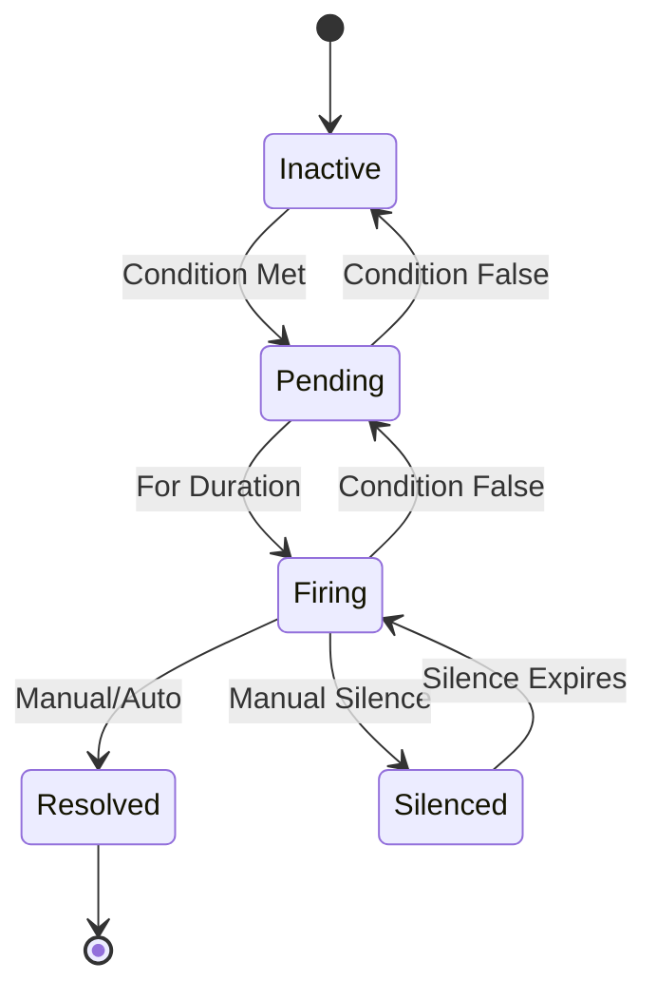

# Alerting

The Anton cluster implements a multi-layered alerting strategy using AlertManager and Grafana to ensure rapid response to critical issues and proactive monitoring of system health.

## Architecture

```mermaid
flowchart TD
    subgraph sources[Alert Sources]
        prom_rules[Prometheus<br/>Alert Rules]
        grafana_alerts[Grafana<br/>Alert Rules]
        external[External Systems<br/>Webhooks]
    end
    
    subgraph processing[Alert Processing]
        alertmanager[AlertManager<br/>Routing & Grouping]
        silencing[Silencing<br/>& Inhibition]
        dedup[Deduplication<br/>& Clustering]
    end
    
    subgraph routing[Routing Logic]
        severity{Severity<br/>Level?}
        teams{Team<br/>Assignment?}
        schedule{On-Call<br/>Schedule?}
    end
    
    subgraph destinations[Notification Channels]
        email[Email<br/>SMTP]
        webhook[Webhooks<br/>Slack/Discord]
        pager[PagerDuty<br/>(if configured)]
    end
    
    sources --> processing
    processing --> routing
    routing --> severity
    severity -->|Critical| pager
    severity -->|Warning| webhook
    severity -->|Info| email
    
    routing --> teams
    teams --> destinations
    routing --> schedule
    schedule --> destinations
    
    classDef source fill:#3498db,color:white
    classDef process fill:#e74c3c,color:white
    classDef route fill:#f39c12,color:white
    classDef dest fill:#27ae60,color:white
    
    class prom_rules,grafana_alerts,external source
    class alertmanager,silencing,dedup process
    class severity,teams,schedule route
    class email,webhook,pager dest
```

## Alert Classification

### Severity Levels

#### Critical Alerts
- **Node Down**: Kubernetes node becomes unavailable
- **Storage Failure**: Ceph cluster degraded or failing
- **Control Plane Issues**: API server or etcd problems
- **Security Events**: Unauthorized access attempts

#### Warning Alerts
- **High Resource Usage**: CPU/Memory above 80% for extended periods
- **Disk Space Low**: Storage usage above 85%
- **Application Errors**: Increased error rates or response times
- **Certificate Expiration**: TLS certificates expiring within 7 days

#### Info Alerts
- **Deployment Events**: Successful/failed deployments
- **Scale Events**: Pod scaling up/down
- **Configuration Changes**: ConfigMap or Secret updates

### Alert States



## Prometheus Alert Rules

### Node-Level Alerts

```yaml
apiVersion: monitoring.coreos.com/v1
kind: PrometheusRule
metadata:
  name: node-alerts
spec:
  groups:
    - name: node.rules
      rules:
        - alert: NodeDown
          expr: up{job="node-exporter"} == 0
          for: 1m
          labels:
            severity: critical
            team: infrastructure
          annotations:
            summary: "Node {{ $labels.instance }} is down"
            description: "Node has been down for more than 1 minute"
            
        - alert: NodeHighCPU
          expr: 100 - (avg by (instance) (irate(node_cpu_seconds_total{mode="idle"}[5m])) * 100) > 80
          for: 5m
          labels:
            severity: warning
            team: infrastructure
          annotations:
            summary: "High CPU usage on {{ $labels.instance }}"
            description: "CPU usage is {{ $value }}% for more than 5 minutes"
```

### Kubernetes Alerts

```yaml
- name: kubernetes.rules
  rules:
    - alert: PodCrashLooping
      expr: rate(kube_pod_container_status_restarts_total[15m]) > 0
      for: 5m
      labels:
        severity: warning
        team: platform
      annotations:
        summary: "Pod {{ $labels.pod }} is crash looping"
        description: "Pod has restarted {{ $value }} times in the last 15 minutes"
        
    - alert: DeploymentReplicasMismatch
      expr: kube_deployment_spec_replicas != kube_deployment_status_available_replicas
      for: 10m
      labels:
        severity: warning
        team: platform
      annotations:
        summary: "Deployment {{ $labels.deployment }} has mismatched replicas"
        description: "Expected {{ $labels.spec_replicas }} but have {{ $labels.available_replicas }}"
```

### Storage Alerts

```yaml
- name: storage.rules
  rules:
    - alert: CephClusterWarning
      expr: ceph_health_status != 0
      for: 5m
      labels:
        severity: warning
        team: storage
      annotations:
        summary: "Ceph cluster health warning"
        description: "Ceph cluster is in {{ $labels.status }} state"
        
    - alert: PersistentVolumeUsageHigh
      expr: 100 * (kubelet_volume_stats_used_bytes / kubelet_volume_stats_capacity_bytes) > 85
      for: 5m
      labels:
        severity: warning
        team: platform
      annotations:
        summary: "PersistentVolume {{ $labels.persistentvolumeclaim }} usage high"
        description: "Volume usage is {{ $value }}%"
```

## AlertManager Configuration

### Routing Configuration

```yaml
route:
  group_by: ['alertname', 'cluster', 'service']
  group_wait: 30s
  group_interval: 5m
  repeat_interval: 4h
  receiver: 'default'
  routes:
    - match:
        severity: critical
      receiver: 'critical-alerts'
      group_wait: 10s
      repeat_interval: 1h
    - match:
        severity: warning
      receiver: 'warning-alerts'
      repeat_interval: 2h
```

### Receivers Configuration

```yaml
receivers:
  - name: 'default'
    webhook_configs:
      - url: 'http://webhook-service/alerts'
        send_resolved: true
        
  - name: 'critical-alerts'
    email_configs:
      - to: 'admin@example.com'
        subject: 'CRITICAL: {{ .GroupLabels.alertname }}'
        body: |
          Alert: {{ .GroupLabels.alertname }}
          Summary: {{ range .Alerts }}{{ .Annotations.summary }}{{ end }}
    webhook_configs:
      - url: 'http://pagerduty-webhook/critical'
        
  - name: 'warning-alerts'
    webhook_configs:
      - url: 'http://slack-webhook/warnings'
```

### Silencing and Inhibition

```yaml
# Inhibition rules - suppress alerts when related alerts fire
inhibit_rules:
  - source_match:
      severity: 'critical'
    target_match:
      severity: 'warning'
    equal: ['alertname', 'instance']
    
  - source_match:
      alertname: 'NodeDown'
    target_match_re:
      alertname: 'Node.*'
    equal: ['instance']
```

## Management Commands

### AlertManager Operations

```bash
# Port forward to AlertManager UI
kubectl port-forward -n monitoring svc/kube-prometheus-stack-alertmanager 9093:9093

# Check alert status
curl http://localhost:9093/api/v1/alerts

# View current silences
curl http://localhost:9093/api/v1/silences

# Create a silence
curl -XPOST http://localhost:9093/api/v1/silences \
  -H "Content-Type: application/json" \
  -d '{"matchers":[{"name":"alertname","value":"NodeHighCPU"}],"startsAt":"'$(date -Iseconds)'","endsAt":"'$(date -d '+1 hour' -Iseconds)'","comment":"Maintenance window"}'
```

### Prometheus Alert Rules

```bash
# Check alert rules status
kubectl get prometheusrule -n monitoring

# Validate alert rules
promtool check rules alert-rules.yaml

# View firing alerts
curl http://localhost:9090/api/v1/alerts | jq '.data.alerts[] | select(.state=="firing")'

# Test alert expression
curl "http://localhost:9090/api/v1/query?query=up==0"
```

### Grafana Alerting

```bash
# Check Grafana alert rules
curl -H "Authorization: Bearer $GRAFANA_TOKEN" \
  http://localhost:3000/api/alert-rules

# Test notification channel
curl -H "Authorization: Bearer $GRAFANA_TOKEN" \
  -X POST http://localhost:3000/api/alert-notifications/test \
  -d '{"id":1}'
```

## Troubleshooting Alerts

### Common Issues

```bash
# Check AlertManager configuration
kubectl logs -n monitoring -l app.kubernetes.io/name=alertmanager

# Verify webhook endpoints
kubectl run test-webhook --image=curlimages/curl --rm -it -- \
  curl -X POST http://webhook-service/test

# Test SMTP configuration
kubectl exec -n monitoring alertmanager-pod -- \
  telnet smtp.example.com 587

# Check alert rule evaluation
kubectl logs -n monitoring -l app.kubernetes.io/name=kube-prometheus-stack-prometheus | grep "rule evaluation"
```

### Alert Debugging

```bash
# Check why alert isn't firing
curl "http://localhost:9090/api/v1/query?query=ALERT_EXPRESSION"

# View alert rule groups
curl http://localhost:9090/api/v1/rules

# Check AlertManager logs for routing issues
kubectl logs -n monitoring -l app.kubernetes.io/name=alertmanager | grep -i routing
```

## Best Practices

### Alert Design
- **Actionable**: Every alert should have a clear remediation path
- **Contextual**: Include relevant labels and annotations
- **Appropriate Urgency**: Match severity to business impact

### Alert Fatigue Prevention
- **Proper Thresholds**: Avoid overly sensitive thresholds
- **Meaningful Grouping**: Group related alerts together
- **Regular Review**: Periodically review and tune alert rules

### On-Call Efficiency
- **Clear Escalation**: Define escalation paths for different severities
- **Documentation**: Link to runbooks in alert annotations
- **Testing**: Regularly test alert delivery channels

The alerting system ensures rapid detection and response to issues across the Anton cluster, providing the necessary visibility and automation to maintain high availability and performance.