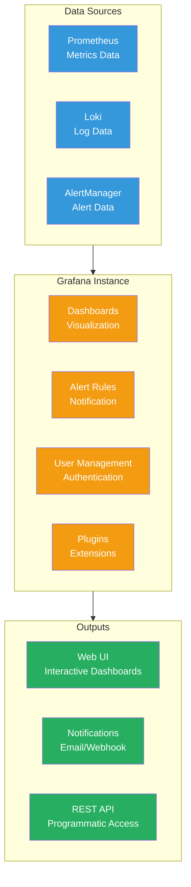

# Grafana

Grafana serves as the primary visualization platform for the Anton cluster, providing rich dashboards and alerting capabilities built on top of Prometheus metrics.

## Architecture



## Data Sources

### Prometheus Integration
```yaml
# Configured as primary data source
apiVersion: 1
datasources:
  - name: Prometheus
    type: prometheus
    url: http://kube-prometheus-stack-prometheus:9090
    isDefault: true
    access: proxy
```

### Loki Integration
```yaml
# Log data source
  - name: Loki
    type: loki
    url: http://loki-gateway:80
    access: proxy
```

## Dashboard Categories

### Infrastructure Dashboards

#### Cluster Overview
- **Node Status**: CPU, memory, disk usage across all nodes
- **Pod Health**: Running vs desired pod counts
- **Network Traffic**: Ingress/egress patterns
- **Storage Usage**: Ceph cluster health and capacity

#### Node Details
- **Hardware Metrics**: Temperature, power consumption (if available)
- **OS Metrics**: Load average, disk I/O, network interfaces
- **Container Runtime**: containerd performance metrics

### Application Dashboards

#### Service Performance
- **HTTP Metrics**: Request rates, response times, error rates
- **Database Performance**: Query times, connection pools
- **Custom Metrics**: Application-specific KPIs

#### Resource Utilization
- **CPU/Memory**: Usage patterns and limits
- **Storage I/O**: Read/write operations
- **Network**: Service-to-service communication

## Custom Dashboard Development

### Dashboard as Code

Dashboards are stored in Git and deployed via Flux:

```
kubernetes/apps/monitoring/kube-prometheus-stack/app/dashboards/
├── cluster-overview.json
├── storage-health.json
├── application-performance.json
└── cost-analysis.json
```

### Dashboard Structure

```json
{
  "dashboard": {
    "title": "Cluster Overview",
    "tags": ["kubernetes", "cluster"],
    "time": {
      "from": "now-1h",
      "to": "now"
    },
    "panels": [
      {
        "title": "CPU Usage",
        "type": "stat",
        "targets": [
          {
            "expr": "avg(cpu_usage_percent)",
            "legendFormat": "CPU %"
          }
        ]
      }
    ]
  }
}
```

## Key Panels and Visualizations

### Time Series Panels
```promql
# CPU usage over time
100 - (avg by (instance) (irate(node_cpu_seconds_total{mode="idle"}[5m])) * 100)

# Memory usage trend
(1 - (node_memory_MemAvailable_bytes / node_memory_MemTotal_bytes)) * 100

# Network traffic
rate(node_network_receive_bytes_total[5m]) * 8
```

### Stat Panels
```promql
# Current pod count
count(up{job="kubelet"})

# Storage usage percentage
100 - ((node_filesystem_avail_bytes / node_filesystem_size_bytes) * 100)

# Service uptime
avg(up{job="kubernetes-service-endpoints"})
```

### Table Panels
```promql
# Top CPU consuming pods
topk(10, sum by (pod) (rate(container_cpu_usage_seconds_total[5m])))

# Persistent volume usage
sort_desc(100 - ((kubelet_volume_stats_available_bytes / kubelet_volume_stats_capacity_bytes) * 100))
```

## Alerting

### Grafana Alert Rules

```yaml
# Define alerts within Grafana
alert:
  name: High Memory Usage
  frequency: 1m
  conditions:
    - query: avg(memory_usage_percent)
      reducer: last
      type: query
    - evaluator:
        params: [80]
        type: gt
      type: threshold
  executionErrorState: alerting
  noDataState: no_data
  for: 2m
```

### Notification Channels

```yaml
# Webhook notification
notifiers:
  - name: webhook
    type: webhook
    settings:
      url: https://hooks.slack.com/webhook/...
      httpMethod: POST
```

## Access Management

### Authentication
```yaml
# Configuration for auth
auth:
  anonymous:
    enabled: false
  basic:
    enabled: true
```

### User Roles
- **Admin**: Full access to dashboards, data sources, and configuration
- **Editor**: Create and modify dashboards
- **Viewer**: Read-only access to dashboards

## Management Commands

### Access Grafana

```bash
# Port forward to Grafana UI
kubectl port-forward -n monitoring svc/kube-prometheus-stack-grafana 3000:80

# Get admin password
kubectl get secret -n monitoring kube-prometheus-stack-grafana -o jsonpath="{.data.admin-password}" | base64 -d

# Direct service access (if ingress configured)
kubectl get ingress -n monitoring
```

### Dashboard Management

```bash
# List available dashboards
kubectl get configmap -n monitoring | grep dashboard

# Update dashboard from file
kubectl create configmap custom-dashboard \
  --from-file=dashboard.json \
  -n monitoring \
  --dry-run=client -o yaml | kubectl apply -f -

# Check Grafana configuration
kubectl get configmap -n monitoring kube-prometheus-stack-grafana -o yaml
```

### Troubleshooting

```bash
# Check Grafana logs
kubectl logs -n monitoring -l app.kubernetes.io/name=grafana

# Verify data source connectivity
kubectl exec -n monitoring -c grafana deployment/kube-prometheus-stack-grafana -- \
  curl -s http://kube-prometheus-stack-prometheus:9090/api/v1/status/config

# Check plugin status
kubectl exec -n monitoring deployment/kube-prometheus-stack-grafana -- \
  grafana-cli plugins ls
```

## Best Practices

### Dashboard Design
- **Consistent Time Ranges**: Use template variables for time selection
- **Appropriate Visualizations**: Choose panel types that match data characteristics
- **Performance**: Limit data points and use recording rules for complex queries

### Organization
- **Folders**: Group related dashboards logically
- **Tags**: Use consistent tagging for searchability
- **Templates**: Create reusable dashboard templates

### Maintenance
```bash
# Backup dashboards
kubectl get configmap -n monitoring -o yaml > grafana-dashboards-backup.yaml

# Monitor Grafana performance
kubectl top pod -n monitoring -l app.kubernetes.io/name=grafana
```

Grafana transforms raw metrics into actionable insights through intuitive visualizations, enabling effective monitoring and observability across the entire Anton cluster infrastructure.