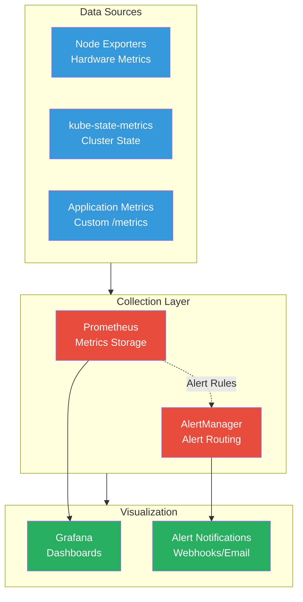

# Monitoring

The Anton cluster uses a comprehensive observability stack based on Prometheus, Grafana, and AlertManager to provide deep insights into cluster health, application performance, and resource utilization.

## Architecture Overview



## Core Components

### Prometheus Stack
- **Prometheus**: Time-series metrics collection and storage
- **Grafana**: Dashboard creation and visualization
- **AlertManager**: Alert routing and notification management
- **Node Exporter**: Hardware and OS metrics
- **kube-state-metrics**: Kubernetes API object metrics

### Key Features
- **Service Discovery**: Automatic discovery of monitoring targets
- **Long-term Storage**: Persistent metrics with configurable retention
- **High Availability**: Cluster-aware alerting and deduplication
- **Custom Dashboards**: Pre-configured and custom Grafana dashboards

## Deployment

The monitoring stack is deployed using the `kube-prometheus-stack` Helm chart in the `monitoring` namespace:

```yaml
# Deployed via Flux GitOps
namespace: monitoring
chart: kube-prometheus-stack
version: 45.7.1
```

## Key Metrics

### Cluster Health
- **Node Status**: CPU, memory, disk usage per node
- **Pod Health**: Running, pending, failed pod counts
- **Resource Utilization**: CPU and memory requests/limits vs usage

### Application Performance
- **HTTP Metrics**: Request rates, response times, error rates
- **Custom Metrics**: Application-specific performance indicators
- **Service Dependencies**: Inter-service communication metrics

### Infrastructure Metrics
- **Storage**: Ceph cluster health, OSD performance, disk usage
- **Network**: Bandwidth utilization, packet loss, connection counts
- **Control Plane**: API server performance, etcd health

## Access and Commands

### Status Commands

```bash
# Check monitoring stack pods
kubectl get pods -n monitoring

# View Prometheus targets
kubectl port-forward -n monitoring svc/kube-prometheus-stack-prometheus 9090:9090

# Check AlertManager status
kubectl get alertmanager -n monitoring

# View Grafana service
kubectl get svc -n monitoring | grep grafana
```

### Configuration

```bash
# View Prometheus configuration
kubectl get prometheus -n monitoring -o yaml

# Check alert rules
kubectl get prometheusrule -n monitoring

# View Grafana configuration
kubectl get configmap -n monitoring | grep grafana
```

### Troubleshooting

```bash
# Check monitoring namespace events
kubectl get events -n monitoring --sort-by='.lastTimestamp'

# View Prometheus logs
kubectl logs -n monitoring -l app.kubernetes.io/name=prometheus

# Check Grafana logs
kubectl logs -n monitoring -l app.kubernetes.io/name=grafana

# Verify service monitors
kubectl get servicemonitor -n monitoring
```

## Dashboards

### Pre-configured Dashboards
- **Cluster Overview**: High-level cluster health and resource usage
- **Node Metrics**: Per-node hardware and OS metrics
- **Pod Metrics**: Container resource usage and health
- **Storage Health**: Ceph cluster status and performance
- **Network Overview**: Cilium and ingress metrics

### Custom Dashboards
Located in `kubernetes/apps/monitoring/kube-prometheus-stack/app/dashboards/`:
- **Storage Health**: Rook-Ceph specific metrics
- **Application Performance**: Custom application metrics
- **Cost Analysis**: Resource usage and optimization insights

## Alerting

### Alert Categories
- **Critical**: Immediate attention required (node down, storage failure)
- **Warning**: Potential issues (high resource usage, slow responses)
- **Info**: Informational alerts (deployments, scaling events)

### Alert Destinations
- **Webhooks**: Integration with external systems
- **Email**: Critical alert notifications
- **Slack**: Team notifications (when configured)

## Performance Optimization

### Retention Policies
```yaml
# Prometheus data retention
retention: 15d
retentionSize: 10GB
```

### Query Optimization
- Use recording rules for frequently queried metrics
- Implement appropriate scrape intervals
- Configure resource limits for monitoring components

The monitoring stack provides comprehensive observability across all layers of the Anton cluster, enabling proactive issue detection and performance optimization.