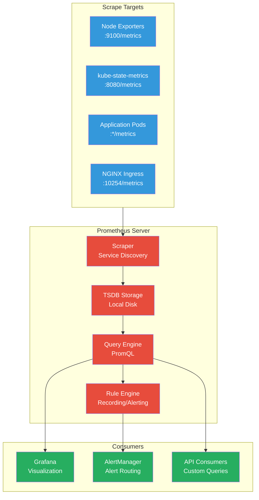

# Prometheus

Prometheus serves as the core metrics collection and storage system in the Anton cluster, providing a robust foundation for observability and alerting.

## Architecture



## Configuration

### Service Discovery

Prometheus automatically discovers monitoring targets using Kubernetes service discovery:

```yaml
# ServiceMonitor for automatic pod discovery
apiVersion: monitoring.coreos.com/v1
kind: ServiceMonitor
metadata:
  name: app-metrics
spec:
  selector:
    matchLabels:
      app: my-application
  endpoints:
    - port: metrics
      path: /metrics
      interval: 30s
```

### Scrape Configuration

```yaml
# Global scrape configuration
global:
  scrape_interval: 30s       # Default scrape interval
  evaluation_interval: 30s   # Rule evaluation interval
  
# Kubernetes API server metrics
- job_name: 'kubernetes-apiservers'
  kubernetes_sd_configs:
    - role: endpoints
      namespaces:
        names: [default]
```

## Key Metrics Collected

### Node-Level Metrics
- **CPU**: Usage, load average, context switches
- **Memory**: Used, available, swap usage
- **Disk**: Usage, I/O operations, read/write rates
- **Network**: Bytes sent/received, packet drops

### Kubernetes Metrics
- **Pods**: Running count, restart count, resource usage
- **Deployments**: Desired vs available replicas
- **Services**: Endpoint availability
- **Persistent Volumes**: Usage and availability

### Application Metrics
- **HTTP**: Request rate, duration, status codes
- **Database**: Connection pools, query performance
- **Custom**: Application-specific business metrics

## Storage and Retention

### Time Series Database (TSDB)
```yaml
# Prometheus storage configuration
storage:
  volumeClaimTemplate:
    spec:
      accessModes: ["ReadWriteOnce"]
      resources:
        requests:
          storage: 10Gi
      storageClassName: ceph-block
```

### Retention Policies
```yaml
# Data retention configuration
retention: 15d              # Keep data for 15 days
retentionSize: 10GB          # Maximum storage size
```

## PromQL Query Examples

### Basic Queries

```promql
# CPU usage per node
100 - (avg by (instance) (irate(node_cpu_seconds_total{mode="idle"}[5m])) * 100)

# Memory usage percentage
(1 - (node_memory_MemAvailable_bytes / node_memory_MemTotal_bytes)) * 100

# Pod restart count
increase(kube_pod_container_status_restarts_total[1h])

# HTTP request rate
rate(http_requests_total[5m])
```

### Advanced Queries

```promql
# Top 10 pods by memory usage
topk(10, 
  sum by (pod) (container_memory_working_set_bytes{container!="POD"})
)

# Storage usage prediction (linear regression)
predict_linear(
  node_filesystem_free_bytes{fstype!="tmpfs"}[1h], 
  24 * 3600
)

# Service availability (SLI)
sum(rate(http_requests_total{status!~"5.."}[5m])) /
sum(rate(http_requests_total[5m]))
```

## Alert Rules

### Recording Rules

```yaml
# Pre-compute expensive queries
apiVersion: monitoring.coreos.com/v1
kind: PrometheusRule
metadata:
  name: recording-rules
spec:
  groups:
    - name: node.rules
      rules:
        - record: node:cpu_utilization
          expr: |
            100 - (avg by (instance) (irate(node_cpu_seconds_total{mode="idle"}[5m])) * 100)
```

### Alerting Rules

```yaml
# Define alert conditions
- name: node.alerts
  rules:
    - alert: NodeCPUHigh
      expr: node:cpu_utilization > 80
      for: 2m
      labels:
        severity: warning
      annotations:
        summary: "High CPU usage on {{ $labels.instance }}"
        description: "CPU usage is {{ $value }}% for 2+ minutes"
```

## Management Commands

### Status and Health

```bash
# Port forward to Prometheus UI
kubectl port-forward -n monitoring svc/kube-prometheus-stack-prometheus 9090:9090

# Check Prometheus configuration
kubectl get prometheus -n monitoring -o yaml

# View current targets
curl http://localhost:9090/api/v1/targets

# Check rule evaluation
curl http://localhost:9090/api/v1/rules
```

### Configuration Management

```bash
# Reload configuration (if supported)
curl -X POST http://localhost:9090/-/reload

# Check configuration validity
promtool check config prometheus.yml

# Validate rules
promtool check rules alert-rules.yml
```

### Troubleshooting

```bash
# Check Prometheus logs
kubectl logs -n monitoring -l app.kubernetes.io/name=kube-prometheus-stack-prometheus

# Verify service discovery
kubectl get servicemonitor -n monitoring

# Check PodMonitor resources
kubectl get podmonitor -n monitoring

# View Prometheus status
kubectl get prometheus -n monitoring
```

## Performance Optimization

### Query Performance

```yaml
# Configure query engine limits
spec:
  query:
    maxConcurrency: 10
    maxSamples: 50000000
    timeout: 2m
```

### Memory Management

```yaml
# Resource limits for Prometheus
resources:
  requests:
    memory: 2Gi
    cpu: 1000m
  limits:
    memory: 4Gi
    cpu: 2000m
```

### Storage Optimization

```bash
# Compact TSDB blocks
kubectl exec -n monitoring prometheus-pod -- promtool tsdb compact /prometheus/data

# Check storage usage
kubectl exec -n monitoring prometheus-pod -- du -sh /prometheus/data
```

Prometheus provides the foundational metrics infrastructure that powers the entire observability stack, enabling data-driven decisions and proactive monitoring across the Anton cluster.