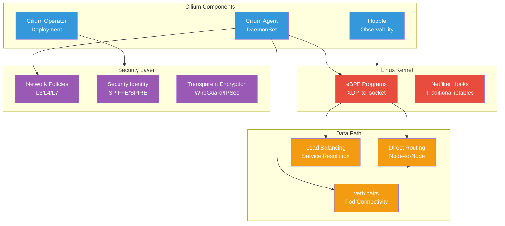
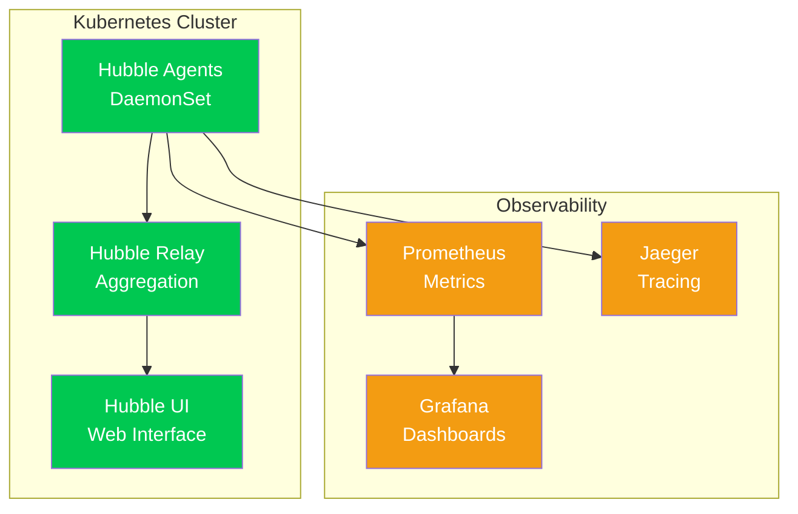

# Cilium

Cilium serves as the Container Network Interface (CNI) for the Anton cluster, providing eBPF-based networking, security, and observability with high performance and advanced features.

## Architecture



## Key Features

### eBPF Dataplane
- **Kernel Bypass**: Direct packet processing in kernel space
- **Performance**: 10x+ performance improvement over iptables
- **Programmability**: Custom network logic without kernel modules
- **XDP Support**: eXpress Data Path for ultra-low latency

### kube-proxy Replacement
```yaml
# Cilium replaces kube-proxy entirely
apiVersion: v1
kind: ConfigMap
metadata:
  name: cilium-config
  namespace: kube-system
data:
  kube-proxy-replacement: strict
  enable-ipv4-masquerade: "true"
  enable-xt-socket-fallback: "true"
```

### Service Load Balancing
- **Direct Server Return (DSR)**: Optimized load balancing
- **Maglev Hashing**: Consistent load distribution
- **Health Checking**: Automatic endpoint health monitoring
- **Session Affinity**: Client IP-based session persistence

## Network Policies

### Layer 3/4 Policies

```yaml
# Basic L3/4 network policy
apiVersion: cilium.io/v2
kind: CiliumNetworkPolicy
metadata:
  name: allow-frontend-to-backend
  namespace: production
spec:
  endpointSelector:
    matchLabels:
      app: frontend
  egress:
    - toEndpoints:
        - matchLabels:
            app: backend
      toPorts:
        - ports:
            - port: "8080"
              protocol: TCP
```

### Layer 7 Policies

```yaml
# HTTP-aware policy
apiVersion: cilium.io/v2
kind: CiliumNetworkPolicy
metadata:
  name: api-access-policy
spec:
  endpointSelector:
    matchLabels:
      app: api-client
  egress:
    - toEndpoints:
        - matchLabels:
            app: api-server
      toPorts:
        - ports:
            - port: "80"
              protocol: TCP
          rules:
            http:
              - method: "GET"
                path: "/api/v1/.*"
              - method: "POST" 
                path: "/api/v1/submit"
                headers:
                  - "Content-Type: application/json"
```

### Global Policies

```yaml
# Cluster-wide security policy
apiVersion: cilium.io/v2
kind: CiliumClusterwideNetworkPolicy
metadata:
  name: deny-cross-namespace
spec:
  endpointSelector: {}
  ingress:
    - fromEndpoints:
        - matchLabels: {}
      # Allow intra-namespace communication only
```

## Security Identity

### Automatic Identity Assignment
```bash
# View security identities
kubectl exec -n kube-system ds/cilium -- cilium identity list

# Check endpoint identity mapping
kubectl exec -n kube-system ds/cilium -- cilium endpoint list

# View policy enforcement
kubectl exec -n kube-system ds/cilium -- cilium policy get
```

### SPIFFE/SPIRE Integration
```yaml
# SPIRE integration for workload identity
apiVersion: v1
kind: ConfigMap
metadata:
  name: cilium-config
data:
  enable-spire: "true"
  spire-agent-socket: "/run/spire/sockets/agent.sock"
```

## Observability with Hubble

### Hubble Architecture


### Flow Visibility

```bash
# View real-time network flows
kubectl exec -n kube-system ds/cilium -- hubble observe

# Filter flows by namespace
kubectl exec -n kube-system ds/cilium -- hubble observe --namespace monitoring

# View flows with Layer 7 information
kubectl exec -n kube-system ds/cilium -- hubble observe --http-status

# Monitor specific service communication
kubectl exec -n kube-system ds/cilium -- hubble observe --from-pod monitoring/prometheus-server
```

### Network Metrics

```bash
# Port forward to Hubble UI
kubectl port-forward -n kube-system svc/hubble-ui 12000:80

# Access Hubble metrics
kubectl port-forward -n kube-system svc/hubble-metrics 9091:9090
curl http://localhost:9091/metrics
```

## Performance Optimization

### Datapath Configuration

```yaml
# High-performance configuration
apiVersion: v1
kind: ConfigMap
metadata:
  name: cilium-config
data:
  # Direct routing for maximum performance
  tunnel: disabled
  auto-direct-node-routes: "true"
  
  # Optimize for throughput
  enable-bandwidth-manager: "true"
  enable-local-redirect-policy: "true"
  
  # CPU efficiency
  enable-cpu-affinity: "true"
  cpu-affinity-threads: "2"
```

### XDP Acceleration

```bash
# Check XDP status
kubectl exec -n kube-system ds/cilium -- cilium status | grep XDP

# View XDP program information
kubectl exec -n kube-system ds/cilium -- cilium bpf lb list

# Monitor XDP performance
kubectl exec -n kube-system ds/cilium -- cilium metrics list | grep xdp
```

### Memory Optimization

```yaml
# Memory tuning for resource-constrained environments
data:
  # BPF map sizes
  bpf-map-dynamic-size-ratio: "0.25"
  bpf-policy-map-max: "16384"
  bpf-fragments-map-max: "8192"
  
  # Connection tracking
  bpf-ct-global-tcp-max: "524288"
  bpf-ct-global-any-max: "262144"
```

## Management Commands

### Agent Operations

```bash
# Check Cilium agent status
kubectl exec -n kube-system ds/cilium -- cilium status --verbose

# View BPF program status
kubectl exec -n kube-system ds/cilium -- cilium bpf fs show

# Check connectivity between nodes
kubectl exec -n kube-system ds/cilium -- cilium connectivity test

# Reload agent configuration
kubectl exec -n kube-system ds/cilium -- cilium config reload
```

### Policy Management

```bash
# List active policies
kubectl get cnp,ccnp -A

# View policy enforcement status
kubectl exec -n kube-system ds/cilium -- cilium policy get

# Test policy rule matching
kubectl exec -n kube-system ds/cilium -- cilium policy selectors

# Validate policy configuration
kubectl exec -n kube-system ds/cilium -- cilium policy validate
```

### Service Load Balancing

```bash
# View service load balancer configuration
kubectl exec -n kube-system ds/cilium -- cilium service list

# Check backend health
kubectl exec -n kube-system ds/cilium -- cilium service get <service-id>

# Monitor load balancing decisions
kubectl exec -n kube-system ds/cilium -- cilium bpf lb list

# View Maglev hash table
kubectl exec -n kube-system ds/cilium -- cilium bpf lb maglev get <service-id>
```

## Troubleshooting

### Connectivity Issues

```bash
# Comprehensive connectivity test
kubectl exec -n kube-system ds/cilium -- cilium connectivity test --single-node

# Check endpoint connectivity
kubectl exec -n kube-system ds/cilium -- cilium endpoint get <endpoint-id>

# Verify routing table
kubectl exec -n kube-system ds/cilium -- cilium bpf tunnel list

# Test specific path connectivity
kubectl exec -n kube-system ds/cilium -- cilium ping <destination-ip>
```

### Policy Debugging

```bash
# Enable policy tracing
kubectl exec -n kube-system ds/cilium -- cilium debuginfo

# View policy decision logs
kubectl logs -n kube-system ds/cilium | grep -i policy

# Check policy enforcement for specific endpoint
kubectl exec -n kube-system ds/cilium -- cilium endpoint get <endpoint-id> -o json | jq '.policy'
```

### Performance Analysis

```bash
# Check eBPF program performance
kubectl exec -n kube-system ds/cilium -- cilium bpf metrics list

# Monitor drop reasons
kubectl exec -n kube-system ds/cilium -- cilium monitor --type drop

# View trace information
kubectl exec -n kube-system ds/cilium -- cilium monitor --type trace

# Analyze bandwidth usage
kubectl top pods -n kube-system -l k8s-app=cilium --containers
```

## Integration with Other Components

### Prometheus Metrics

```yaml
# ServiceMonitor for Cilium metrics
apiVersion: monitoring.coreos.com/v1
kind: ServiceMonitor
metadata:
  name: cilium-agent
spec:
  selector:
    matchLabels:
      k8s-app: cilium
  endpoints:
    - port: prometheus
      path: /metrics
```

### Grafana Dashboards

Key metrics to monitor:
- **Network throughput**: bytes/packets per second
- **Policy enforcement**: allowed/denied flows
- **BPF map usage**: memory utilization
- **Service load balancing**: backend distribution

### Alerting Rules

```yaml
# Example Cilium alerts
- alert: CiliumAgentDown
  expr: up{job="cilium-agent"} == 0
  for: 5m
  labels:
    severity: critical
    
- alert: CiliumPolicyEnforcementIssue  
  expr: rate(cilium_policy_l3_l4_denied_total[5m]) > 10
  for: 2m
  labels:
    severity: warning
```

Cilium provides a modern, high-performance networking foundation that replaces traditional networking components while adding advanced security and observability features through eBPF technology.