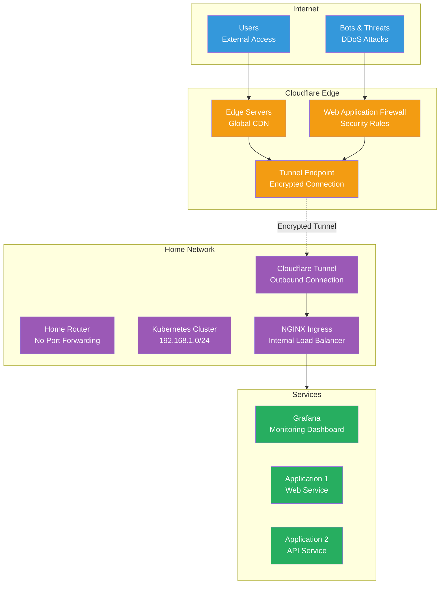

# Cloudflare

Cloudflare provides secure external access to the Anton cluster through Zero Trust tunnels, DNS management, and DDoS protection without exposing any ports on the home network.

## Architecture



## Cloudflare Tunnel

### Zero Trust Architecture
- **No Port Forwarding**: No inbound ports opened on home router
- **Outbound Only**: Tunnel client initiates secure connection to Cloudflare
- **Encrypted**: All traffic encrypted between tunnel client and edge
- **Authentication**: Access control at Cloudflare edge level

### Tunnel Configuration

```yaml
# Cloudflared deployment in Kubernetes
apiVersion: apps/v1
kind: Deployment
metadata:
  name: cloudflared-tunnel
  namespace: network
spec:
  replicas: 2
  selector:
    matchLabels:
      app: cloudflared
  template:
    metadata:
      labels:
        app: cloudflared
    spec:
      containers:
        - name: cloudflared
          image: cloudflare/cloudflared:latest
          args:
            - tunnel
            - --config
            - /etc/cloudflared/config/config.yaml
            - run
          volumeMounts:
            - name: config
              mountPath: /etc/cloudflared/config
              readOnly: true
            - name: creds
              mountPath: /etc/cloudflared/creds
              readOnly: true
      volumes:
        - name: config
          configMap:
            name: cloudflared-config
        - name: creds
          secret:
            secretName: cloudflared-credentials
```

### Tunnel Routes

```yaml
# Example tunnel configuration
apiVersion: v1
kind: ConfigMap
metadata:
  name: cloudflared-config
  namespace: network
data:
  config.yaml: |
    tunnel: <tunnel-uuid>
    credentials-file: /etc/cloudflared/creds/credentials.json
    
    ingress:
      # Grafana monitoring dashboard
      - hostname: grafana.example.com
        service: http://nginx-external:80
        originRequest:
          httpHostHeader: grafana.example.com
          
      # Application services
      - hostname: app.example.com
        service: http://nginx-external:80
        originRequest:
          httpHostHeader: app.example.com
          
      # Catch-all rule (required)
      - service: http_status:404
```

## DNS Management

### Automatic DNS Updates
```yaml
# External-DNS configuration for Cloudflare
apiVersion: apps/v1
kind: Deployment
metadata:
  name: external-dns-cloudflare
  namespace: network
spec:
  template:
    spec:
      containers:
        - name: external-dns
          image: k8s.gcr.io/external-dns/external-dns:v0.13.6
          args:
            - --source=ingress
            - --domain-filter=example.com
            - --provider=cloudflare
            - --cloudflare-proxied
            - --cloudflare-dns-records-per-page=5000
          env:
            - name: CF_API_TOKEN
              valueFrom:
                secretKeyRef:
                  name: cloudflare-api-token
                  key: api-token
```

### DNS Record Types
- **A Records**: Apex domain routing
- **CNAME Records**: Subdomain routing  
- **TXT Records**: Domain verification and SPF
- **Proxied Records**: Traffic routed through Cloudflare

## Security Features

### Web Application Firewall (WAF)

```yaml
# WAF rules configuration (managed via Cloudflare dashboard)
security_rules:
  - name: "Block Common Attacks"
    expression: '(cf.threat_score gt 14) or (http.request.uri.path contains "/admin")'
    action: block
    
  - name: "Rate Limit API"
    expression: '(http.request.uri.path matches "^/api/")'
    action: challenge
    rate_limit:
      period: 60
      requests: 100
      
  - name: "Geographic Restrictions"
    expression: '(ip.geoip.country ne "US" and ip.geoip.country ne "CA")'
    action: challenge
```

### Access Control

```yaml
# Zero Trust Access policies
access_policies:
  - name: "Admin Access"
    resources:
      - "grafana.example.com/admin/*"
    requires:
      - email_ends_with: "@company.com"
      - mfa: required
      
  - name: "Developer Access" 
    resources:
      - "app.example.com/*"
    requires:
      - email_domain: "company.com"
      - device_trust: managed
```

### SSL/TLS Configuration
- **Edge Certificates**: Automatic SSL termination at edge
- **Origin Certificates**: Cloudflare-issued certs for cluster
- **Full Strict Mode**: End-to-end encryption validation
- **HSTS**: HTTP Strict Transport Security headers

## Performance Optimization

### Caching Configuration

```yaml
# Page Rules for caching optimization
page_rules:
  - url: "*.example.com/static/*"
    settings:
      cache_level: cache_everything
      edge_cache_ttl: 2592000  # 30 days
      browser_cache_ttl: 86400  # 1 day
      
  - url: "api.example.com/*"
    settings:
      cache_level: bypass
      disable_performance: true
      
  - url: "grafana.example.com/*"
    settings:
      cache_level: bypass
      disable_apps: true
```

### CDN Settings
- **Minification**: Auto minify CSS, JS, HTML
- **Compression**: Gzip/Brotli compression
- **Image Optimization**: Polish and Mirage
- **HTTP/2 & HTTP/3**: Modern protocol support

## Monitoring and Analytics

### Tunnel Health Monitoring

```bash
# Check tunnel status
kubectl logs -n network -l app=cloudflared

# View tunnel metrics
kubectl exec -n network deployment/cloudflared-tunnel -- \
  cloudflared tunnel info <tunnel-name>

# Monitor connection health
kubectl get pods -n network -l app=cloudflared -w
```

### Cloudflare Analytics

Key metrics available through Cloudflare dashboard:
- **Request Volume**: Total requests and unique visitors
- **Bandwidth**: Data transfer and caching ratios  
- **Security Events**: Blocked threats and challenge completions
- **Performance**: Response times and cache hit ratios

### Prometheus Integration

```yaml
# CloudFlare Exporter for Prometheus
apiVersion: apps/v1
kind: Deployment
metadata:
  name: cloudflare-exporter
  namespace: monitoring
spec:
  template:
    spec:
      containers:
        - name: cloudflare-exporter
          image: lablabs/cloudflare-exporter:latest
          env:
            - name: CF_API_TOKEN
              valueFrom:
                secretKeyRef:
                  name: cloudflare-api-token
                  key: api-token
          ports:
            - containerPort: 8080
              name: metrics
```

## Management Commands

### Tunnel Operations

```bash
# List available tunnels
cloudflared tunnel list

# Create new tunnel
cloudflared tunnel create homelab-tunnel

# Configure tunnel routes
cloudflared tunnel route dns homelab-tunnel grafana.example.com

# Test tunnel connectivity
cloudflared tunnel run --url http://localhost:8080 homelab-tunnel
```

### DNS Management

```bash
# List DNS records
curl -X GET "https://api.cloudflare.com/client/v4/zones/$ZONE_ID/dns_records" \
  -H "Authorization: Bearer $CF_API_TOKEN"

# Create DNS record
curl -X POST "https://api.cloudflare.com/client/v4/zones/$ZONE_ID/dns_records" \
  -H "Authorization: Bearer $CF_API_TOKEN" \
  -H "Content-Type: application/json" \
  --data '{"type":"CNAME","name":"app","content":"tunnel-id.cfargotunnel.com","proxied":true}'

# Update existing record
curl -X PUT "https://api.cloudflare.com/client/v4/zones/$ZONE_ID/dns_records/$RECORD_ID" \
  -H "Authorization: Bearer $CF_API_TOKEN" \
  -H "Content-Type: application/json" \
  --data '{"content":"new-content.example.com"}'
```

### Security Configuration

```bash
# View security events
curl -X GET "https://api.cloudflare.com/client/v4/zones/$ZONE_ID/security/events" \
  -H "Authorization: Bearer $CF_API_TOKEN"

# Update WAF rules
curl -X POST "https://api.cloudflare.com/client/v4/zones/$ZONE_ID/firewall/rules" \
  -H "Authorization: Bearer $CF_API_TOKEN" \
  -H "Content-Type: application/json" \
  --data '{"filter":{"expression":"(ip.country eq \"CN\")"},"action":"block"}'
```

## Troubleshooting

### Connection Issues

```bash
# Test tunnel connectivity
kubectl exec -n network deployment/cloudflared-tunnel -- \
  cloudflared tunnel info <tunnel-name>

# Check tunnel logs for errors
kubectl logs -n network -l app=cloudflared | grep -i error

# Verify DNS resolution
dig +short grafana.example.com
nslookup grafana.example.com 1.1.1.1
```

### Performance Issues

```bash
# Check tunnel latency
kubectl exec -n network deployment/cloudflared-tunnel -- \
  ping -c 5 region1.argotunnel.com

# Monitor bandwidth usage
kubectl top pods -n network -l app=cloudflared

# Test direct vs proxied performance  
curl -w "@curl-format.txt" -s -o /dev/null https://grafana.example.com
```

### Certificate Issues

```bash
# Check SSL certificate status
openssl s_client -connect grafana.example.com:443 -servername grafana.example.com

# Verify certificate chain
curl -vI https://grafana.example.com 2>&1 | grep -E "(SSL|certificate)"

# Test SSL Labs rating
curl -s "https://api.ssllabs.com/api/v3/analyze?host=grafana.example.com"
```

## Best Practices

### Security
- **API Token Permissions**: Limit tokens to minimum required permissions
- **Access Policies**: Implement Zero Trust access controls
- **Rate Limiting**: Configure appropriate rate limits for APIs
- **Monitoring**: Enable security event notifications

### Performance
- **Cache Policies**: Optimize caching rules for application patterns
- **Geographic Routing**: Use Argo Smart Routing for performance
- **Compression**: Enable appropriate compression settings
- **HTTP Versions**: Utilize HTTP/2 and HTTP/3 where supported

### Reliability
- **Multiple Tunnels**: Deploy redundant tunnel instances
- **Health Checks**: Monitor tunnel connectivity continuously
- **Failover**: Configure backup tunnel routes
- **Monitoring**: Set up alerts for tunnel disconnections

Cloudflare provides enterprise-grade security, performance, and reliability features while maintaining the simplicity of a zero-configuration external access solution for the homelab cluster.