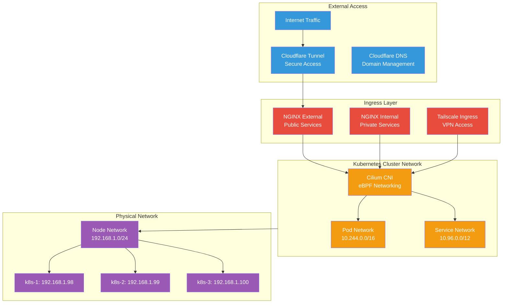

# Networking

The Anton cluster implements a modern, secure networking stack using Cilium for CNI, NGINX for ingress, and Cloudflare for external connectivity, providing high performance and advanced security features.

## Architecture Overview



## Network Layers

### Physical Network
- **Node Subnet**: 192.168.1.0/24
- **Gateway**: 192.168.1.1
- **Connectivity**: Gigabit Ethernet
- **DHCP Reservations**: Static IPs for all nodes

### Cluster Networking
- **Pod CIDR**: 10.244.0.0/16 (managed by Cilium)
- **Service CIDR**: 10.96.0.0/12 (Kubernetes default)
- **CNI**: Cilium with eBPF dataplane
- **kube-proxy**: Replaced by Cilium

### Ingress Classes

```bash
# Available ingress classes
kubectl get ingressclass

NAME        CONTROLLER                 PARAMETERS   AGE
external    k8s.io/external            <none>       68d
internal    k8s.io/internal            <none>       68d
tailscale   tailscale.com/ts-ingress   <none>       68d
```

#### External Ingress
- **Purpose**: Public services accessible from internet
- **Backend**: NGINX controller
- **TLS**: Automatic Let's Encrypt certificates
- **Access**: Via Cloudflare tunnel

#### Internal Ingress  
- **Purpose**: Private services for local network access
- **Backend**: NGINX controller
- **TLS**: Internal certificates
- **Access**: Local network only

#### Tailscale Ingress
- **Purpose**: Secure VPN access to services
- **Backend**: Tailscale ingress controller
- **TLS**: Tailscale-managed certificates
- **Access**: Authenticated VPN users

## Core Components

### Cilium CNI
- **eBPF Dataplane**: Kernel-bypass networking for performance
- **Security Policies**: Layer 3/4 and Layer 7 network policies
- **Service Mesh**: Optional sidecar-free service mesh
- **Load Balancing**: Direct server return (DSR) support

### NGINX Ingress Controllers
- **High Availability**: Multiple controller instances
- **SSL Termination**: Automatic certificate management
- **Rate Limiting**: DDoS protection and resource management
- **Monitoring**: Prometheus metrics integration

### Cloudflare Integration
- **Zero Trust Tunnel**: Secure external access without exposed ports
- **DNS Management**: Automatic DNS record updates
- **DDoS Protection**: Cloudflare's edge protection
- **SSL/TLS**: End-to-end encryption

## Network Policies

### Default Security Posture
```yaml
# Example default deny policy
apiVersion: networking.k8s.io/v1
kind: NetworkPolicy
metadata:
  name: default-deny-all
  namespace: production
spec:
  podSelector: {}
  policyTypes:
    - Ingress
    - Egress
```

### Application-Specific Policies
```yaml
# Allow specific communication
apiVersion: networking.k8s.io/v1
kind: NetworkPolicy
metadata:
  name: allow-frontend-to-backend
spec:
  podSelector:
    matchLabels:
      app: frontend
  policyTypes:
    - Egress
  egress:
    - to:
        - podSelector:
            matchLabels:
              app: backend
      ports:
        - protocol: TCP
          port: 8080
```

## Service Discovery

### DNS Configuration
```bash
# Check DNS resolution
kubectl run test-dns --image=busybox --rm -it -- nslookup kubernetes.default

# View CoreDNS configuration
kubectl get configmap -n kube-system coredns -o yaml
```

### Service Types
- **ClusterIP**: Internal cluster communication
- **NodePort**: Direct node access (limited use)
- **LoadBalancer**: External load balancer (MetalLB if configured)
- **ExternalName**: DNS CNAME to external services

## Monitoring Commands

### Network Status

```bash
# Check Cilium status
kubectl get pods -n kube-system -l k8s-app=cilium

# View Cilium connectivity status
kubectl exec -n kube-system -c cilium-agent ds/cilium -- cilium status

# Check network policies
kubectl get networkpolicies -A

# View service endpoints
kubectl get endpoints -A
```

### Ingress Controllers

```bash
# Check NGINX controller status
kubectl get pods -n network -l app.kubernetes.io/name=ingress-nginx

# View ingress resources
kubectl get ingress -A

# Check certificate status
kubectl get certificates -A

# Monitor ingress metrics
kubectl port-forward -n network svc/ingress-nginx-controller-metrics 10254:10254
```

### Connectivity Testing

```bash
# Test pod-to-pod connectivity
kubectl run test-source --image=busybox --rm -it -- ping 10.244.1.10

# Test service connectivity
kubectl run test-client --image=busybox --rm -it -- wget -qO- http://kubernetes.default/api/v1

# Test external connectivity
kubectl run test-external --image=busybox --rm -it -- wget -qO- https://google.com

# Check DNS resolution
kubectl run test-dns --image=busybox --rm -it -- nslookup prometheus.monitoring.svc.cluster.local
```

## Performance Optimization

### Cilium Configuration

```yaml
# Cilium performance tuning
apiVersion: v1
kind: ConfigMap
metadata:
  name: cilium-config
  namespace: kube-system
data:
  # Enable direct routing for performance
  enable-l7-proxy: "true"
  enable-ipv4-masquerade: "true"
  enable-xt-socket-fallback: "true"
  
  # Optimize for throughput
  tunnel: disabled
  ipam: kubernetes
  
  # Security features
  enable-policy: default
  policy-enforcement: default
```

### NGINX Tuning

```yaml
# NGINX performance configuration
apiVersion: v1
kind: ConfigMap
metadata:
  name: nginx-configuration
  namespace: network
data:
  # Connection handling
  worker-processes: "auto"
  worker-connections: "1024"
  
  # Performance tuning
  keepalive-timeout: "65"
  client-body-buffer-size: "128k"
  client-max-body-size: "50m"
  
  # Compression
  enable-gzip: "true"
  gzip-level: "6"
  gzip-types: "text/plain application/json application/javascript text/css"
```

## Troubleshooting

### Common Network Issues

```bash
# Check Cilium agent health
kubectl exec -n kube-system ds/cilium -- cilium status --verbose

# View network policy enforcement
kubectl exec -n kube-system ds/cilium -- cilium policy get

# Check service load balancing
kubectl exec -n kube-system ds/cilium -- cilium service list

# Diagnose connectivity issues
kubectl exec -n kube-system ds/cilium -- cilium connectivity test
```

### NGINX Issues

```bash
# Check NGINX controller logs
kubectl logs -n network -l app.kubernetes.io/name=ingress-nginx

# View NGINX configuration
kubectl exec -n network deployment/ingress-nginx-controller -- cat /etc/nginx/nginx.conf

# Test backend connectivity
kubectl exec -n network deployment/ingress-nginx-controller -- curl -I http://backend-service:8080/health
```

### DNS Resolution Problems

```bash
# Check CoreDNS pods
kubectl get pods -n kube-system -l k8s-app=kube-dns

# View DNS configuration
kubectl get configmap -n kube-system coredns -o yaml

# Test DNS resolution
kubectl run dns-test --image=busybox --rm -it -- nslookup kubernetes.default.svc.cluster.local
```

## Security Features

### Network Segmentation
- **Namespace Isolation**: Default network policies per namespace
- **Microsegmentation**: Pod-level network policies
- **Layer 7 Filtering**: Application-aware security policies

### TLS/SSL Management
- **Cert-Manager**: Automatic certificate lifecycle
- **Let's Encrypt**: Free SSL certificates for public services
- **Internal CA**: Self-signed certificates for internal services

### DDoS Protection
- **Cloudflare Shield**: Edge-level protection
- **Rate Limiting**: Application-level request limiting
- **Connection Limits**: NGINX connection throttling

The networking infrastructure provides a robust, secure, and high-performance foundation that supports both internal cluster communication and external service exposure while maintaining strong security boundaries.