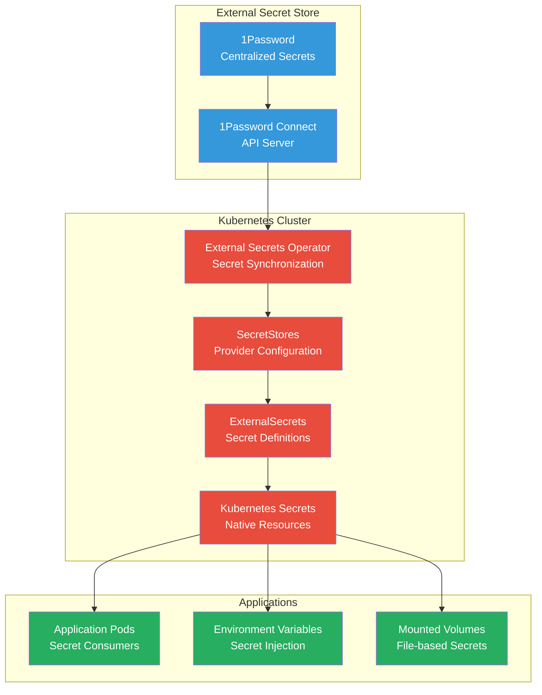

# Secrets Management

The Anton cluster implements secure secrets management using the External Secrets Operator integrated with 1Password, providing centralized secret storage, automatic synchronization, and secure access patterns.

## Architecture Overview



## External Secrets Operator

### Core Components

#### Operator Deployment
```yaml
apiVersion: apps/v1
kind: Deployment
metadata:
  name: external-secrets
  namespace: external-secrets
spec:
  replicas: 1
  selector:
    matchLabels:
      app.kubernetes.io/name: external-secrets
  template:
    spec:
      containers:
        - name: external-secrets
          image: ghcr.io/external-secrets/external-secrets:v0.9.11
          args:
            - --concurrent=1
            - --log-level=info
            - --metrics-addr=:8080
          ports:
            - name: metrics
              containerPort: 8080
```

#### SecretStore Configuration

```yaml
# 1Password SecretStore
apiVersion: external-secrets.io/v1
kind: SecretStore
metadata:
  name: onepassword-secret-store
  namespace: external-secrets
spec:
  provider:
    onepassword:
      connectHost: http://onepassword-connect:8080
      vaults:
        secrets: 1
      auth:
        secretRef:
          connectToken:
            name: onepassword-token
            key: token
```

#### ClusterSecretStore

```yaml
# Cluster-wide SecretStore for shared secrets
apiVersion: external-secrets.io/v1
kind: ClusterSecretStore
metadata:
  name: onepassword-cluster-store
spec:
  provider:
    onepassword:
      connectHost: http://onepassword-connect.external-secrets:8080
      vaults:
        infrastructure: 1
        applications: 2
      auth:
        secretRef:
          connectToken:
            name: onepassword-token
            namespace: external-secrets
            key: token
```

## Secret Patterns

### Database Credentials

```yaml
# PostgreSQL database credentials
apiVersion: external-secrets.io/v1
kind: ExternalSecret
metadata:
  name: postgres-credentials
  namespace: database
spec:
  refreshInterval: 1h
  secretStoreRef:
    name: onepassword-cluster-store
    kind: ClusterSecretStore
  target:
    name: postgres-secret
    creationPolicy: Owner
    deletionPolicy: Retain
  data:
    - secretKey: username
      remoteRef:
        key: postgres-database
        property: username
    - secretKey: password
      remoteRef:
        key: postgres-database
        property: password
    - secretKey: database
      remoteRef:
        key: postgres-database
        property: database
```

### API Keys and Tokens

```yaml
# External service API keys
apiVersion: external-secrets.io/v1
kind: ExternalSecret
metadata:
  name: monitoring-api-keys
  namespace: monitoring
spec:
  refreshInterval: 6h
  secretStoreRef:
    name: onepassword-cluster-store
    kind: ClusterSecretStore
  target:
    name: monitoring-secrets
  data:
    - secretKey: cloudflare-api-token
      remoteRef:
        key: cloudflare-credentials
        property: api-token
    - secretKey: github-token
      remoteRef:
        key: github-credentials
        property: personal-access-token
    - secretKey: docker-registry-token
      remoteRef:
        key: docker-credentials
        property: registry-token
```

### TLS Certificates

```yaml
# Custom TLS certificates
apiVersion: external-secrets.io/v1
kind: ExternalSecret
metadata:
  name: custom-tls-certificates
  namespace: network
spec:
  refreshInterval: 24h
  secretStoreRef:
    name: onepassword-cluster-store
    kind: ClusterSecretStore
  target:
    name: custom-tls-secret
    type: kubernetes.io/tls
  data:
    - secretKey: tls.crt
      remoteRef:
        key: internal-ca-certificate
        property: certificate
    - secretKey: tls.key
      remoteRef:
        key: internal-ca-certificate
        property: private-key
```

## 1Password Integration

### 1Password Connect Server

```yaml
# 1Password Connect deployment
apiVersion: apps/v1
kind: Deployment
metadata:
  name: onepassword-connect
  namespace: external-secrets
spec:
  replicas: 1
  selector:
    matchLabels:
      app: onepassword-connect
  template:
    spec:
      containers:
        - name: connect-api
          image: 1password/connect-api:1.7.2
          env:
            - name: OP_BUS_PORT
              value: "11220"
            - name: OP_SESSION
              valueFrom:
                secretKeyRef:
                  name: onepassword-credentials
                  key: 1password-credentials.json
          ports:
            - containerPort: 8080
              name: api
            - containerPort: 11220
              name: bus
          volumeMounts:
            - name: shared-data
              mountPath: /home/opuser/.op/data
        
        - name: connect-sync
          image: 1password/connect-sync:1.7.2
          env:
            - name: OP_SESSION
              valueFrom:
                secretKeyRef:
                  name: onepassword-credentials
                  key: 1password-credentials.json
            - name: OP_HTTP_PORT
              value: "8081"
          ports:
            - containerPort: 8081
              name: sync
          volumeMounts:
            - name: shared-data
              mountPath: /home/opuser/.op/data
      volumes:
        - name: shared-data
          emptyDir: {}
```

### Access Token Configuration

```yaml
# 1Password Connect access token
apiVersion: v1
kind: Secret
metadata:
  name: onepassword-token
  namespace: external-secrets
type: Opaque
stringData:
  token: "YOUR_1PASSWORD_CONNECT_TOKEN"
```

## Secret Usage Patterns

### Environment Variables

```yaml
# Application using secrets as environment variables
apiVersion: apps/v1
kind: Deployment
metadata:
  name: web-application
spec:
  template:
    spec:
      containers:
        - name: app
          image: myapp:latest
          env:
            - name: DATABASE_URL
              valueFrom:
                secretKeyRef:
                  name: postgres-secret
                  key: database-url
            - name: API_KEY
              valueFrom:
                secretKeyRef:
                  name: monitoring-secrets
                  key: api-key
          envFrom:
            - secretRef:
                name: app-config-secrets
```

### Volume Mounts

```yaml
# Mounting secrets as files
spec:
  template:
    spec:
      containers:
        - name: app
          volumeMounts:
            - name: tls-certs
              mountPath: /etc/ssl/certs
              readOnly: true
            - name: config-files
              mountPath: /etc/config
              readOnly: true
      volumes:
        - name: tls-certs
          secret:
            secretName: custom-tls-secret
            defaultMode: 0600
        - name: config-files
          secret:
            secretName: app-config-secret
            items:
              - key: config.yaml
                path: application.yaml
                mode: 0644
```

### Init Containers

```yaml
# Using secrets in init containers for setup
spec:
  template:
    spec:
      initContainers:
        - name: database-migration
          image: migrate:latest
          env:
            - name: DATABASE_URL
              valueFrom:
                secretKeyRef:
                  name: postgres-secret
                  key: migration-url
          command: ["migrate", "-path", "/migrations", "-database", "$(DATABASE_URL)", "up"]
```

## Security Best Practices

### Secret Rotation

```yaml
# Automatic secret rotation configuration
apiVersion: external-secrets.io/v1
kind: ExternalSecret
metadata:
  name: rotating-api-key
spec:
  refreshInterval: 1h  # Check for updates every hour
  target:
    name: api-key-secret
    creationPolicy: Owner
    deletionPolicy: Delete  # Clean up when ExternalSecret is deleted
  data:
    - secretKey: api-key
      remoteRef:
        key: service-api-credentials
        property: current-key
        # Optional version pinning
        version: latest
```

### Access Control

```yaml
# RBAC for External Secrets Operator
apiVersion: rbac.authorization.k8s.io/v1
kind: Role
metadata:
  name: external-secrets-reader
  namespace: application
rules:
  - apiGroups: ["external-secrets.io"]
    resources: ["externalsecrets", "secretstores"]
    verbs: ["get", "list", "watch"]
  - apiGroups: [""]
    resources: ["secrets"]
    verbs: ["get", "list", "watch", "create", "update", "patch"]

---
apiVersion: rbac.authorization.k8s.io/v1
kind: RoleBinding
metadata:
  name: external-secrets-binding
  namespace: application
subjects:
  - kind: ServiceAccount
    name: external-secrets
    namespace: external-secrets
roleRef:
  kind: Role
  name: external-secrets-reader
  apiGroup: rbac.authorization.k8s.io
```

### Network Policies

```yaml
# Restrict access to 1Password Connect
apiVersion: networking.k8s.io/v1
kind: NetworkPolicy
metadata:
  name: onepassword-connect-access
  namespace: external-secrets
spec:
  podSelector:
    matchLabels:
      app: onepassword-connect
  policyTypes:
    - Ingress
  ingress:
    - from:
        - namespaceSelector:
            matchLabels:
              name: external-secrets
        - podSelector:
            matchLabels:
              app.kubernetes.io/name: external-secrets
      ports:
        - protocol: TCP
          port: 8080
```

## Monitoring and Operations

### Health Checks

```bash
# Check External Secrets Operator status
kubectl get pods -n external-secrets

# View ExternalSecret status
kubectl get externalsecrets -A

# Check SecretStore connectivity
kubectl describe secretstore onepassword-secret-store -n external-secrets

# Verify 1Password Connect health
kubectl port-forward -n external-secrets svc/onepassword-connect 8080:8080
curl http://localhost:8080/health
```

### Troubleshooting

```bash
# Check operator logs
kubectl logs -n external-secrets -l app.kubernetes.io/name=external-secrets

# View ExternalSecret events
kubectl describe externalsecret postgres-credentials -n database

# Test SecretStore connection
kubectl get secretstore onepassword-cluster-store -o yaml

# Check 1Password Connect logs
kubectl logs -n external-secrets -l app=onepassword-connect -c connect-api
kubectl logs -n external-secrets -l app=onepassword-connect -c connect-sync
```

### Metrics and Monitoring

```yaml
# ServiceMonitor for External Secrets Operator
apiVersion: monitoring.coreos.com/v1
kind: ServiceMonitor
metadata:
  name: external-secrets-metrics
spec:
  selector:
    matchLabels:
      app.kubernetes.io/name: external-secrets
  endpoints:
    - port: metrics
      path: /metrics
```

## Management Commands

### Secret Operations

```bash
# List all ExternalSecrets
kubectl get externalsecrets -A

# Force refresh of specific secret
kubectl annotate externalsecret postgres-credentials -n database \
  force-sync="$(date +%s)" --overwrite

# Check secret synchronization status
kubectl get externalsecrets -o wide

# View generated Kubernetes secret
kubectl get secret postgres-secret -n database -o yaml
```

### 1Password Operations

```bash
# Test 1Password Connect API
kubectl exec -n external-secrets deploy/onepassword-connect -c connect-api -- \
  curl -s http://localhost:8080/v1/vaults

# Check vault access
kubectl port-forward -n external-secrets svc/onepassword-connect 8080:8080
curl -H "Authorization: Bearer $YOUR_OP_CONNECT_TOKEN" \
  http://localhost:8080/v1/vaults/secrets/items
```

### Debugging Secret Issues

```bash
# Check secret creation events
kubectl get events -n database --field-selector reason=Created

# Verify secret content (be careful in production)
kubectl get secret postgres-secret -n database -o jsonpath='{.data.username}' | base64 -d

# Test application access to secrets
kubectl exec -n database deployment/postgres-app -- \
  env | grep -E "(PASSWORD|TOKEN|KEY)"
```

## Legacy SOPS Support

For existing SOPS-encrypted secrets, the cluster maintains backward compatibility:

```yaml
# SOPS-encrypted secret (legacy)
apiVersion: v1
kind: Secret
metadata:
  name: legacy-sops-secret
  namespace: application
type: Opaque
data:
  password: ENC[AES256_GCM,data:...,tag:...,type:str]
```

```bash
# Decrypt SOPS secret for migration
sops -d legacy-secret.sops.yaml > decrypted-secret.yaml

# Migrate to 1Password and create ExternalSecret
# Add to 1Password vault, then create ExternalSecret resource
```

The secrets management system provides secure, centralized, and automated secret handling while maintaining the flexibility to support various secret types and access patterns across the Anton cluster.