# Storage

The Anton cluster uses Rook-Ceph to provide distributed, software-defined storage that delivers high availability, scalability, and performance for all stateful workloads.

## Architecture Overview

```mermaid
flowchart TD
    subgraph nodes[Physical Nodes]
        node1[k8s-1<br/>192.168.1.98<br/>2x 1TB NVMe]
        node2[k8s-2<br/>192.168.1.99<br/>2x 1TB NVMe]
        node3[k8s-3<br/>192.168.1.100<br/>2x 1TB NVMe]
    end
    
    subgraph rook[Rook Operator]
        operator[Rook Operator<br/>Lifecycle Management]
        discover[Device Discovery<br/>Automatic Detection]
    end
    
    subgraph ceph[Ceph Components]
        mon[MON Daemons<br/>Cluster State]
        mgr[MGR Daemons<br/>Management]
        osd[OSD Daemons<br/>6x 1TB Storage]
        mds[MDS Daemons<br/>CephFS Metadata]
        rgw[RGW Daemons<br/>S3 Gateway]
    end
    
    subgraph storage[Storage Classes]
        block[ceph-block<br/>RBD Volumes]
        fs[ceph-filesystem<br/>Shared Storage]
        bucket[ceph-bucket<br/>Object Storage]
    end
    
    subgraph apps[Applications]
        postgres[PostgreSQL<br/>Databases]
        prometheus[Prometheus<br/>Metrics]
        loki[Loki<br/>Log Storage]
        registry[Container Registry<br/>Image Storage]
    end
    
    nodes --> rook
    rook --> ceph
    ceph --> storage
    storage --> apps
    
    classDef physical fill:#e1f5fe
    classDef rook_comp fill:#3498db,color:white
    classDef ceph_comp fill:#e74c3c,color:white
    classDef storage_comp fill:#9b59b6,color:white
    classDef app_comp fill:#27ae60,color:white
    
    class node1,node2,node3 physical
    class operator,discover rook_comp
    class mon,mgr,osd,mds,rgw ceph_comp
    class block,fs,bucket storage_comp
    class postgres,prometheus,loki,registry app_comp
```



## Storage Classes

The cluster provides three storage classes optimized for different use cases:

### Block Storage (ceph-block) - Default
```yaml
apiVersion: storage.k8s.io/v1
kind: StorageClass
metadata:
  name: ceph-block
provisioner: storage.rbd.csi.ceph.com
parameters:
  clusterID: storage
  pool: ceph-blockpool
  imageFormat: "2"
  imageFeatures: layering
  csi.storage.k8s.io/provisioner-secret-name: rook-csi-rbd-provisioner
  csi.storage.k8s.io/provisioner-secret-namespace: storage
  csi.storage.k8s.io/node-stage-secret-name: rook-csi-rbd-node
  csi.storage.k8s.io/node-stage-secret-namespace: storage
allowVolumeExpansion: true
reclaimPolicy: Delete
volumeBindingMode: Immediate
```

**Use Cases:**
- Database storage (PostgreSQL, MongoDB)
- Application data volumes
- Prometheus metrics storage
- High-performance workloads

### Filesystem Storage (ceph-filesystem)
```yaml
apiVersion: storage.k8s.io/v1
kind: StorageClass
metadata:
  name: ceph-filesystem
provisioner: storage.cephfs.csi.ceph.com
parameters:
  clusterID: storage
  fsName: ceph-filesystem
  pool: ceph-filesystem-data0
allowVolumeExpansion: true
reclaimPolicy: Delete
volumeBindingMode: Immediate
```

**Use Cases:**
- Shared storage across multiple pods
- Content management systems
- Development environments
- ReadWriteMany access patterns

### Object Storage (ceph-bucket)
```yaml
apiVersion: storage.k8s.io/v1
kind: StorageClass
metadata:
  name: ceph-bucket
provisioner: rook-ceph.rook.io/bucket
parameters:
  objectStoreName: ceph-objectstore
  bucketName: app-bucket
reclaimPolicy: Delete
```

**Use Cases:**
- Container registry backends
- Log storage (Loki chunks)
- Backup storage
- Static website content

## Cluster Configuration

### Physical Layout
- **Total Capacity**: 6x 1TB NVMe SSDs (6TB raw)
- **Replication**: 3-way replication for all data
- **Usable Capacity**: ~2TB after replication and overhead
- **Failure Domain**: Host-level (can survive single node failure)

### Ceph Cluster Health

```bash
# Check overall cluster health
kubectl -n storage exec deploy/rook-ceph-tools -- ceph status

# View cluster capacity and usage
kubectl -n storage exec deploy/rook-ceph-tools -- ceph df

# Check OSD status
kubectl -n storage exec deploy/rook-ceph-tools -- ceph osd status

# View placement group health
kubectl -n storage exec deploy/rook-ceph-tools -- ceph pg stat
```

## Performance Characteristics

### Throughput Expectations
- **Sequential Read**: ~400-500 MB/s per OSD
- **Sequential Write**: ~200-300 MB/s per OSD  
- **Random IOPS**: 10K-15K IOPS per OSD
- **Aggregate**: ~2.4GB/s read, ~1.8GB/s write theoretical

### Latency Profile
- **Block Storage**: 1-5ms typical latency
- **Filesystem**: 2-8ms typical latency
- **Object Storage**: 10-50ms typical latency

## Resource Allocation

### Current Storage Usage

```bash
# Check PVC usage across namespaces
kubectl get pvc -A

# View storage consumption by application
kubectl get pvc -A -o custom-columns="NAMESPACE:.metadata.namespace,NAME:.metadata.name,SIZE:.spec.resources.requests.storage,STORAGECLASS:.spec.storageClassName"

# Monitor volume usage
kubectl exec -n storage deploy/rook-ceph-tools -- rbd du -p ceph-blockpool
```

### Capacity Planning

```bash
# Check available space
kubectl -n storage exec deploy/rook-ceph-tools -- ceph df detail

# View OSD utilization
kubectl -n storage exec deploy/rook-ceph-tools -- ceph osd df

# Monitor cluster growth trends
kubectl -n storage exec deploy/rook-ceph-tools -- ceph tell osd.* perf schema
```

## Management Commands

### Cluster Operations

```bash
# Access Ceph toolbox
kubectl -n storage exec -it deploy/rook-ceph-tools -- bash

# View cluster topology
kubectl -n storage exec deploy/rook-ceph-tools -- ceph osd tree

# Check cluster warnings
kubectl -n storage exec deploy/rook-ceph-tools -- ceph health detail

# View active operations
kubectl -n storage exec deploy/rook-ceph-tools -- ceph -w
```

### Storage Administration

```bash
# List all pools
kubectl -n storage exec deploy/rook-ceph-tools -- ceph osd pool ls detail

# Check pool statistics
kubectl -n storage exec deploy/rook-ceph-tools -- ceph osd pool stats

# View RBD images
kubectl -n storage exec deploy/rook-ceph-tools -- rbd ls -p ceph-blockpool

# Check image details
kubectl -n storage exec deploy/rook-ceph-tools -- rbd info -p ceph-blockpool pvc-<uuid>
```

### Performance Monitoring

```bash
# Monitor cluster performance
kubectl -n storage exec deploy/rook-ceph-tools -- ceph tell osd.* perf schema

# Check slow operations
kubectl -n storage exec deploy/rook-ceph-tools -- ceph daemon osd.0 dump_historic_slow_ops

# View bandwidth utilization
kubectl top pods -n storage

# Monitor OSD performance metrics
kubectl -n storage exec deploy/rook-ceph-tools -- ceph tell osd.* perf schema
```

## Troubleshooting

### Health Diagnostics

```bash
# Comprehensive health check
kubectl -n storage exec deploy/rook-ceph-tools -- ceph health detail

# Check for stuck PGs
kubectl -n storage exec deploy/rook-ceph-tools -- ceph pg dump_stuck

# View cluster logs
kubectl logs -n storage -l app=rook-ceph-mon

# Check OSD logs
kubectl logs -n storage -l app=rook-ceph-osd
```

### Recovery Operations

```bash
# Restart stuck OSDs
kubectl -n storage delete pod -l app=rook-ceph-osd,ceph_daemon_id=0

# Force scrub operations
kubectl -n storage exec deploy/rook-ceph-tools -- ceph pg scrub <pg-id>

# Check and repair filesystem
kubectl -n storage exec deploy/rook-ceph-tools -- ceph fs status
kubectl -n storage exec deploy/rook-ceph-tools -- ceph mds repaired
```

## Best Practices

### Volume Management
- **Size Planning**: Plan for 3x replication overhead
- **Performance**: Use block storage for databases
- **Backup**: Implement regular snapshot policies
- **Monitoring**: Set up alerts for capacity thresholds

### Maintenance
- **Regular Health Checks**: Daily cluster health monitoring
- **Capacity Monitoring**: Track usage growth trends
- **Performance Baselines**: Establish performance benchmarks
- **Update Strategy**: Plan Ceph version upgrades carefully

The Rook-Ceph storage system provides enterprise-grade distributed storage capabilities, ensuring data durability, high availability, and consistent performance for all cluster workloads.