# Operations

Daily operations, maintenance procedures, and troubleshooting workflows for the Rook-Ceph storage system in the Anton cluster.

## Daily Health Checks

### Automated Health Monitoring

```bash
# Comprehensive cluster health check
./scripts/storage-health-check.ts --json

# Quick status overview  
kubectl -n storage exec deploy/rook-ceph-tools -- ceph status

# Check for any warnings or errors
kubectl -n storage exec deploy/rook-ceph-tools -- ceph health detail
```

### Key Health Indicators

```mermaid
flowchart TD
    health[Cluster Health Check]
    
    health --> mon_check{MON Quorum?}
    health --> osd_check{All OSDs Up?}  
    health --> pg_check{PGs Active+Clean?}
    health --> space_check{Storage <85%?}
    
    mon_check -->|Yes| mon_ok[✅ Monitors OK]
    mon_check -->|No| mon_alert[🚨 Monitor Issues]
    
    osd_check -->|Yes| osd_ok[✅ OSDs Healthy]
    osd_check -->|No| osd_alert[🚨 OSD Problems]
    
    pg_check -->|Yes| pg_ok[✅ Data Healthy]
    pg_check -->|No| pg_alert[🚨 Data Issues]
    
    space_check -->|Yes| space_ok[✅ Capacity OK]
    space_check -->|No| space_alert[⚠️ Space Warning]
    
    classDef ok fill:#27ae60,color:white
    classDef warning fill:#f39c12,color:white
    classDef alert fill:#e74c3c,color:white
    
    class mon_ok,osd_ok,pg_ok,space_ok ok
    class space_alert warning
    class mon_alert,osd_alert,pg_alert alert
```



## Routine Maintenance

### Weekly Operations

```bash
# Check cluster performance trends
kubectl -n storage exec deploy/rook-ceph-tools -- ceph tell osd.* perf schema

# Review slow operations
kubectl -n storage exec deploy/rook-ceph-tools -- ceph daemon osd.0 dump_historic_slow_ops

# Validate data consistency (automatically scheduled but can be manual)
kubectl -n storage exec deploy/rook-ceph-tools -- ceph pg scrub <pg-id>

# Clean up old snapshots if any
kubectl -n storage exec deploy/rook-ceph-tools -- rbd snap ls -p ceph-blockpool
```

### Monthly Operations

```bash
# Review capacity trends and plan expansion
kubectl -n storage exec deploy/rook-ceph-tools -- ceph df detail

# Check for device wear indicators
kubectl -n storage exec deploy/rook-ceph-tools -- ceph device ls

# Perform deep scrub on critical pools
kubectl -n storage exec deploy/rook-ceph-tools -- ceph pg deep-scrub <pg-id>

# Review and update retention policies
kubectl get pvc -A --sort-by=.metadata.creationTimestamp
```

## Capacity Management

### Storage Monitoring

```bash
# Current usage breakdown
kubectl -n storage exec deploy/rook-ceph-tools -- ceph df

# Per-pool utilization
kubectl -n storage exec deploy/rook-ceph-tools -- ceph osd pool stats

# OSD utilization distribution
kubectl -n storage exec deploy/rook-ceph-tools -- ceph osd df tree

# Identify largest consumers
kubectl -n storage exec deploy/rook-ceph-tools -- rbd du -p ceph-blockpool --format json
```

### Capacity Planning

```promql
# Prometheus queries for capacity planning

# Current usage percentage
100 * (ceph_cluster_total_used_bytes / ceph_cluster_total_bytes)

# Growth rate (bytes per hour)
rate(ceph_cluster_total_used_bytes[24h]) * 3600

# Projected time to 85% capacity
((ceph_cluster_total_bytes * 0.85) - ceph_cluster_total_used_bytes) / 
rate(ceph_cluster_total_used_bytes[7d]) / 86400
```

### Expansion Procedures

```yaml
# Adding new storage to existing nodes
apiVersion: ceph.rook.io/v1
kind: CephCluster
metadata:
  name: rook-ceph
spec:
  storage:
    nodes:
      - name: k8s-1
        devices:
          - name: /dev/sdb  # Existing
          - name: /dev/sdc  # New device
```

## Performance Monitoring

### Baseline Performance Metrics

```bash
# Establish performance baselines
kubectl -n storage exec deploy/rook-ceph-tools -- rados bench -p ceph-blockpool 60 write
kubectl -n storage exec deploy/rook-ceph-tools -- rados bench -p ceph-blockpool 60 seq
kubectl -n storage exec deploy/rook-ceph-tools -- rados bench -p ceph-blockpool 60 rand

# Monitor real-time performance
watch "kubectl -n storage exec deploy/rook-ceph-tools -- ceph osd perf"
```

### Performance Tuning

```bash
# Adjust OSD memory targets (if needed)
kubectl -n storage exec deploy/rook-ceph-tools -- ceph config set osd.* osd_memory_target 2147483648

# Tune RBD cache settings
kubectl -n storage exec deploy/rook-ceph-tools -- ceph config set client rbd_cache true
kubectl -n storage exec deploy/rook-ceph-tools -- ceph config set client rbd_cache_size 67108864

# Optimize placement group count
kubectl -n storage exec deploy/rook-ceph-tools -- ceph osd pool autoscale-status
```

## Backup and Recovery

### Volume Snapshots

```bash
# Create volume snapshots for backup
kubectl apply -f - <<EOF
apiVersion: snapshot.storage.k8s.io/v1
kind: VolumeSnapshot
metadata:
  name: postgres-backup-$(date +%Y%m%d)
  namespace: database
spec:
  volumeSnapshotClassName: csi-ceph-blockpool-snapclass
  source:
    persistentVolumeClaimName: postgres-data
EOF

# List available snapshots
kubectl get volumesnapshot -A

# Restore from snapshot
kubectl apply -f - <<EOF
apiVersion: v1
kind: PersistentVolumeClaim
metadata:
  name: postgres-restore
spec:
  dataSource:
    name: postgres-backup-20241201
    kind: VolumeSnapshot
    apiGroup: snapshot.storage.k8s.io
  accessModes: [ReadWriteOnce]
  resources:
    requests:
      storage: 10Gi
  storageClassName: ceph-block
EOF
```

### Cluster-Level Backup

```bash
# Export cluster configuration
kubectl get cephcluster -n storage rook-ceph -o yaml > cluster-backup.yaml
kubectl get cephblockpool -n storage -o yaml >> cluster-backup.yaml
kubectl get cephobjectstore -n storage -o yaml >> cluster-backup.yaml

# Backup critical data using Velero (if installed)
velero backup create storage-backup --include-namespaces storage
```

## Troubleshooting Workflows

### OSD Issues

```bash
# Identify problematic OSD
kubectl -n storage exec deploy/rook-ceph-tools -- ceph osd tree | grep down

# Check OSD logs
kubectl logs -n storage -l ceph_daemon_id=0 | tail -50

# Restart failed OSD
kubectl -n storage delete pod -l ceph_daemon_id=0

# If restart doesn't help, mark out and back in
kubectl -n storage exec deploy/rook-ceph-tools -- ceph osd out 0
kubectl -n storage exec deploy/rook-ceph-tools -- ceph osd in 0
```

### Placement Group Issues

```bash
# Identify stuck PGs
kubectl -n storage exec deploy/rook-ceph-tools -- ceph pg dump_stuck

# Check specific PG details
kubectl -n storage exec deploy/rook-ceph-tools -- ceph pg 1.0 query

# Force recovery if needed
kubectl -n storage exec deploy/rook-ceph-tools -- ceph pg force-recovery 1.0
```

### Monitor Issues

```bash
# Check monitor quorum
kubectl -n storage exec deploy/rook-ceph-tools -- ceph mon stat

# View monitor details and identify issues
kubectl -n storage exec deploy/rook-ceph-tools -- ceph mon dump

# Restart problematic monitor
kubectl -n storage delete pod rook-ceph-mon-a

# Check monitor logs
kubectl logs -n storage rook-ceph-mon-a
```

### CSI Driver Issues

```bash
# Check CSI driver pods
kubectl get pods -n storage -l app=csi-rbdplugin

# View CSI driver logs
kubectl logs -n storage -l app=csi-rbdplugin -c csi-rbdplugin

# Check volume attachment issues
kubectl describe volumeattachment

# Restart CSI components if needed
kubectl -n storage rollout restart daemonset csi-rbdplugin
kubectl -n storage rollout restart deployment csi-rbdplugin-provisioner
```

## Emergency Procedures

### Cluster Recovery

```bash
# If cluster is completely down, start with monitors
kubectl -n storage scale deployment rook-ceph-operator --replicas=1

# Wait for operator to stabilize, then check cluster
kubectl -n storage exec deploy/rook-ceph-tools -- ceph status

# If toolbox is unavailable, access from operator
kubectl -n storage exec deploy/rook-ceph-operator -- ceph status --connect-timeout 10
```

### Data Recovery

```bash
# If data corruption is suspected
kubectl -n storage exec deploy/rook-ceph-tools -- ceph pg repair <pg-id>

# For severe corruption, export/import pool
kubectl -n storage exec deploy/rook-ceph-tools -- rados export -p ceph-blockpool pool-backup.dump
kubectl -n storage exec deploy/rook-ceph-tools -- rados import -p ceph-blockpool-new pool-backup.dump
```

### Disaster Recovery

```bash
# Complete cluster rebuild (last resort)
# ⚠️  WARNING: This will DELETE ALL DATA. Ensure backups are verified and accessible.
# ⚠️  CRITICAL: Verify no other clusters share the same storage devices.
# 1. Backup critical data and configurations
# 2. Delete CephCluster resource
kubectl -n storage delete cephcluster rook-ceph --wait

# 3. Clean up node storage
kubectl -n storage get job -l app=rook-ceph-detect-version

# 4. Redeploy with backed up configuration
kubectl apply -f cluster-backup.yaml
```

## Automation Scripts

### Health Check Script

```typescript
// Example monitoring script structure
export async function checkStorageHealth() {
  const checks = [
    checkClusterHealth(),
    checkOSDStatus(), 
    checkPGHealth(),
    checkCapacity(),
    checkPerformance()
  ];
  
  const results = await Promise.all(checks);
  return generateReport(results);
}
```

### Alert Integration

```yaml
# Example PrometheusRule for storage alerts
apiVersion: monitoring.coreos.com/v1
kind: PrometheusRule
metadata:
  name: ceph-storage-alerts
spec:
  groups:
    - name: ceph.rules
      rules:
        - alert: CephClusterDown
          expr: ceph_health_status != 0
          for: 5m
          labels:
            severity: critical
          annotations:
            summary: "Ceph cluster is not healthy"
            
        - alert: CephOSDDown  
          expr: ceph_osd_up < count(ceph_osd_up)
          for: 2m
          labels:
            severity: warning
```

These operational procedures ensure the storage system remains healthy, performant, and available while providing clear workflows for both routine maintenance and emergency situations.