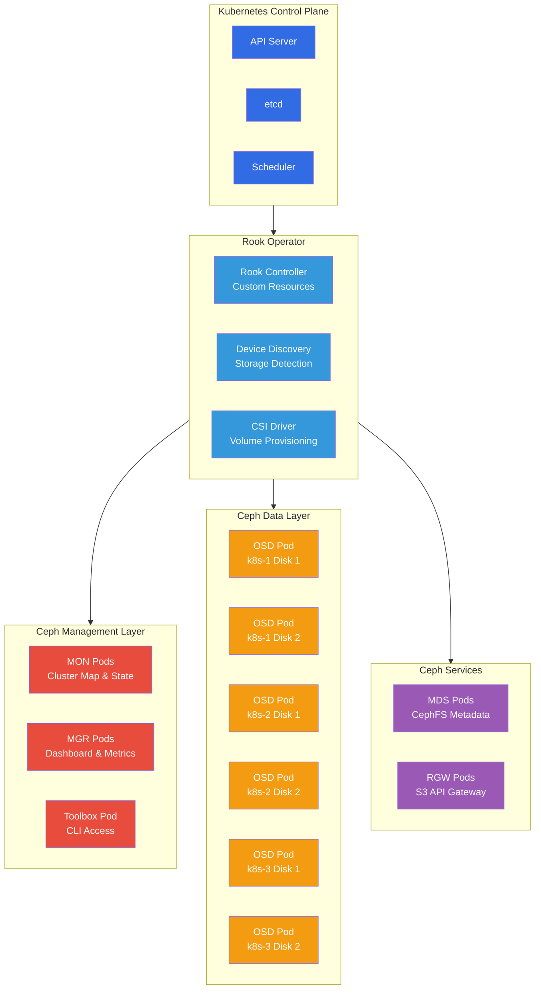
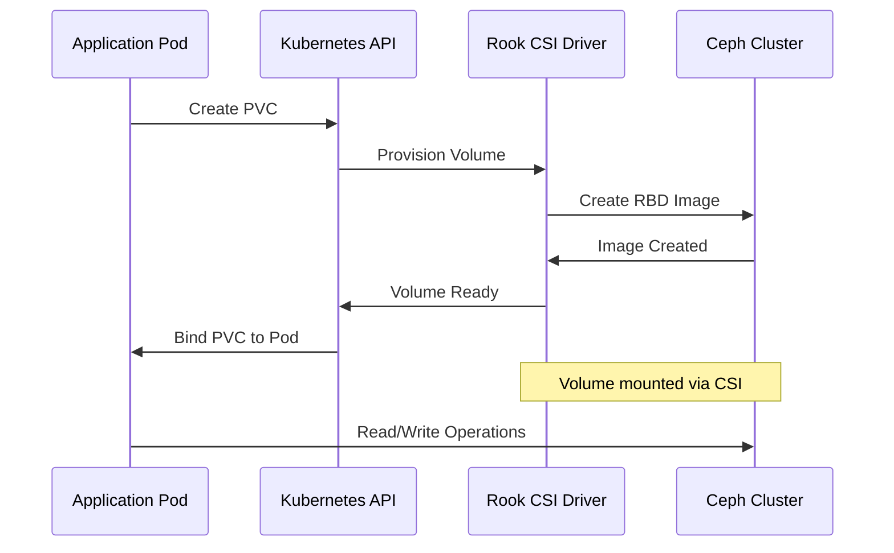

# Rook-Ceph

Rook is a Kubernetes operator that turns distributed storage systems like Ceph into self-managing, self-scaling, and self-healing storage services integrated deeply with Kubernetes.

## Architecture Deep Dive



## Custom Resources

Rook extends Kubernetes with Custom Resource Definitions (CRDs) to manage Ceph:

### CephCluster

The primary resource defining the Ceph cluster:

```yaml
apiVersion: ceph.rook.io/v1
kind: CephCluster
metadata:
  name: rook-ceph
  namespace: storage
spec:
  cephVersion:
    image: quay.io/ceph/ceph:v19.2.3
    allowUnsupported: false
  dataDirHostPath: /var/lib/rook
  skipUpgradeChecks: false
  continueUpgradeAfterChecksEvenIfNotHealthy: false
  
  mon:
    count: 3
    allowMultiplePerNode: false
  
  mgr:
    count: 2
    allowMultiplePerNode: false
    modules:
      - name: pg_autoscaler
        enabled: true
      - name: rook
        enabled: true
  
  dashboard:
    enabled: true
    ssl: false
  
  storage:
    useAllNodes: true
    useAllDevices: false
    deviceFilter: "^sd[b-z]"  # Only use secondary drives
```

### CephBlockPool

Defines storage pools for block devices:

```yaml
apiVersion: ceph.rook.io/v1
kind: CephBlockPool
metadata:
  name: ceph-blockpool
  namespace: storage
spec:
  failureDomain: host
  replicated:
    size: 3
    requireSafeReplicaSize: true
  parameters:
    compression_mode: aggressive
    compression_algorithm: snappy
  mirroring:
    enabled: false
```

### CephObjectStore

Configures S3-compatible object storage:

```yaml
apiVersion: ceph.rook.io/v1
kind: CephObjectStore
metadata:
  name: ceph-objectstore
  namespace: storage
spec:
  metadataPool:
    failureDomain: host
    replicated:
      size: 3
  dataPool:
    failureDomain: host
    replicated:
      size: 3
  preservePoolsOnDelete: true
  gateway:
    instances: 2
    placement:
      nodeAffinity:
        requiredDuringSchedulingIgnoredDuringExecution:
          nodeSelectorTerms:
            - matchExpressions:
                - key: role
                  operator: In
                  values: [storage-node]
    resources:
      requests:
        cpu: 500m
        memory: 1Gi
      limits:
        cpu: 2000m
        memory: 4Gi
```

## Component Details

### MON (Monitor) Daemons

Monitors maintain the cluster map and provide consensus:

```bash
# Check monitor status
kubectl -n storage exec deploy/rook-ceph-tools -- ceph mon stat

# View monitor details
kubectl -n storage exec deploy/rook-ceph-tools -- ceph mon dump

# Check quorum status  
kubectl -n storage exec deploy/rook-ceph-tools -- ceph quorum_status
```

**Functions:**
- Maintain cluster membership map
- Provide authentication services
- Store cluster configuration
- Ensure data consistency through consensus

### MGR (Manager) Daemons

Managers handle cluster orchestration and provide APIs:

```bash
# Check manager status
kubectl -n storage exec deploy/rook-ceph-tools -- ceph mgr stat

# View available modules
kubectl -n storage exec deploy/rook-ceph-tools -- ceph mgr module ls

# Enable/disable modules
kubectl -n storage exec deploy/rook-ceph-tools -- ceph mgr module enable dashboard
```

**Functions:**
- Cluster health monitoring
- Performance metrics collection
- Dashboard and API services
- Plugin management (Prometheus, dashboard, etc.)

### OSD (Object Storage Daemon)

OSDs manage physical storage devices:

```bash
# View OSD topology
kubectl -n storage exec deploy/rook-ceph-tools -- ceph osd tree

# Check OSD performance
kubectl -n storage exec deploy/rook-ceph-tools -- ceph osd perf

# View individual OSD details
kubectl -n storage exec deploy/rook-ceph-tools -- ceph osd metadata 0

# Check OSD utilization
kubectl -n storage exec deploy/rook-ceph-tools -- ceph osd df tree
```

**Functions:**
- Store and retrieve actual data objects
- Handle replication and recovery
- Perform data scrubbing and repair
- Report health status to monitors

## CSI Integration

### Volume Provisioning Flow



### CSI Components

```bash
# Check CSI driver pods
kubectl get pods -n storage -l app=csi-rbdplugin
kubectl get pods -n storage -l app=csi-cephfsplugin

# View CSI node registration
kubectl get csinodes

# Check available storage classes
kubectl get storageclass | grep ceph
```

## Performance Tuning

### OSD Configuration

```yaml
# OSD-specific configuration
spec:
  storage:
    nodes:
      - name: k8s-1
        devices:
          - name: /dev/sdb
            config:
              osdsPerDevice: "1"
              deviceClass: "ssd"
              metadataDevice: "/dev/sdc1"  # Optional metadata device
```

### Pool Optimization

```bash
# Adjust placement group count
kubectl -n storage exec deploy/rook-ceph-tools -- ceph osd pool set ceph-blockpool pg_num 128
kubectl -n storage exec deploy/rook-ceph-tools -- ceph osd pool set ceph-blockpool pgp_num 128

# Enable pool compression
kubectl -n storage exec deploy/rook-ceph-tools -- ceph osd pool set ceph-blockpool compression_mode aggressive

# Tune replication settings
kubectl -n storage exec deploy/rook-ceph-tools -- ceph osd pool set ceph-blockpool size 3
kubectl -n storage exec deploy/rook-ceph-tools -- ceph osd pool set ceph-blockpool min_size 2
```

### Client Performance

```yaml
# RBD CSI configuration for performance
apiVersion: v1
kind: ConfigMap
metadata:
  name: rook-ceph-csi-config
data:
  csi-cluster-config-json: |
    [
      {
        "clusterID": "storage",
        "monitors": [
          "rook-ceph-mon-a:6789",
          "rook-ceph-mon-b:6789", 
          "rook-ceph-mon-c:6789"
        ],
        "cephFS": {
          "netNamespaceFilePath": "/var/run/netns/cni-xxx"
        },
        "rbd": {
          "netNamespaceFilePath": "/var/run/netns/cni-xxx"
        },
        "readAffinity": {
          "enabled": true,
          "crushLocationLabels": ["region", "zone"]
        }
      }
    ]
```

## Monitoring and Metrics

### Prometheus Integration

Rook automatically configures Prometheus monitoring:

```bash
# Check Prometheus targets for Ceph
kubectl port-forward -n monitoring svc/prometheus-operated 9090:9090
# Navigate to http://localhost:9090/targets and search for ceph

# Key metrics to monitor
curl -s http://localhost:9090/api/v1/query?query=ceph_cluster_total_bytes
curl -s http://localhost:9090/api/v1/query?query=ceph_cluster_total_used_bytes
curl -s http://localhost:9090/api/v1/query?query=ceph_osd_up
```

### Common Monitoring Queries

```promql
# Cluster utilization percentage
100 * (ceph_cluster_total_used_bytes / ceph_cluster_total_bytes)

# OSD availability
sum(ceph_osd_up) / count(ceph_osd_up) * 100

# PG health status
ceph_pg_active_clean / ceph_pg_total * 100

# Average OSD utilization
avg by (ceph_daemon) (ceph_osd_utilization)

# Storage growth rate
rate(ceph_cluster_total_used_bytes[1h]) * 3600
```

### Dashboard Access

```bash
# Get dashboard password
kubectl -n storage get secret rook-ceph-dashboard-password -o jsonpath="{['data']['password']}" | base64 --decode

# Port forward to dashboard
kubectl -n storage port-forward svc/rook-ceph-mgr-dashboard 7000:7000

# Access at http://localhost:7000 (admin / <password>)
```

## Troubleshooting

### Common Issues

```bash
# Check cluster health
kubectl -n storage exec deploy/rook-ceph-tools -- ceph health detail

# View recent cluster events
kubectl get events -n storage --sort-by=.metadata.creationTimestamp

# Check OSD startup issues
kubectl logs -n storage -l app=rook-ceph-osd

# Verify device discovery
kubectl logs -n storage -l app=rook-discover

# Check operator logs
kubectl logs -n storage -l app=rook-ceph-operator
```

### Recovery Procedures

```bash
# Restart failed OSD
kubectl -n storage delete pod -l ceph_daemon_id=0

# Force remove stuck OSD
kubectl -n storage exec deploy/rook-ceph-tools -- ceph osd out 0
kubectl -n storage exec deploy/rook-ceph-tools -- ceph osd purge 0 --yes-i-really-mean-it

# Repair inconsistent PGs
kubectl -n storage exec deploy/rook-ceph-tools -- ceph pg repair <pg-id>

# Emergency toolbox access
kubectl -n storage exec -it deploy/rook-ceph-tools -- bash
```

## Maintenance Operations

### Cluster Upgrades

```yaml
# Update Ceph version in CephCluster
spec:
  cephVersion:
    image: quay.io/ceph/ceph:v19.2.3  # New version
    allowUnsupported: false
```

### Adding Storage

```bash
# Add new device to existing node
kubectl -n storage edit cephcluster rook-ceph
# Add device to devices list

# Scale OSD deployment
kubectl -n storage get deployment -l app=rook-ceph-osd

# Verify new OSD integration
kubectl -n storage exec deploy/rook-ceph-tools -- ceph osd tree
```

Rook-Ceph provides a robust, self-healing storage foundation that integrates seamlessly with Kubernetes, delivering enterprise-grade distributed storage capabilities with operational simplicity.