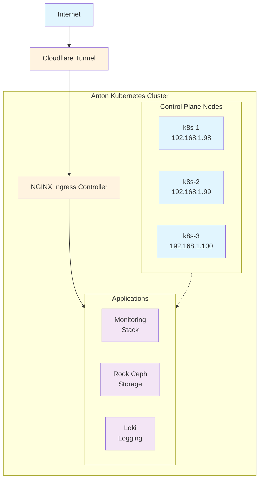

# Anton

Kubernetes homelab cluster for learning & experimentation. It is running on 3 MS-01 nodes with Talos Linux and Flux GitOps.

🔗 **Blog Post**: https://wcygan.net/anton

### **Warning to readers**

This documentation is heavily generated by AI and may be inaccurate / incomplete. AI is used for both development and documentation. I am primarily using [Claude Code](https://www.anthropic.com/claude-code). I am not a professional SRE or DevOps engineer, so Claude enables me to do things that I wouldn't be able to do otherwise.

The AI has already deleted all of my software once (just like in [Silicon Valley](https://www.youtube.com/watch?v=m0b_D2JgZgY)). I'm **okay with that** because there isn't anything important in the cluster. It's entirely for educational purposes.

### Key Features
- **Immutable Infrastructure**: Talos Linux (API-driven, no SSH)
- **GitOps**: Flux v2 for declarative deployments
- **High Availability**: 3-node control plane with distributed storage
- **Monitoring**: Prometheus + Grafana + AlertManager
- **Logging**: Loki stack with S3 storage backend
- **Storage**: Rook-Ceph distributed block storage
- **Networking**: Cilium CNI with kube-proxy replacement
- **Ingress**: NGINX with Cloudflare tunnel integration

### Hardware
- **Nodes**: 3x MS-01 mini PCs (Intel N100, 16GB RAM each)
- **Storage**: 6x 1TB NVMe SSDs (2 per node, 3-way replication)
- **Network**: Gigabit Ethernet

## Cluster Topology

## Core Applications

### Infrastructure Layer
- **Flux**: GitOps operator managing all deployments
- **Cilium**: eBPF-based networking and security
- **Rook-Ceph**: Distributed storage system
- **External Secrets**: Integration with 1Password

### Platform Services  
- **NGINX Ingress**: Traffic routing (internal/external)
- **Cert-Manager**: Automatic TLS certificate management
- **Cloudflare Tunnel**: Secure external access

### Observability Stack
- **Prometheus**: Metrics collection and alerting
- **Grafana**: Visualization and dashboards  
- **Loki**: Log aggregation and querying
- **AlertManager**: Alert routing and notification
