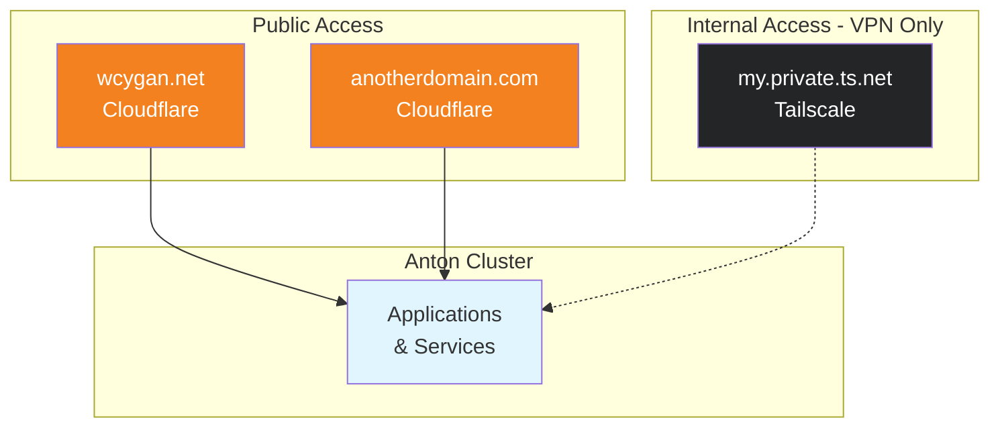
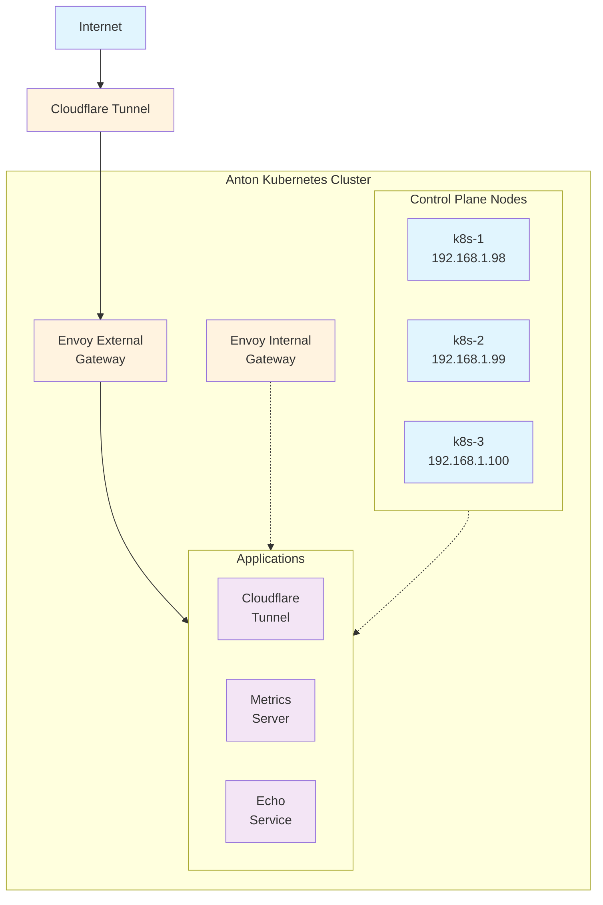

# Anton

Kubernetes homelab cluster. I use this for:

- Exposing applications to the public internet
- Hosting applications that I can access remotely over VPN
- Trying new stuff

🔗 **Blog Post**: https://wcygan.net/anton

## Cluster Access

### Hardware
- **Nodes**: 3x MS-01 mini PCs (Intel N100, 16GB RAM each)
- **Storage**: 6x 1TB NVMe SSDs
- **Network**: Gigabit Ethernet

### Operating System
- **OS**: [Talos Linux](https://www.talos.dev/) - API-driven, immutable Kubernetes OS
- **Management**: Declarative configuration via YAML
- **Security**: No SSH access, minimal attack surface

## Cluster Topology

