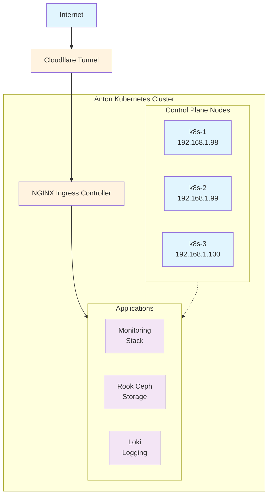

# Anton

https://wcygan.net/anton

## Cluster Topology

```mermaid
flowchart TD
    internet[Internet] --> cloudflare[Cloudflare Tunnel]
    cloudflare --> nginx[NGINX Ingress Controller]
    
    subgraph cluster[Anton Kubernetes Cluster]
        nginx
        
        subgraph nodes[Control Plane Nodes]
            direction LR
            k8s1[k8s-1<br/>192.168.1.98]
            k8s2[k8s-2<br/>192.168.1.99] 
            k8s3[k8s-3<br/>192.168.1.100]
        end
        
        subgraph apps[Applications]
            direction LR
            monitoring[Monitoring<br/>Stack]
            storage[Rook Ceph<br/>Storage]
            logging[Loki<br/>Logging]
        end
    end
    
    nginx --> apps
    nodes -.-> apps
    
    classDef node fill:#e1f5fe
    classDef ingress fill:#fff3e0
    classDef app fill:#f3e5f5
    
    class k8s1,k8s2,k8s3 node
    class nginx,cloudflare ingress
    class monitoring,storage,logging app
```
