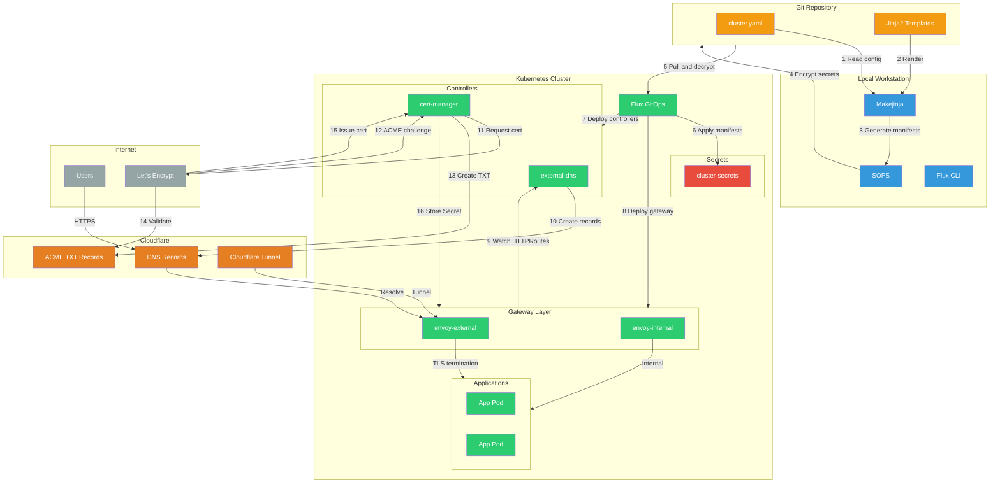
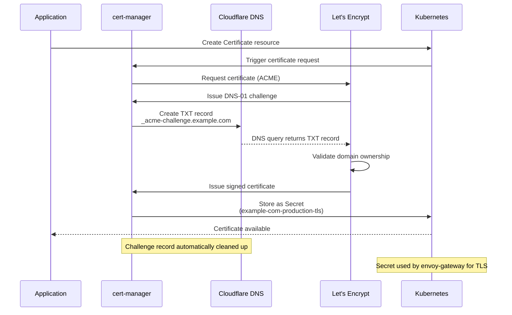
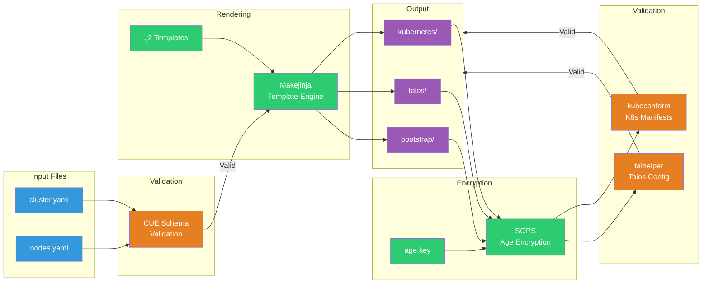
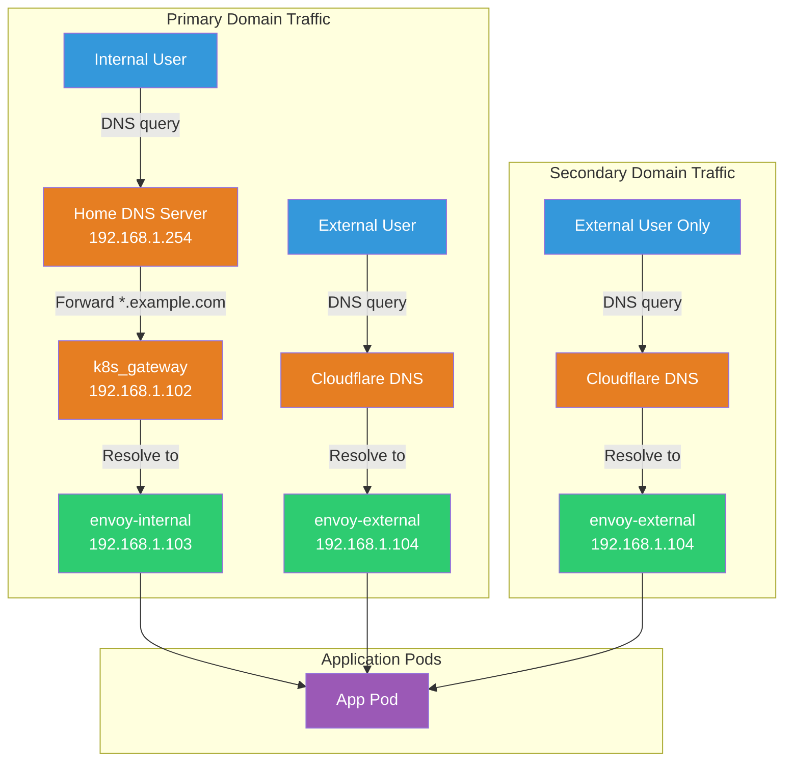
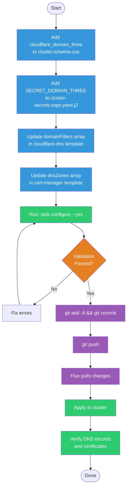

# Multi-Domain Support in Talos Kubernetes Cluster

## Overview

This document describes the architecture and implementation for hosting multiple domains from a single Talos Kubernetes cluster using Flux GitOps, with Cloudflare as the DNS provider and SSL certificate authority.

## Goals

- Support multiple domains (e.g., `example.com`, `example.org`) from one cluster
- Automatic DNS record management via external-dns
- Automatic SSL certificate provisioning via cert-manager
- Maintain GitOps workflow with SOPS-encrypted secrets
- Template-driven configuration for easy domain addition/removal

## System Architecture



## Architecture Components

### 1. Cloudflare Role

Cloudflare serves three critical functions:

**DNS Provider**
- Hosts authoritative DNS records for all managed domains
- external-dns (cloudflare-dns) automatically creates/updates DNS records
- Supports wildcard records (e.g., `*.example.com`) pointing to gateway IPs

**SSL Certificate Authority Interface**
- cert-manager uses Cloudflare DNS-01 ACME challenge for Let's Encrypt
- DNS-01 allows wildcard certificates without exposing cluster to internet
- Single Cloudflare API token provides access to all domains in account

**Tunnel Provider (optional)**
- Cloudflare Tunnel (cloudflared) provides secure ingress without port forwarding
- Routes external traffic through Cloudflare network to cluster gateway

### 2. Core Kubernetes Components

**cert-manager**
- Requests wildcard SSL certificates from Let's Encrypt
- Uses Cloudflare DNS-01 solver for domain validation
- Stores certificates as Kubernetes Secrets
- Configured via `ClusterIssuer` with multiple `dnsZones`

**external-dns (cloudflare-dns)**
- Watches `HTTPRoute` and `DNSEndpoint` resources
- Automatically creates DNS records in Cloudflare
- Filters domains via `domainFilters` array
- Syncs changes bidirectionally (policy: sync)

**envoy-gateway**
- Provides internal (`envoy-internal`) and external (`envoy-external`) gateways
- Terminates SSL using cert-manager certificates
- Routes traffic based on `HTTPRoute` hostname matching

**k8s_gateway**
- Provides internal DNS resolution for split-horizon DNS
- Limited to single domain (primary domain only)
- Not affected by multi-domain configuration

### 3. Template System (Makejinja)

**Purpose**
- Single source of truth: `cluster.yaml` defines all domain names
- Jinja2 templates in `templates/config/` generate all manifests
- Conditional rendering supports optional domains

**Key Templates Modified**
- `.taskfiles/template/resources/cluster.schema.cue` - Schema validation
- `templates/config/kubernetes/components/sops/cluster-secrets.sops.yaml.j2` - Secret generation
- `templates/config/kubernetes/apps/network/cloudflare-dns/app/helmrelease.yaml.j2` - DNS filters
- `templates/config/kubernetes/apps/cert-manager/cert-manager/app/clusterissuer.yaml.j2` - Certificate zones

## Implementation Details

### Step 1: Schema Definition

Add optional domain field to CUE schema:

```cue
// .taskfiles/template/resources/cluster.schema.cue
#Config: {
    cloudflare_domain: net.FQDN      // Primary domain (required)
    cloudflare_domain_two?: net.FQDN // Secondary domain (optional)
    // ...
}
```

### Step 2: Secret Template

Conditionally add domain to cluster secrets:

```yaml
# templates/config/kubernetes/components/sops/cluster-secrets.sops.yaml.j2
apiVersion: v1
kind: Secret
metadata:
  name: cluster-secrets
stringData:
  SECRET_DOMAIN: "#{ cloudflare_domain }#"
#% if cloudflare_domain_two is defined %#
  SECRET_DOMAIN_TWO: "#{ cloudflare_domain_two }#"
#% endif %#
```

**Result**: Secret available in `flux-system` namespace, consumed by manifests using `${SECRET_DOMAIN_TWO}` syntax.

### Step 3: DNS Management (external-dns)

Configure cloudflare-dns to manage multiple domains:

```yaml
# templates/config/kubernetes/apps/network/cloudflare-dns/app/helmrelease.yaml.j2
domainFilters: ["${SECRET_DOMAIN}"#% if cloudflare_domain_two is defined %#, "${SECRET_DOMAIN_TWO}"#% endif %#]
```

**Behavior**:
- external-dns watches `HTTPRoute` resources with `gateway-name=envoy-external`
- For each matching route, creates DNS A/AAAA record in Cloudflare
- Record points to `cloudflare_gateway_addr` (external gateway IP)
- TXT records with prefix `k8s.` track ownership

### Step 4: SSL Certificates (cert-manager)

**A. Configure ClusterIssuer for Multiple Zones**

```yaml
# templates/config/kubernetes/apps/cert-manager/cert-manager/app/clusterissuer.yaml.j2
solvers:
  - dns01:
      cloudflare:
        apiTokenSecretRef:
          name: cert-manager-secret
          key: api-token
    selector:
      dnsZones: ["${SECRET_DOMAIN}"#% if cloudflare_domain_two is defined %#, "${SECRET_DOMAIN_TWO}"#% endif %#]
```

**B. Create Certificate Resources for Each Domain**

```yaml
# templates/config/kubernetes/apps/network/envoy-gateway/app/certificate.yaml.j2
---
apiVersion: cert-manager.io/v1
kind: Certificate
metadata:
  name: "${SECRET_DOMAIN/./-}-production"
spec:
  secretName: "${SECRET_DOMAIN/./-}-production-tls"
  issuerRef:
    name: letsencrypt-production
    kind: ClusterIssuer
  commonName: "${SECRET_DOMAIN}"
  dnsNames: ["${SECRET_DOMAIN}", "*.${SECRET_DOMAIN}"]
#% if cloudflare_domain_two is defined %#
---
apiVersion: cert-manager.io/v1
kind: Certificate
metadata:
  name: "${SECRET_DOMAIN_TWO/./-}-production"
spec:
  secretName: "${SECRET_DOMAIN_TWO/./-}-production-tls"
  issuerRef:
    name: letsencrypt-production
    kind: ClusterIssuer
  commonName: "${SECRET_DOMAIN_TWO}"
  dnsNames: ["${SECRET_DOMAIN_TWO}", "*.${SECRET_DOMAIN_TWO}"]
#% endif %#
```

**C. Add Certificates to Gateway TLS Configuration**

```yaml
# templates/config/kubernetes/apps/network/envoy-gateway/app/envoy.yaml.j2
---
apiVersion: gateway.networking.k8s.io/v1
kind: Gateway
metadata:
  name: envoy-external
spec:
  gatewayClassName: envoy
  listeners:
    - name: https
      protocol: HTTPS
      port: 443
      tls:
        certificateRefs:
          - kind: Secret
            name: ${SECRET_DOMAIN/./-}-production-tls
#% if cloudflare_domain_two is defined %#
          - kind: Secret
            name: ${SECRET_DOMAIN_TWO/./-}-production-tls
#% endif %#
```

**Important**: Repeat for `envoy-internal` gateway if using second domain internally.

**How it works**: Gateway uses SNI (Server Name Indication) to select the correct certificate based on the requested hostname.

**Flow**:



**Steps**:
1. Application requests certificate via `Certificate` resource
2. cert-manager creates ACME challenge with Let's Encrypt
3. Cloudflare DNS-01 solver creates temporary TXT record `_acme-challenge.example.com`
4. Let's Encrypt validates domain ownership via DNS query
5. Certificate issued and stored as Kubernetes Secret
6. envoy-gateway references Secret for TLS termination

### Step 5: Template Rendering

Run configuration pipeline:

```bash
task configure --yes
```

**Pipeline Steps**:



**Steps**:
1. **Validate schemas** - CUE validates `cluster.yaml` structure
2. **Render templates** - Makejinja generates all manifests from `.j2` templates
3. **Encrypt secrets** - SOPS encrypts all `*.sops.*` files with Age key
4. **Validate manifests** - kubeconform validates Kubernetes YAML
5. **Validate Talos** - talhelper validates Talos configuration

### Step 6: GitOps Deployment

```bash
git add -A
git commit -m "feat: add secondary domain support"
git push
task reconcile  # Force Flux to pull changes
```

**Flux Reconciliation**:
1. Flux pulls latest Git state
2. Decrypts SOPS secrets using in-cluster Age key
3. Applies `cluster-secrets` Secret to `flux-system` namespace
4. Kustomizations apply updated HelmReleases
5. cloudflare-dns and cert-manager detect config changes
6. DNS records created, certificates requested automatically

## Domain Usage Patterns

### Traffic Flow Comparison



### Accessing Applications

**Primary Domain** (`${SECRET_DOMAIN}`):
- Internal DNS via k8s_gateway (split-horizon)
- External DNS via cloudflare-dns
- SSL certificates via cert-manager
- HTTPRoutes use gateway `envoy-external` or `envoy-internal`

**Secondary Domain** (`${SECRET_DOMAIN_TWO}`):
- External DNS only (no k8s_gateway support)
- SSL certificates via cert-manager
- HTTPRoutes must use gateway `envoy-external`
- Access via public DNS or manual `/etc/hosts` entry

### Deploying Apps on Secondary Domain

**Critical**: Secondary domain apps require **DNSEndpoint** instead of relying on HTTPRoute annotations.

**Why**: external-dns has `--gateway-name=envoy-external` filter that forces ALL HTTPRoutes to use the Gateway's annotation, ignoring individual HTTPRoute annotations. DNSEndpoint bypasses this limitation.

**Example App Structure** (second domain):

```yaml
# app/dnsendpoint.yaml
---
apiVersion: externaldns.k8s.io/v1alpha1
kind: DNSEndpoint
metadata:
  name: my-app
spec:
  endpoints:
    - dnsName: "my-app.${SECRET_DOMAIN_TWO}"
      recordType: CNAME
      targets: ["external.${SECRET_DOMAIN_TWO}"]
```

```yaml
# app/httproute.yaml
---
apiVersion: gateway.networking.k8s.io/v1
kind: HTTPRoute
metadata:
  name: my-app
spec:
  parentRefs:
    - name: envoy-external
      namespace: network
      sectionName: https
  hostnames:
    - "my-app.${SECRET_DOMAIN_TWO}"
  rules:
    - backendRefs:
        - name: my-app
          port: 80
```

```yaml
# app/kustomization.yaml
---
apiVersion: kustomize.config.k8s.io/v1beta1
kind: Kustomization
resources:
  - ./dnsendpoint.yaml    # Critical: Must be listed
  - ./helmrelease.yaml
  - ./httproute.yaml
  - ./ocirepository.yaml
```

**Multi-Domain App** (works on both domains):

```yaml
# Use HTTPRoute annotation for primary domain (automatic via gateway filter)
---
apiVersion: gateway.networking.k8s.io/v1
kind: HTTPRoute
metadata:
  name: example-app
spec:
  parentRefs:
    - name: envoy-external
      namespace: network
      sectionName: https
  hostnames:
    - "app.${SECRET_DOMAIN}"      # Primary - automatic DNS
    - "app.${SECRET_DOMAIN_TWO}"  # Secondary - needs DNSEndpoint
  rules:
    - backendRefs:
        - name: example-app
          port: 80

# Add DNSEndpoint for secondary domain
---
apiVersion: externaldns.k8s.io/v1alpha1
kind: DNSEndpoint
metadata:
  name: example-app-secondary
spec:
  endpoints:
    - dnsName: "app.${SECRET_DOMAIN_TWO}"
      recordType: CNAME
      targets: ["external.${SECRET_DOMAIN_TWO}"]
```

**Result**:
- Primary domain: DNS created automatically from HTTPRoute via gateway annotation
- Secondary domain: DNS created explicitly from DNSEndpoint (bypasses gateway-name filter)
- Both use same backend and certificate

## Security Considerations

### Cloudflare API Token

**Required Permissions**:
- Zone:DNS:Edit - Create/update/delete DNS records
- Account:Cloudflare Tunnel:Read - Read tunnel configurations

**Scope**: Limit to specific zones (domains) in Cloudflare dashboard

### SOPS Encryption

All secrets encrypted with Age key:
- `age.key` - Master key (never commit)
- `.sops.yaml` - Encryption rules
- `*.sops.*` - Encrypted files in Git

Flux decrypts at runtime using in-cluster Age key.

### Certificate Security

- Private keys stored as Kubernetes Secrets
- Automatic rotation via cert-manager (90-day certificates)
- DNS-01 challenge prevents exposing cluster to internet
- Wildcard certificates reduce per-service certificate overhead

## Limitations

### k8s_gateway Single Domain

k8s_gateway only supports one domain for internal DNS:
- Primary domain gets split-horizon DNS
- Secondary domains require external DNS or manual entries
- Workaround: Use external DNS provider for internal resolution

### Cloudflare API Rate Limits

Cloudflare free tier limits:
- 1200 requests/5 minutes
- external-dns batches updates to stay within limits
- Use `txtPrefix` and `txtOwnerId` to avoid conflicts

### Certificate Naming

Envoy Gateway expects specific certificate Secret names:
- Format: `${SECRET_DOMAIN/./-}-production-tls`
- Example: `example-com-production-tls`
- Must update references when adding domains

## Adding Additional Domains



**Steps**:
1. Add `cloudflare_domain_three?: net.FQDN` to schema
2. Update secret template with conditional block
3. Update `domainFilters` and `dnsZones` arrays
4. Run `task configure --yes`
5. Commit and push changes
6. Flux automatically applies updates

## Troubleshooting

### DNS Records Pointing to Wrong Domain

**Symptom**: DNS record created but points to primary domain instead of secondary domain
- Example: `app.secondary.com` → `external.primary.com` (wrong)
- Expected: `app.secondary.com` → `external.secondary.com` (correct)

**Root Cause**: external-dns `--gateway-name=envoy-external` filter forces all HTTPRoutes to use Gateway's annotation, ignoring HTTPRoute-level annotations.

**Solution**: Use DNSEndpoint resource instead of HTTPRoute annotations
```bash
# Check current DNS records
kubectl get dnsendpoint -A

# Verify external-dns configuration
kubectl get helmrelease -n network cloudflare-dns -o yaml | grep -A 5 "extraArgs"
# Should show: --gateway-name=envoy-external

# Fix: Create DNSEndpoint for second domain app
# See "Deploying Apps on Secondary Domain" section above
```

### HTTP 502 Bad Gateway on Second Domain

**Symptom**: DNS resolves correctly, but HTTPS returns 502 error

**Root Cause**: Missing TLS certificate for second domain (gateway only has cert for primary domain)

**Diagnosis**:
```bash
# Check certificates
kubectl get certificate -n network

# Check gateway certificate references
kubectl get gateway -n network envoy-external -o yaml | grep -A 10 "certificateRefs"

# Test DNS
dig +short app.secondary.com
```

**Solution**: Add certificate for second domain
1. Update `templates/config/kubernetes/apps/network/envoy-gateway/app/certificate.yaml.j2`
2. Add certificate to Gateway listeners in `envoy.yaml.j2`
3. Run `task configure --yes && git add -A && git commit && git push && task reconcile`
4. Wait for cert-manager to issue certificate (~2-3 minutes)

```bash
# Monitor certificate issuance
kubectl get certificate -n network -w

# Check certificate details
kubectl describe certificate -n network <domain>-com-production

# View challenges (DNS-01)
kubectl get challenge -n network
```

### DNS Records Not Created

```bash
kubectl -n network logs -l app.kubernetes.io/name=cloudflare-dns
# Check for Cloudflare API errors

# Verify domain filters
kubectl get helmrelease -n network cloudflare-dns -o yaml | grep domainFilters

# Check DNSEndpoint status
kubectl get dnsendpoint -A
kubectl describe dnsendpoint -n <namespace> <name>
```

### Certificates Not Issued

```bash
# Check cert-manager logs
kubectl -n cert-manager logs -l app.kubernetes.io/name=cert-manager

# Certificate status
kubectl describe certificate -n <namespace> <cert-name>

# Certificate request details
kubectl get certificaterequest -n <namespace>
kubectl describe certificaterequest -n <namespace> <name>

# ACME order and challenges
kubectl get order -n <namespace>
kubectl get challenge -n <namespace>
kubectl describe challenge -n <namespace> <name>

# Verify Cloudflare API token has correct permissions
# Zone:DNS:Edit required for DNS-01 challenge
```

**Common Issues**:
- DNS-01 challenge waiting for propagation (normal, 1-3 minutes)
- Cloudflare API rate limits (1200 req/5min on free tier)
- Invalid API token or missing Zone:DNS:Edit permission
- ClusterIssuer not configured for domain (check `dnsZones` array)

### Split-Horizon DNS Issues

- k8s_gateway only serves primary domain
- Verify home DNS forwards primary domain to `cluster_dns_gateway_addr`
- Secondary domains require different DNS strategy (external DNS or manual entries)

### HTTP 404 Not Found on Apex Domain (But Wildcard Works)

**Symptom**:
- `https://example.com` returns 404 from Cloudflare
- `https://www.example.com` or `https://app.example.com` work correctly
- Direct gateway test works: `curl -H "Host: example.com" https://192.168.1.104`

**Root Cause**: Cloudflare Tunnel ingress rules only have wildcard patterns (`*.example.com`), missing apex domain rules.

**Why**: Wildcard patterns (`*.domain.com`) don't match the apex domain (`domain.com`) - this is standard DNS/HTTP routing behavior.

**Diagnosis**:
```bash
# Check tunnel configuration
kubectl get configmap -n network cloudflare-tunnel -o yaml | grep -A 20 "ingress:"

# Should see only wildcards (problem):
# ingress:
#   - hostname: "*.example.com"
#   - service: https://...

# Test direct gateway routing
curl -H "Host: example.com" https://192.168.1.104 --insecure
# If this works but public URL doesn't, it's a tunnel config issue
```

**Solution**: Add explicit apex domain rules **before** wildcard rules in Cloudflare Tunnel template:

```yaml
# templates/config/kubernetes/apps/network/cloudflare-tunnel/app/helmrelease.yaml.j2
configMaps:
  config:
    data:
      config.yaml: |-
        ingress:
          # Apex domain MUST come before wildcard
          - hostname: "${SECRET_DOMAIN}"
            originRequest:
              http2Origin: true
              originServerName: external.${SECRET_DOMAIN}
            service: https://envoy-external.{{ .Release.Namespace }}.svc.cluster.local:443
          # Wildcard pattern
          - hostname: "*.${SECRET_DOMAIN}"
            originRequest:
              http2Origin: true
              originServerName: external.${SECRET_DOMAIN}
            service: https://envoy-external.{{ .Release.Namespace }}.svc.cluster.local:443
#% if cloudflare_domain_two is defined %#
          # Repeat for second domain
          - hostname: "${SECRET_DOMAIN_TWO}"
            originRequest:
              http2Origin: true
              originServerName: external.${SECRET_DOMAIN_TWO}
            service: https://envoy-external.{{ .Release.Namespace }}.svc.cluster.local:443
          - hostname: "*.${SECRET_DOMAIN_TWO}"
            originRequest:
              http2Origin: true
              originServerName: external.${SECRET_DOMAIN_TWO}
            service: https://envoy-external.{{ .Release.Namespace }}.svc.cluster.local:443
#% endif %#
          # Catch-all 404
          - service: http_status:404
```

**Apply the fix**:
```bash
# Regenerate manifests with apex domain rules
task configure --yes

# Commit changes (domain names safe as Flux variables)
git add -A && git commit -m "feat: add apex domain support to cloudflare tunnel"
git push

# Apply to cluster
task reconcile

# Wait for tunnel pod to restart (~30 seconds)
kubectl get pods -n network -l app.kubernetes.io/name=cloudflare-tunnel -w

# Test apex domain
curl -I https://example.com
# Should return HTTP/2 200
```

**Key Points**:
- Apex domain rules **must precede** wildcard rules (order matters in Cloudflare Tunnel ingress)
- Both domains (primary and secondary) need explicit apex rules if using Cloudflare Tunnel
- Uses `${SECRET_DOMAIN}` variables so no domain names are committed to git
- Tunnel pod automatically restarts when ConfigMap changes (via reloader annotation)

## References

- [Cloudflare DNS-01 ACME Challenge](https://cert-manager.io/docs/configuration/acme/dns01/cloudflare/)
- [external-dns Cloudflare Tutorial](https://kubernetes-sigs.github.io/external-dns/latest/docs/tutorials/cloudflare/)
- [Envoy Gateway Secure Gateways (TLS)](https://gateway.envoyproxy.io/docs/tasks/security/secure-gateways/)
- [Makejinja Template Engine](https://github.com/mirkolenz/makejinja)
