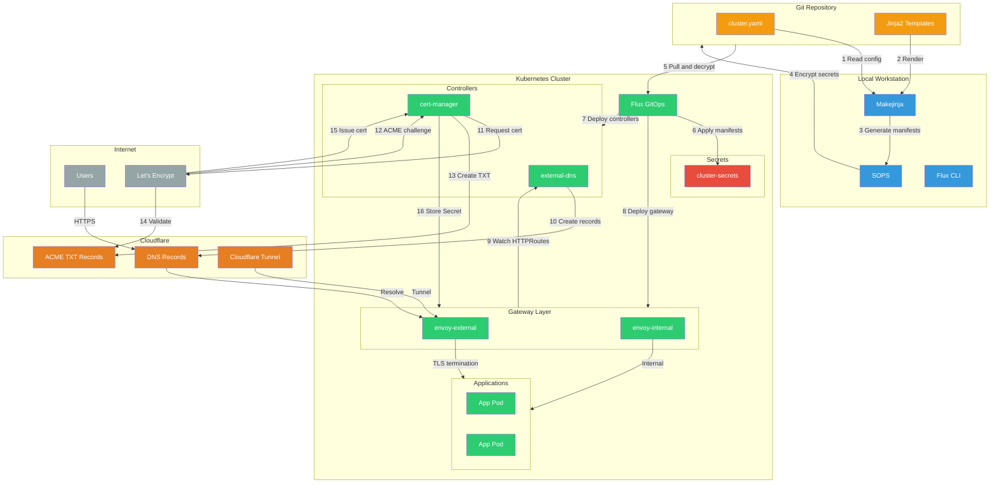
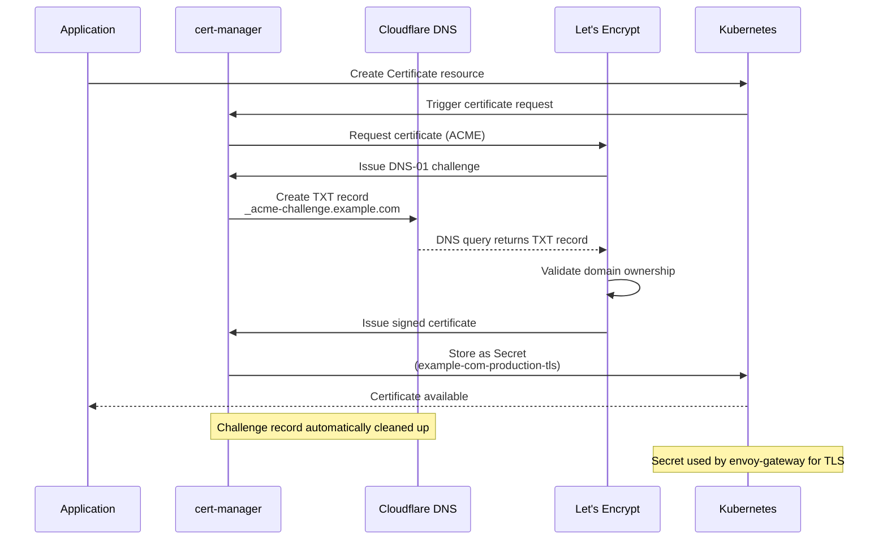
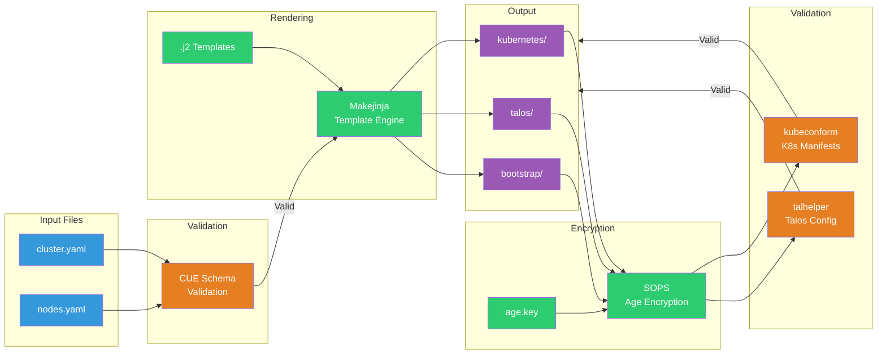
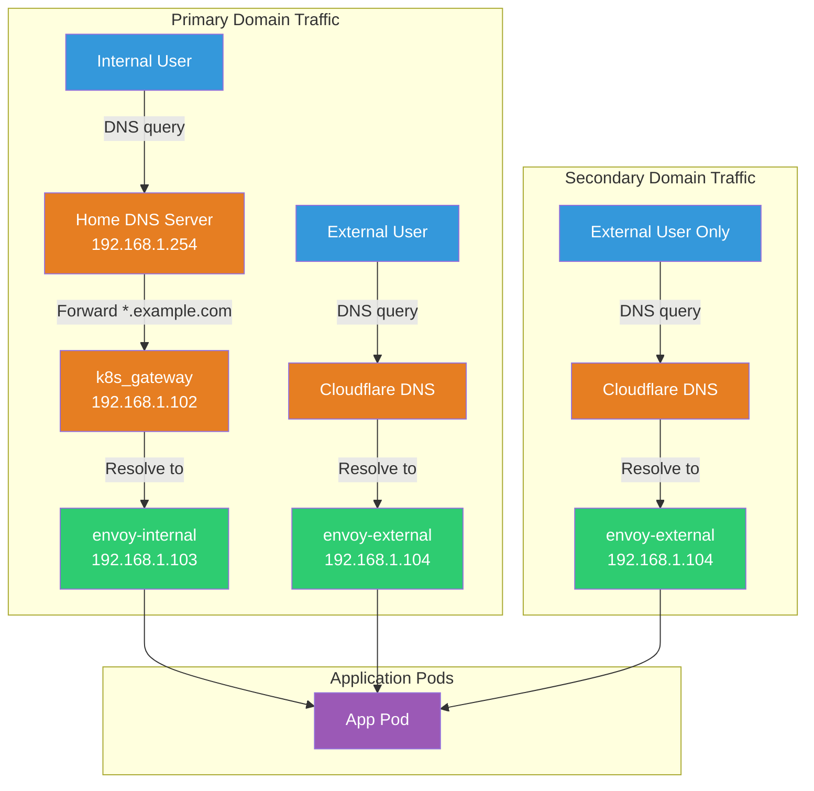
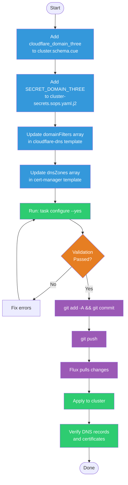

# Multi-Domain Support in Talos Kubernetes Cluster

## Overview

This document describes the architecture and implementation for hosting multiple domains from a single Talos Kubernetes cluster using Flux GitOps, with Cloudflare as the DNS provider and SSL certificate authority.

## Goals

- Support multiple domains (e.g., `example.com`, `example.org`) from one cluster
- Automatic DNS record management via external-dns
- Automatic SSL certificate provisioning via cert-manager
- Maintain GitOps workflow with SOPS-encrypted secrets
- Template-driven configuration for easy domain addition/removal

## Status (April 2026)

The Jinja template pipeline described under "Implementation Details" below was archived on 2026-04-19 — the templates, `cluster.yaml`, and the `task configure` flow now live under `.private/`, and the rendered manifests under `kubernetes/`, `talos/`, and `bootstrap/` are hand-edited and committed directly. The conceptual model (cluster-secrets → external-dns → cert-manager → envoy-gateway → cloudflare-tunnel) is unchanged; only the rendering step is gone.

For the current end-to-end recipe see "[Walkthrough — adding a third domain (direct-edit flow)](#walkthrough--adding-a-third-domain-direct-edit-flow)" below. The legacy Jinja sections are kept for historical context.

## System Architecture


```mermaid
flowchart TD
    subgraph git[Git Repository]
        cluster_yaml["cluster.yaml"]
        templates["Jinja2 Templates"]
    end

    subgraph local[Local Workstation]
        makejinja["Makejinja"]
        sops["SOPS"]
        flux_cli["Flux CLI"]
    end

    subgraph cloudflare[Cloudflare]
        dns_records["DNS Records"]
        acme_txt["ACME TXT Records"]
        tunnel["Cloudflare Tunnel"]
    end

    subgraph k8s[Kubernetes Cluster]
        flux["Flux GitOps"]

        subgraph controllers[Controllers]
            external_dns["external-dns"]
            cert_manager["cert-manager"]
        end

        subgraph gateway[Gateway Layer]
            envoy_ext["envoy-external"]
            envoy_int["envoy-internal"]
        end

        subgraph apps[Applications]
            app1["App Pod"]
            app2["App Pod"]
        end

        subgraph secrets[Secrets]
            cluster_secrets["cluster-secrets"]
        end
    end

    subgraph internet[Internet]
        users["Users"]
        letsencrypt["Let's Encrypt"]
    end

    %% Template flow
    cluster_yaml -->|1 Read config| makejinja
    templates -->|2 Render| makejinja
    makejinja -->|3 Generate manifests| sops
    sops -->|4 Encrypt secrets| git

    %% GitOps flow
    git -->|5 Pull and decrypt| flux
    flux -->|6 Apply manifests| cluster_secrets
    flux -->|7 Deploy controllers| controllers
    flux -->|8 Deploy gateway| gateway

    %% DNS management
    gateway -->|9 Watch HTTPRoutes| external_dns
    external_dns -->|10 Create records| dns_records

    %% Certificate flow
    cert_manager -->|11 Request cert| letsencrypt
    letsencrypt -->|12 ACME challenge| cert_manager
    cert_manager -->|13 Create TXT| acme_txt
    letsencrypt -->|14 Validate| acme_txt
    letsencrypt -->|15 Issue cert| cert_manager
    cert_manager -->|16 Store Secret| gateway

    %% Traffic flow
    users -->|HTTPS| dns_records
    dns_records -->|Resolve| envoy_ext
    tunnel -->|Tunnel| envoy_ext
    envoy_ext -->|TLS termination| apps
    envoy_int -->|Internal| apps

    classDef gitClass fill:#f39c12,color:white
    classDef localClass fill:#3498db,color:white
    classDef cloudClass fill:#e67e22,color:white
    classDef k8sClass fill:#2ecc71,color:white
    classDef secretClass fill:#e74c3c,color:white
    classDef internetClass fill:#95a5a6,color:white

    class cluster_yaml,templates gitClass
    class makejinja,sops,flux_cli localClass
    class dns_records,acme_txt,tunnel cloudClass
    class flux,external_dns,cert_manager,envoy_ext,envoy_int,app1,app2 k8sClass
    class cluster_secrets secretClass
    class users,letsencrypt internetClass
```

## Architecture Components

### 1. Cloudflare Role

Cloudflare serves three critical functions:

**DNS Provider**
- Hosts authoritative DNS records for all managed domains
- external-dns (cloudflare-dns) automatically creates/updates DNS records
- Supports wildcard records (e.g., `*.example.com`) pointing to gateway IPs

**SSL Certificate Authority Interface**
- cert-manager uses Cloudflare DNS-01 ACME challenge for Let's Encrypt
- DNS-01 allows wildcard certificates without exposing cluster to internet
- Single Cloudflare API token provides access to all domains in account

**Tunnel Provider (optional)**
- Cloudflare Tunnel (cloudflared) provides secure ingress without port forwarding
- Routes external traffic through Cloudflare network to cluster gateway

### 2. Core Kubernetes Components

**cert-manager**
- Requests wildcard SSL certificates from Let's Encrypt
- Uses Cloudflare DNS-01 solver for domain validation
- Stores certificates as Kubernetes Secrets
- Configured via `ClusterIssuer` with multiple `dnsZones`

**external-dns (cloudflare-dns)**
- Watches `HTTPRoute` and `DNSEndpoint` resources
- Automatically creates DNS records in Cloudflare
- Filters domains via `domainFilters` array
- Syncs changes bidirectionally (policy: sync)

**envoy-gateway**
- Provides internal (`envoy-internal`) and external (`envoy-external`) gateways
- Terminates SSL using cert-manager certificates
- Routes traffic based on `HTTPRoute` hostname matching

**k8s_gateway**
- Provides internal DNS resolution for split-horizon DNS
- Limited to single domain (primary domain only)
- Not affected by multi-domain configuration

### 3. Template System (Makejinja)

**Purpose**
- Single source of truth: `cluster.yaml` defines all domain names
- Jinja2 templates in `templates/config/` generate all manifests
- Conditional rendering supports optional domains

**Key Templates Modified**
- `.taskfiles/template/resources/cluster.schema.cue` - Schema validation
- `templates/config/kubernetes/components/sops/cluster-secrets.sops.yaml.j2` - Secret generation
- `templates/config/kubernetes/apps/network/cloudflare-dns/app/helmrelease.yaml.j2` - DNS filters
- `templates/config/kubernetes/apps/cert-manager/cert-manager/app/clusterissuer.yaml.j2` - Certificate zones

## Implementation Details

### Step 1: Schema Definition

Add optional domain field to CUE schema:

```cue
// .taskfiles/template/resources/cluster.schema.cue
#Config: {
    cloudflare_domain: net.FQDN      // Primary domain (required)
    cloudflare_domain_two?: net.FQDN // Secondary domain (optional)
    // ...
}
```

### Step 2: Secret Template

Conditionally add domain to cluster secrets:

```yaml
# templates/config/kubernetes/components/sops/cluster-secrets.sops.yaml.j2
apiVersion: v1
kind: Secret
metadata:
  name: cluster-secrets
stringData:
  SECRET_DOMAIN: "#{ cloudflare_domain }#"
#% if cloudflare_domain_two is defined %#
  SECRET_DOMAIN_TWO: "#{ cloudflare_domain_two }#"
#% endif %#
```

**Result**: Secret available in `flux-system` namespace, consumed by manifests using `${SECRET_DOMAIN_TWO}` syntax.

### Step 3: DNS Management (external-dns)

Configure cloudflare-dns to manage multiple domains:

```yaml
# templates/config/kubernetes/apps/network/cloudflare-dns/app/helmrelease.yaml.j2
domainFilters: ["${SECRET_DOMAIN}"#% if cloudflare_domain_two is defined %#, "${SECRET_DOMAIN_TWO}"#% endif %#]
```

**Behavior**:
- external-dns watches `HTTPRoute` resources with `gateway-name=envoy-external`
- For each matching route, creates DNS A/AAAA record in Cloudflare
- Record points to `cloudflare_gateway_addr` (external gateway IP)
- TXT records with prefix `k8s.` track ownership

### Step 4: SSL Certificates (cert-manager)

**A. Configure ClusterIssuer for Multiple Zones**

```yaml
# templates/config/kubernetes/apps/cert-manager/cert-manager/app/clusterissuer.yaml.j2
solvers:
  - dns01:
      cloudflare:
        apiTokenSecretRef:
          name: cert-manager-secret
          key: api-token
    selector:
      dnsZones: ["${SECRET_DOMAIN}"#% if cloudflare_domain_two is defined %#, "${SECRET_DOMAIN_TWO}"#% endif %#]
```

**B. Create Certificate Resources for Each Domain**

```yaml
# templates/config/kubernetes/apps/network/envoy-gateway/app/certificate.yaml.j2
---
apiVersion: cert-manager.io/v1
kind: Certificate
metadata:
  name: "${SECRET_DOMAIN/./-}-production"
spec:
  secretName: "${SECRET_DOMAIN/./-}-production-tls"
  issuerRef:
    name: letsencrypt-production
    kind: ClusterIssuer
  commonName: "${SECRET_DOMAIN}"
  dnsNames: ["${SECRET_DOMAIN}", "*.${SECRET_DOMAIN}"]
#% if cloudflare_domain_two is defined %#
---
apiVersion: cert-manager.io/v1
kind: Certificate
metadata:
  name: "${SECRET_DOMAIN_TWO/./-}-production"
spec:
  secretName: "${SECRET_DOMAIN_TWO/./-}-production-tls"
  issuerRef:
    name: letsencrypt-production
    kind: ClusterIssuer
  commonName: "${SECRET_DOMAIN_TWO}"
  dnsNames: ["${SECRET_DOMAIN_TWO}", "*.${SECRET_DOMAIN_TWO}"]
#% endif %#
```

**C. Add Certificates to Gateway TLS Configuration**

```yaml
# templates/config/kubernetes/apps/network/envoy-gateway/app/envoy.yaml.j2
---
apiVersion: gateway.networking.k8s.io/v1
kind: Gateway
metadata:
  name: envoy-external
spec:
  gatewayClassName: envoy
  listeners:
    - name: https
      protocol: HTTPS
      port: 443
      tls:
        certificateRefs:
          - kind: Secret
            name: ${SECRET_DOMAIN/./-}-production-tls
#% if cloudflare_domain_two is defined %#
          - kind: Secret
            name: ${SECRET_DOMAIN_TWO/./-}-production-tls
#% endif %#
```

**Important**: Repeat for `envoy-internal` gateway if using second domain internally.

**How it works**: Gateway uses SNI (Server Name Indication) to select the correct certificate based on the requested hostname.

**Flow**:


```mermaid
sequenceDiagram
    participant App as Application
    participant CM as cert-manager
    participant CF as Cloudflare DNS
    participant LE as Let's Encrypt
    participant K8s as Kubernetes

    App->>K8s: Create Certificate resource
    K8s->>CM: Trigger certificate request
    CM->>LE: Request certificate (ACME)
    LE->>CM: Issue DNS-01 challenge
    CM->>CF: Create TXT record<br/>_acme-challenge.example.com
    CF-->>LE: DNS query returns TXT record
    LE->>LE: Validate domain ownership
    LE->>CM: Issue signed certificate
    CM->>K8s: Store as Secret<br/>(example-com-production-tls)
    K8s-->>App: Certificate available

    Note over CM,CF: Challenge record automatically cleaned up
    Note over K8s: Secret used by envoy-gateway for TLS
```

**Steps**:
1. Application requests certificate via `Certificate` resource
2. cert-manager creates ACME challenge with Let's Encrypt
3. Cloudflare DNS-01 solver creates temporary TXT record `_acme-challenge.example.com`
4. Let's Encrypt validates domain ownership via DNS query
5. Certificate issued and stored as Kubernetes Secret
6. envoy-gateway references Secret for TLS termination

### Step 5: Template Rendering

Run configuration pipeline:

```bash
task configure --yes
```

**Pipeline Steps**:


```mermaid
flowchart LR
    subgraph input[Input Files]
        cluster[cluster.yaml]
        nodes[nodes.yaml]
    end

    subgraph validate[Validation]
        cue[CUE Schema<br/>Validation]
    end

    subgraph render[Rendering]
        makejinja[Makejinja<br/>Template Engine]
        j2[.j2 Templates]
    end

    subgraph encrypt[Encryption]
        sops[SOPS<br/>Age Encryption]
        age[age.key]
    end

    subgraph validate2[Validation]
        kubeconform[kubeconform<br/>K8s Manifests]
        talhelper[talhelper<br/>Talos Config]
    end

    subgraph output[Output]
        kubernetes[kubernetes/]
        talos[talos/]
        bootstrap[bootstrap/]
    end

    cluster --> cue
    nodes --> cue
    cue -->|Valid| makejinja
    j2 --> makejinja
    makejinja --> kubernetes
    makejinja --> talos
    makejinja --> bootstrap
    kubernetes --> sops
    talos --> sops
    bootstrap --> sops
    age --> sops
    sops --> kubeconform
    sops --> talhelper
    kubeconform -->|Valid| output
    talhelper -->|Valid| output

    classDef inputClass fill:#3498db,color:white
    classDef validateClass fill:#e67e22,color:white
    classDef processClass fill:#2ecc71,color:white
    classDef outputClass fill:#9b59b6,color:white

    class cluster,nodes inputClass
    class cue,kubeconform,talhelper validateClass
    class makejinja,j2,sops,age processClass
    class kubernetes,talos,bootstrap outputClass
```

**Steps**:
1. **Validate schemas** - CUE validates `cluster.yaml` structure
2. **Render templates** - Makejinja generates all manifests from `.j2` templates
3. **Encrypt secrets** - SOPS encrypts all `*.sops.*` files with Age key
4. **Validate manifests** - kubeconform validates Kubernetes YAML
5. **Validate Talos** - talhelper validates Talos configuration

### Step 6: GitOps Deployment

```bash
git add -A
git commit -m "feat: add secondary domain support"
git push
task reconcile  # Force Flux to pull changes
```

**Flux Reconciliation**:
1. Flux pulls latest Git state
2. Decrypts SOPS secrets using in-cluster Age key
3. Applies `cluster-secrets` Secret to `flux-system` namespace
4. Kustomizations apply updated HelmReleases
5. cloudflare-dns and cert-manager detect config changes
6. DNS records created, certificates requested automatically

## Domain Usage Patterns

### Traffic Flow Comparison


```mermaid
flowchart TD
    subgraph primary[Primary Domain Traffic]
        user1[Internal User]
        user2[External User]
        home_dns[Home DNS Server<br/>192.168.1.254]
        k8s_gw[k8s_gateway<br/>192.168.1.102]
        cloudflare1[Cloudflare DNS]

        user1 -->|DNS query| home_dns
        home_dns -->|Forward *.example.com| k8s_gw
        k8s_gw -->|Resolve to| envoy_int1[envoy-internal<br/>192.168.1.103]

        user2 -->|DNS query| cloudflare1
        cloudflare1 -->|Resolve to| envoy_ext1[envoy-external<br/>192.168.1.104]
    end

    subgraph secondary[Secondary Domain Traffic]
        user3[External User Only]
        cloudflare2[Cloudflare DNS]

        user3 -->|DNS query| cloudflare2
        cloudflare2 -->|Resolve to| envoy_ext2[envoy-external<br/>192.168.1.104]
    end

    subgraph apps[Application Pods]
        envoy_int1 --> app1[App Pod]
        envoy_ext1 --> app1
        envoy_ext2 --> app1
    end

    classDef userClass fill:#3498db,color:white
    classDef dnsClass fill:#e67e22,color:white
    classDef gatewayClass fill:#2ecc71,color:white
    classDef appClass fill:#9b59b6,color:white

    class user1,user2,user3 userClass
    class home_dns,k8s_gw,cloudflare1,cloudflare2 dnsClass
    class envoy_int1,envoy_ext1,envoy_ext2 gatewayClass
    class app1 appClass
```

### Accessing Applications

**Primary Domain** (`${SECRET_DOMAIN}`):
- Internal DNS via k8s_gateway (split-horizon)
- External DNS via cloudflare-dns
- SSL certificates via cert-manager
- HTTPRoutes use gateway `envoy-external` or `envoy-internal`

**Secondary Domain** (`${SECRET_DOMAIN_TWO}`):
- External DNS only (no k8s_gateway support)
- SSL certificates via cert-manager
- HTTPRoutes must use gateway `envoy-external`
- Access via public DNS or manual `/etc/hosts` entry

### Deploying Apps on Secondary Domain

**Critical**: Secondary domain apps require **DNSEndpoint** instead of relying on HTTPRoute annotations.

**Why**: external-dns has `--gateway-name=envoy-external` filter that forces ALL HTTPRoutes to use the Gateway's annotation, ignoring individual HTTPRoute annotations. DNSEndpoint bypasses this limitation.

**Example App Structure** (second domain):

```yaml
# app/dnsendpoint.yaml
---
apiVersion: externaldns.k8s.io/v1alpha1
kind: DNSEndpoint
metadata:
  name: my-app
spec:
  endpoints:
    - dnsName: "my-app.${SECRET_DOMAIN_TWO}"
      recordType: CNAME
      targets: ["external.${SECRET_DOMAIN_TWO}"]
```

```yaml
# app/httproute.yaml
---
apiVersion: gateway.networking.k8s.io/v1
kind: HTTPRoute
metadata:
  name: my-app
spec:
  parentRefs:
    - name: envoy-external
      namespace: network
      sectionName: https
  hostnames:
    - "my-app.${SECRET_DOMAIN_TWO}"
  rules:
    - backendRefs:
        - name: my-app
          port: 80
```

```yaml
# app/kustomization.yaml
---
apiVersion: kustomize.config.k8s.io/v1beta1
kind: Kustomization
resources:
  - ./dnsendpoint.yaml    # Critical: Must be listed
  - ./helmrelease.yaml
  - ./httproute.yaml
  - ./ocirepository.yaml
```

**Multi-Domain App** (works on both domains):

```yaml
# Use HTTPRoute annotation for primary domain (automatic via gateway filter)
---
apiVersion: gateway.networking.k8s.io/v1
kind: HTTPRoute
metadata:
  name: example-app
spec:
  parentRefs:
    - name: envoy-external
      namespace: network
      sectionName: https
  hostnames:
    - "app.${SECRET_DOMAIN}"      # Primary - automatic DNS
    - "app.${SECRET_DOMAIN_TWO}"  # Secondary - needs DNSEndpoint
  rules:
    - backendRefs:
        - name: example-app
          port: 80

# Add DNSEndpoint for secondary domain
---
apiVersion: externaldns.k8s.io/v1alpha1
kind: DNSEndpoint
metadata:
  name: example-app-secondary
spec:
  endpoints:
    - dnsName: "app.${SECRET_DOMAIN_TWO}"
      recordType: CNAME
      targets: ["external.${SECRET_DOMAIN_TWO}"]
```

**Result**:
- Primary domain: DNS created automatically from HTTPRoute via gateway annotation
- Secondary domain: DNS created explicitly from DNSEndpoint (bypasses gateway-name filter)
- Both use same backend and certificate

## Security Considerations

### Cloudflare API Token

**Required Permissions**:
- Zone:DNS:Edit - Create/update/delete DNS records
- Account:Cloudflare Tunnel:Read - Read tunnel configurations

**Scope**: Limit to specific zones (domains) in Cloudflare dashboard

### SOPS Encryption

All secrets encrypted with Age key:
- `age.key` - Master key (never commit)
- `.sops.yaml` - Encryption rules
- `*.sops.*` - Encrypted files in Git

Flux decrypts at runtime using in-cluster Age key.

### Certificate Security

- Private keys stored as Kubernetes Secrets
- Automatic rotation via cert-manager (90-day certificates)
- DNS-01 challenge prevents exposing cluster to internet
- Wildcard certificates reduce per-service certificate overhead

## Limitations

### k8s_gateway Single Domain

k8s_gateway only supports one domain for internal DNS:
- Primary domain gets split-horizon DNS
- Secondary domains require external DNS or manual entries
- Workaround: Use external DNS provider for internal resolution

### Cloudflare API Rate Limits

Cloudflare free tier limits:
- 1200 requests/5 minutes
- external-dns batches updates to stay within limits
- Use `txtPrefix` and `txtOwnerId` to avoid conflicts

### Certificate Naming

Envoy Gateway expects specific certificate Secret names:
- Format: `${SECRET_DOMAIN/./-}-production-tls`
- Example: `example-com-production-tls`
- Must update references when adding domains

## Walkthrough — adding a third domain (direct-edit flow)

This is the recipe used to onboard a third Cloudflare-managed domain end-to-end, including extending the existing Cloudflare Tunnel to serve it. Throughout, the new domain is referred to as `example3.com` and the variable name as `SECRET_DOMAIN_THREE`; substitute the actual values for your case.

### Prerequisite — Cloudflare account and API token scope

Before touching the repo, confirm two things in Cloudflare:

1. **The new zone is in the same Cloudflare account as the existing tunnel.** Tunnels are account-scoped; any zone in the same account can `CNAME` to `<tunnel-uuid>.cfargotunnel.com`. Verify with `cloudflared tunnel list` (after `cloudflared tunnel login` and selecting your primary zone) — the running tunnel should appear with active connections. Then check the Cloudflare dashboard's account selector: the new zone must show under the same account.
2. **The Cloudflare API token used by cert-manager and external-dns is authorized for the new zone.** This is the single most common failure mode (see [Troubleshooting](#troubleshooting)). The least-effort fix is to edit the existing token in **My Profile → API Tokens** and either add `Zone:DNS:Edit` for the new zone or change scope to **All zones from an account**. The token *value* doesn't change, so no SOPS edits or pod restarts are needed; cert-manager and external-dns retry within ~1 minute.

If the new zone lives in a different Cloudflare account, either move it (dashboard → remove + re-add → re-verify nameservers) or stand up a second tunnel — the recipe below assumes single-account.

### Step 1 — add the secret

Edit the SOPS-encrypted cluster secret non-interactively:

```sh
SOPS_AGE_KEY_FILE=./age.key sops --set \
  '["stringData"]["SECRET_DOMAIN_THREE"] "example3.com"' \
  kubernetes/components/sops/cluster-secrets.sops.yaml

# verify it stayed encrypted
SOPS_AGE_KEY_FILE=./age.key sops filestatus \
  kubernetes/components/sops/cluster-secrets.sops.yaml
# {"encrypted":true}
```

`task reconcile` (or the next Flux interval) applies the updated `cluster-secrets` Secret in `flux-system`; downstream Kustomizations pick up the new `${SECRET_DOMAIN_THREE}` substitution variable on their next reconcile.

### Step 2 — extend the platform manifests

Six small additions across the network and cert-manager stacks:

| File | Change |
|---|---|
| `kubernetes/apps/network/cloudflare-dns/app/helmrelease.yaml` | append to `domainFilters` |
| `kubernetes/apps/cert-manager/cert-manager/app/clusterissuer.yaml` | append to `dnsZones` |
| `kubernetes/apps/network/envoy-gateway/app/certificate.yaml` | append a third `Certificate` block, mirroring the existing two, with `${SECRET_DOMAIN_THREE/./-}-production` |
| `kubernetes/apps/network/envoy-gateway/app/envoy.yaml` | append cert ref on **both** `envoy-external` and `envoy-internal` listener TLS blocks (matches existing pattern; internal cert ref is harmless even though split-horizon DNS is primary-only) |
| `kubernetes/apps/network/cloudflare-tunnel/app/helmrelease.yaml` | append apex + wildcard ingress rules (see "Tunnel ingress order" below) |
| `kubernetes/apps/network/cloudflare-tunnel/app/dnsendpoint.yaml` | append `external.${SECRET_DOMAIN_THREE}` `CNAME` to the existing tunnel UUID |

#### Tunnel ingress order

Inside `cloudflare-tunnel/app/helmrelease.yaml`, the `ingress:` list under `configMaps.config.data."config.yaml"` is **order-sensitive**:

- The **apex** entry (`example3.com`) must come **before** the **wildcard** entry (`*.example3.com`) — wildcards do not match the bare apex.
- The catch-all `service: http_status:404` must remain the last entry.

The new pair is appended just before the catch-all:

```yaml
              # ... existing entries for SECRET_DOMAIN and SECRET_DOMAIN_TWO ...
              - hostname: "${SECRET_DOMAIN_THREE}"
                originRequest:
                  http2Origin: true
                  originServerName: external.${SECRET_DOMAIN_THREE}
                service: https://envoy-external.{{ .Release.Namespace }}.svc.cluster.local:443
              - hostname: "*.${SECRET_DOMAIN_THREE}"
                originRequest:
                  http2Origin: true
                  originServerName: external.${SECRET_DOMAIN_THREE}
                service: https://envoy-external.{{ .Release.Namespace }}.svc.cluster.local:443
              - service: http_status:404
```

The existing `reloader.stakater.com/auto: true` annotation on the cloudflare-tunnel deployment automatically rolls the pod when the rendered ConfigMap changes — no manual restart needed.

#### Tunnel DNSEndpoint

The existing `cloudflare-tunnel/app/dnsendpoint.yaml` already lists `external.${SECRET_DOMAIN}` and `external.${SECRET_DOMAIN_TWO}` as `CNAME`s to the tunnel target. Append a third entry with the same target — **read the target from the existing file** rather than hard-coding it:

```yaml
    - dnsName: "external.${SECRET_DOMAIN_THREE}"
      recordType: CNAME
      targets: ["<tunnel-uuid>.cfargotunnel.com"]
```

### Step 3 — commit, push, reconcile

A single commit for all seven platform files keeps the change atomic and easy to revert:

```sh
git add kubernetes/components/sops/cluster-secrets.sops.yaml \
        kubernetes/apps/cert-manager/cert-manager/app/clusterissuer.yaml \
        kubernetes/apps/network/cloudflare-dns/app/helmrelease.yaml \
        kubernetes/apps/network/cloudflare-tunnel/app/dnsendpoint.yaml \
        kubernetes/apps/network/cloudflare-tunnel/app/helmrelease.yaml \
        kubernetes/apps/network/envoy-gateway/app/certificate.yaml \
        kubernetes/apps/network/envoy-gateway/app/envoy.yaml
git commit -m "feat(network): onboard SECRET_DOMAIN_THREE across platform"
git push
task reconcile
```

### Step 4 — verify

```sh
kubectl get certificate -n network <new-domain-with-dashes>-production -w
# READY=True within ~2 min once the API token is correct

kubectl get dnsendpoint -A | grep -E '<new-domain>|external'
kubectl get configmap -n network cloudflare-tunnel -o jsonpath='{.data.config\.yaml}'

dig +short TXT _acme-challenge.<new-domain> @1.1.1.1
dig +short external.<new-domain> @1.1.1.1
dig +short <some-app>.<new-domain> @1.1.1.1
curl -sI https://<some-app>.<new-domain>/
```

If the certificate sits at `False` for more than ~5 minutes with `Reason: Found no Zones for domain ...` in `kubectl describe challenge`, the API token does not have the new zone — return to the prerequisite step.

## Walkthrough — exposing an existing app on the new domain

When an app already runs on the primary domain (e.g. `echo.${SECRET_DOMAIN}`), prefer the **Multi-Domain App** pattern (described under [Deploying Apps on Secondary Domain](#deploying-apps-on-secondary-domain) above) over cloning the workload — same backend, two public hostnames, one extra DNS record.

For the bjw-s `app-template` chart pattern used by most anton apps, this is two changes:

1. In the app's HelmRelease `values.route.<route-name>.hostnames`, append the new hostname:

   ```yaml
       route:
         app:
           hostnames:
             - "{{ .Release.Name }}.${SECRET_DOMAIN}"
             - "{{ .Release.Name }}.${SECRET_DOMAIN_THREE}"
   ```

2. Add a sibling `dnsendpoint.yaml` to the app's `app/` directory and list it in `app/kustomization.yaml`:

   ```yaml
   ---
   apiVersion: externaldns.k8s.io/v1alpha1
   kind: DNSEndpoint
   metadata:
     name: <app-name>
   spec:
     endpoints:
       - dnsName: "<app-name>.${SECRET_DOMAIN_THREE}"
         recordType: CNAME
         targets: ["external.${SECRET_DOMAIN_THREE}"]
   ```

The `DNSEndpoint` resource is required for any non-primary domain because external-dns is invoked with `--gateway-name=envoy-external` — that filter forces all `HTTPRoute`s to inherit the gateway's DNS annotation and ignore HTTPRoute-level annotations. `DNSEndpoint` records are picked up via `--crd-source-kind=DNSEndpoint` and bypass the gateway filter.

For an app that does **not** yet exist, scaffold it via the `add-flux-app` skill (3-file Flux pattern) and add the multi-hostname route + DNSEndpoint as part of that scaffold.

## Adding Additional Domains


```mermaid
flowchart TD
    start([Start]) --> schema[Add cloudflare_domain_three<br/>to cluster.schema.cue]
    schema --> secret[Add SECRET_DOMAIN_THREE<br/>to cluster-secrets.sops.yaml.j2]
    secret --> dns[Update domainFilters array<br/>in cloudflare-dns template]
    dns --> cert[Update dnsZones array<br/>in cert-manager template]
    cert --> configure[Run: task configure --yes]
    configure --> validate{Validation<br/>Passed?}
    validate -->|No| fix[Fix errors]
    fix --> configure
    validate -->|Yes| commit[git add -A && git commit]
    commit --> push[git push]
    push --> flux[Flux pulls changes]
    flux --> apply[Apply to cluster]
    apply --> verify[Verify DNS records<br/>and certificates]
    verify --> done([Done])

    classDef configClass fill:#3498db,color:white
    classDef actionClass fill:#2ecc71,color:white
    classDef decisionClass fill:#e67e22,color:white
    classDef gitClass fill:#9b59b6,color:white

    class schema,secret,dns,cert configClass
    class configure,apply,verify actionClass
    class validate decisionClass
    class commit,push,flux gitClass
```

**Steps**:
1. Add `cloudflare_domain_three?: net.FQDN` to schema
2. Update secret template with conditional block
3. Update `domainFilters` and `dnsZones` arrays
4. Run `task configure --yes`
5. Commit and push changes
6. Flux automatically applies updates

## Troubleshooting

### DNS Records Pointing to Wrong Domain

**Symptom**: DNS record created but points to primary domain instead of secondary domain
- Example: `app.secondary.com` → `external.primary.com` (wrong)
- Expected: `app.secondary.com` → `external.secondary.com` (correct)

**Root Cause**: external-dns `--gateway-name=envoy-external` filter forces all HTTPRoutes to use Gateway's annotation, ignoring HTTPRoute-level annotations.

**Solution**: Use DNSEndpoint resource instead of HTTPRoute annotations
```bash
# Check current DNS records
kubectl get dnsendpoint -A

# Verify external-dns configuration
kubectl get helmrelease -n network cloudflare-dns -o yaml | grep -A 5 "extraArgs"
# Should show: --gateway-name=envoy-external

# Fix: Create DNSEndpoint for second domain app
# See "Deploying Apps on Secondary Domain" section above
```

### HTTP 502 Bad Gateway on Second Domain

**Symptom**: DNS resolves correctly, but HTTPS returns 502 error

**Root Cause**: Missing TLS certificate for second domain (gateway only has cert for primary domain)

**Diagnosis**:
```bash
# Check certificates
kubectl get certificate -n network

# Check gateway certificate references
kubectl get gateway -n network envoy-external -o yaml | grep -A 10 "certificateRefs"

# Test DNS
dig +short app.secondary.com
```

**Solution**: Add certificate for second domain
1. Update `templates/config/kubernetes/apps/network/envoy-gateway/app/certificate.yaml.j2`
2. Add certificate to Gateway listeners in `envoy.yaml.j2`
3. Run `task configure --yes && git add -A && git commit && git push && task reconcile`
4. Wait for cert-manager to issue certificate (~2-3 minutes)

```bash
# Monitor certificate issuance
kubectl get certificate -n network -w

# Check certificate details
kubectl describe certificate -n network <domain>-com-production

# View challenges (DNS-01)
kubectl get challenge -n network
```

### DNS Records Not Created

```bash
kubectl -n network logs -l app.kubernetes.io/name=cloudflare-dns
# Check for Cloudflare API errors

# Verify domain filters
kubectl get helmrelease -n network cloudflare-dns -o yaml | grep domainFilters

# Check DNSEndpoint status
kubectl get dnsendpoint -A
kubectl describe dnsendpoint -n <namespace> <name>
```

### Certificates Not Issued

```bash
# Check cert-manager logs
kubectl -n cert-manager logs -l app.kubernetes.io/name=cert-manager

# Certificate status
kubectl describe certificate -n <namespace> <cert-name>

# Certificate request details
kubectl get certificaterequest -n <namespace>
kubectl describe certificaterequest -n <namespace> <name>

# ACME order and challenges
kubectl get order -n <namespace>
kubectl get challenge -n <namespace>
kubectl describe challenge -n <namespace> <name>

# Verify Cloudflare API token has correct permissions
# Zone:DNS:Edit required for DNS-01 challenge
```

**Common Issues**:
- DNS-01 challenge waiting for propagation (normal, 1-3 minutes)
- Cloudflare API rate limits (1200 req/5min on free tier)
- Invalid API token or missing Zone:DNS:Edit permission
- ClusterIssuer not configured for domain (check `dnsZones` array)

### Split-Horizon DNS Issues

- k8s_gateway only serves primary domain
- Verify home DNS forwards primary domain to `cluster_dns_gateway_addr`
- Secondary domains require different DNS strategy (external DNS or manual entries)

### HTTP 404 Not Found on Apex Domain (But Wildcard Works)

**Symptom**:
- `https://example.com` returns 404 from Cloudflare
- `https://www.example.com` or `https://app.example.com` work correctly
- Direct gateway test works: `curl -H "Host: example.com" https://192.168.1.104`

**Root Cause**: Cloudflare Tunnel ingress rules only have wildcard patterns (`*.example.com`), missing apex domain rules.

**Why**: Wildcard patterns (`*.domain.com`) don't match the apex domain (`domain.com`) - this is standard DNS/HTTP routing behavior.

**Diagnosis**:
```bash
# Check tunnel configuration
kubectl get configmap -n network cloudflare-tunnel -o yaml | grep -A 20 "ingress:"

# Should see only wildcards (problem):
# ingress:
#   - hostname: "*.example.com"
#   - service: https://...

# Test direct gateway routing
curl -H "Host: example.com" https://192.168.1.104 --insecure
# If this works but public URL doesn't, it's a tunnel config issue
```

**Solution**: Add explicit apex domain rules **before** wildcard rules in Cloudflare Tunnel template:

```yaml
# templates/config/kubernetes/apps/network/cloudflare-tunnel/app/helmrelease.yaml.j2
configMaps:
  config:
    data:
      config.yaml: |-
        ingress:
          # Apex domain MUST come before wildcard
          - hostname: "${SECRET_DOMAIN}"
            originRequest:
              http2Origin: true
              originServerName: external.${SECRET_DOMAIN}
            service: https://envoy-external.{{ .Release.Namespace }}.svc.cluster.local:443
          # Wildcard pattern
          - hostname: "*.${SECRET_DOMAIN}"
            originRequest:
              http2Origin: true
              originServerName: external.${SECRET_DOMAIN}
            service: https://envoy-external.{{ .Release.Namespace }}.svc.cluster.local:443
#% if cloudflare_domain_two is defined %#
          # Repeat for second domain
          - hostname: "${SECRET_DOMAIN_TWO}"
            originRequest:
              http2Origin: true
              originServerName: external.${SECRET_DOMAIN_TWO}
            service: https://envoy-external.{{ .Release.Namespace }}.svc.cluster.local:443
          - hostname: "*.${SECRET_DOMAIN_TWO}"
            originRequest:
              http2Origin: true
              originServerName: external.${SECRET_DOMAIN_TWO}
            service: https://envoy-external.{{ .Release.Namespace }}.svc.cluster.local:443
#% endif %#
          # Catch-all 404
          - service: http_status:404
```

**Apply the fix**:
```bash
# Regenerate manifests with apex domain rules
task configure --yes

# Commit changes (domain names safe as Flux variables)
git add -A && git commit -m "feat: add apex domain support to cloudflare tunnel"
git push

# Apply to cluster
task reconcile

# Wait for tunnel pod to restart (~30 seconds)
kubectl get pods -n network -l app.kubernetes.io/name=cloudflare-tunnel -w

# Test apex domain
curl -I https://example.com
# Should return HTTP/2 200
```

**Key Points**:
- Apex domain rules **must precede** wildcard rules (order matters in Cloudflare Tunnel ingress)
- Both domains (primary and secondary) need explicit apex rules if using Cloudflare Tunnel
- Uses `${SECRET_DOMAIN}` variables so no domain names are committed to git
- Tunnel pod automatically restarts when ConfigMap changes (via reloader annotation)

### Empty `${SECRET_DOMAIN_*}` substitution after adding a new domain

**Symptom**: After committing the new domain, some manifests render the variable correctly while others render it as an empty string. Common signal: `kubectl -n network get configmap cloudflare-tunnel -o jsonpath='{.data.config\.yaml}'` shows `hostname: ""` and `originServerName: external.` for the new domain block, and the new tunnel pod enters CrashLoopBackOff with an ingress-validation error.

**Root cause**: A race during the first reconcile after the SOPS edit — a Kustomization rendered its `postBuild.substituteFrom: cluster-secrets` *before* the `cluster-secrets` Secret object was actually applied with the new key. The `HelmRelease`'s `.spec.values` ends up with the correct value, but the rendered chart output (e.g. the tunnel ConfigMap) is stale.

**Diagnosis**:

```sh
# is the new key actually in the in-cluster Secret?
kubectl -n flux-system get secret cluster-secrets -o jsonpath='{.data}' | jq 'keys'

# is the HR spec correct (i.e. just the rendered output is stale)?
kubectl -n network get hr cloudflare-tunnel -o jsonpath='{.spec.values.configMaps.config.data}' | jq -r '.["config.yaml"]'
```

**Fix**: force a re-reconcile of the affected `HelmRelease`. The next reconcile re-substitutes against the now-current Secret and the chart re-renders:

```sh
flux -n network reconcile helmrelease cloudflare-tunnel
```

The `reloader.stakater.com/auto: true` annotation on the deployment automatically rolls the pod once the ConfigMap is updated.

### Stale ACME order after a Cloudflare token permission fix

**Symptom**: The Cloudflare API token was missing access to the new zone when the cert-manager `Order` was first created. After granting access, the cert remains `Ready=False` indefinitely. `kubectl describe challenge` shows the first challenge has `Presented: true` but the second never advances; only one TXT record is visible authoritatively (e.g. `dig TXT _acme-challenge.<new-domain> @1.1.1.1` returns one entry, but the wildcard certificate request needs two distinct TXT values at the same name).

**Root cause**: cert-manager retries the *existing* `Order` after the token fix, but the `Challenge` resources can be left in a state where the second one never re-attempts the DNS-01 `Present` step. The fastest recovery is to recycle the order entirely.

**Fix**:

```sh
kubectl get order,challenge -n network | grep <new-domain-with-dashes>
kubectl delete order -n network <new-domain-with-dashes>-production-1-<hash>
kubectl delete challenge -n network <challenge-1> <challenge-2>
```

cert-manager creates a fresh `Order` and `Challenge` resources within seconds. Both DNS-01 presents succeed against the corrected token, the wildcard verifies, and the certificate becomes `Ready` in ~90 seconds. The user-facing `Certificate` object remains untouched — only its in-flight `Order` is recycled.

## References

- [Cloudflare DNS-01 ACME Challenge](https://cert-manager.io/docs/configuration/acme/dns01/cloudflare/)
- [external-dns Cloudflare Tutorial](https://kubernetes-sigs.github.io/external-dns/latest/docs/tutorials/cloudflare/)
- [Envoy Gateway Secure Gateways (TLS)](https://gateway.envoyproxy.io/docs/tasks/security/secure-gateways/)
- [Makejinja Template Engine](https://github.com/mirkolenz/makejinja)
