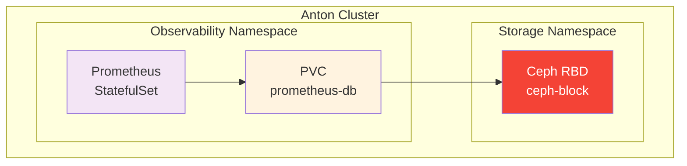

# Prometheus Disk Exhaustion Runbook

Troubleshooting guide for when Prometheus crashes with "no space left on device" errors.

## Overview

Prometheus stores time-series data in a Time-Series Database (TSDB) with a Write-Ahead Log (WAL). When the disk fills up, Prometheus enters a CrashLoopBackOff state and cannot recover without intervention.

**Symptoms:**
- Prometheus pod in `CrashLoopBackOff` with thousands of restarts
- Error in logs: `opening storage failed: open /prometheus/wal/XXXXX: no space left on device`
- Grafana dashboards show no data
- Alerting stops functioning

## Architecture



**Key Components:**
- **Prometheus StatefulSet**: Managed by prometheus-operator HelmRelease
- **PVC**: `prometheus-prometheus-operator-kube-p-prometheus-db-prometheus-prometheus-operator-kube-p-prometheus-0`
- **StorageClass**: `ceph-block` (supports online volume expansion)

## Detection

### Check Pod Status

```bash
kubectl get pods -n observability | grep prometheus-prometheus
```

**Healthy output:**
```
prometheus-prometheus-operator-kube-p-prometheus-0   2/2   Running   0   1d
```

**Unhealthy output:**
```
prometheus-prometheus-operator-kube-p-prometheus-0   1/2   CrashLoopBackOff   4973 (2m ago)   21d
```

### Check Container Logs

```bash
kubectl logs prometheus-prometheus-operator-kube-p-prometheus-0 \
  -n observability -c prometheus --tail=20
```

**Error indicating disk exhaustion:**
```
level=ERROR msg="Error running goroutines from run.Group"
err="opening storage failed: open /prometheus/wal/00002993: no space left on device"
```

### Check PVC Usage

```bash
# Check PVC capacity
kubectl get pvc -n observability | grep prometheus

# Check actual disk usage inside the pod (if running)
kubectl exec -n observability prometheus-prometheus-operator-kube-p-prometheus-0 \
  -c prometheus -- df -h /prometheus
```

**Example output when full:**
```
Filesystem   Size   Used   Available   Use%   Mounted on
/dev/rbd2    98G    98G    0           100%   /prometheus
```

### Proactive Monitoring

Query Prometheus (when healthy) to monitor disk usage:

```promql
# Current disk usage percentage
(1 - (kubelet_volume_stats_available_bytes{persistentvolumeclaim=~".*prometheus.*"}
    / kubelet_volume_stats_capacity_bytes{persistentvolumeclaim=~".*prometheus.*"})) * 100

# Predict days until full (based on 7-day trend)
predict_linear(kubelet_volume_stats_available_bytes{persistentvolumeclaim=~".*prometheus.*"}[7d], 86400 * 30) < 0
```

## Root Cause Analysis

### Common Causes

| Cause | Description | Solution |
|-------|-------------|----------|
| High cardinality | Too many unique label combinations | Review and reduce labels |
| Long retention | Keeping data longer than storage allows | Reduce `retention` period |
| Undersized PVC | Storage allocation too small for workload | Expand PVC |
| Scrape explosion | New services generating excessive metrics | Adjust scrape configs |

### Calculate Required Storage

**Formula:**
```
Required Storage = (Ingestion Rate GB/day) × (Retention Days) × 1.2 (safety margin)
```

**This cluster's metrics:**
- Ingestion rate: ~6-7 GB/day
- Retention: 7 days
- Required: ~60 GB minimum
- Allocated: 200 GB (provides headroom)

## Resolution

### Step 1: Expand the PVC

The `ceph-block` StorageClass supports online volume expansion:

```bash
# Patch PVC to new size (e.g., 200Gi)
kubectl patch pvc prometheus-prometheus-operator-kube-p-prometheus-db-prometheus-prometheus-operator-kube-p-prometheus-0 \
  -n observability \
  -p '{"spec":{"resources":{"requests":{"storage":"200Gi"}}}}'
```

**Verify expansion status:**
```bash
kubectl get pvc -n observability \
  prometheus-prometheus-operator-kube-p-prometheus-db-prometheus-prometheus-operator-kube-p-prometheus-0 \
  -o jsonpath='{.spec.resources.requests.storage} requested / {.status.capacity.storage} actual / {.status.conditions[*].type}'
```

### Step 2: Delete the Crashed Pod

The filesystem resize completes when the pod restarts:

```bash
kubectl delete pod prometheus-prometheus-operator-kube-p-prometheus-0 -n observability
```

### Step 3: Monitor Recovery

Prometheus will replay WAL segments during startup:

```bash
# Watch logs during recovery
kubectl logs -f prometheus-prometheus-operator-kube-p-prometheus-0 \
  -n observability -c prometheus
```

**Recovery progress:**
```
level=INFO msg="WAL segment loaded" segment=1500 maxSegment=2993
level=INFO msg="WAL segment loaded" segment=1501 maxSegment=2993
...
```

Recovery time depends on WAL size (~1 segment/second, can take 30+ minutes for large WALs).

### Step 4: Update GitOps Configuration

**Critical**: Update the HelmRelease to prevent recurrence.

Edit `kubernetes/apps/observability/prometheus-operator/app/helmrelease.yaml`:

```yaml
values:
  prometheus:
    prometheusSpec:
      retention: 7d              # Reduced from 15d
      storageSpec:
        volumeClaimTemplate:
          spec:
            storageClassName: ceph-block
            resources:
              requests:
                storage: 200Gi   # Increased from 100Gi
```

**Commit and push:**
```bash
git add kubernetes/apps/observability/prometheus-operator/app/helmrelease.yaml
git commit -m "fix(prometheus): reduce retention to 7d and increase storage to 200Gi"
git push
```

**Trigger Flux reconciliation:**
```bash
kubectl annotate helmrelease prometheus-operator -n observability \
  reconcile.fluxcd.io/requestedAt="$(date +%s)" --overwrite
```

## Prevention Measures

### Current Configuration

| Setting | Value | Rationale |
|---------|-------|-----------|
| Retention | 7 days | Balances history with storage costs |
| Storage | 200 Gi | ~3x headroom over steady-state usage |
| StorageClass | ceph-block | Supports online expansion |

### Recommended Alerts

Add to `kubernetes/apps/observability/prometheus-operator/app/prometheus-rules.yaml`:

```yaml
groups:
  - name: prometheus-storage
    rules:
      - alert: PrometheusStorageWarning
        expr: |
          (1 - (kubelet_volume_stats_available_bytes{persistentvolumeclaim=~".*prometheus.*"}
              / kubelet_volume_stats_capacity_bytes{persistentvolumeclaim=~".*prometheus.*"})) > 0.8
        for: 15m
        labels:
          severity: warning
        annotations:
          summary: "Prometheus storage >80% full"
          description: "Prometheus PVC {{ $labels.persistentvolumeclaim }} is {{ $value | humanizePercentage }} full"

      - alert: PrometheusStorageCritical
        expr: |
          (1 - (kubelet_volume_stats_available_bytes{persistentvolumeclaim=~".*prometheus.*"}
              / kubelet_volume_stats_capacity_bytes{persistentvolumeclaim=~".*prometheus.*"})) > 0.9
        for: 5m
        labels:
          severity: critical
        annotations:
          summary: "Prometheus storage >90% full"
          description: "Prometheus PVC {{ $labels.persistentvolumeclaim }} is {{ $value | humanizePercentage }} full. Immediate action required."
```

### Capacity Planning

**Monthly review checklist:**
1. Check current disk usage: `kubectl exec ... -- df -h /prometheus`
2. Review ingestion rate trends in Grafana
3. Verify retention policy matches business needs
4. Plan PVC expansion if usage exceeds 70%

## Key Insights

1. **StatefulSet PVCs don't auto-resize** - Changing the HelmRelease `storageSpec` only affects new PVCs; existing PVCs must be manually expanded
2. **Ceph supports online expansion** - No downtime required for PVC resize with ceph-block
3. **WAL replay takes time** - Large WALs can take 30+ minutes to replay; this is normal
4. **Retention vs Storage tradeoff** - Shorter retention reduces storage but limits historical queries

## Reference Links

- [Prometheus Storage Documentation](https://prometheus.io/docs/prometheus/latest/storage/)
- [Kubernetes PVC Expansion](https://kubernetes.io/docs/concepts/storage/persistent-volumes/#expanding-persistent-volumes-claims)
- [Prometheus Operator Storage Spec](https://prometheus-operator.dev/docs/operator/storage/)
- [Rook Ceph Block Storage](/notes/rook-ceph)
