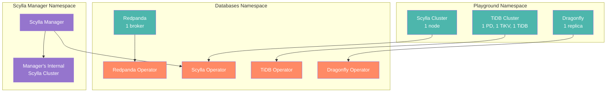
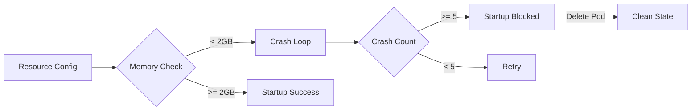
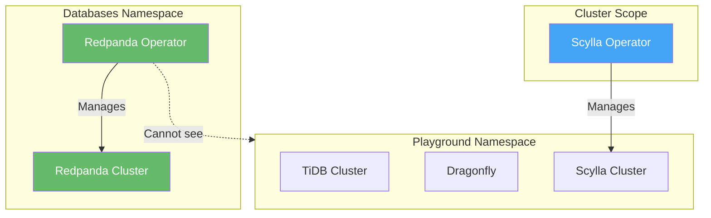
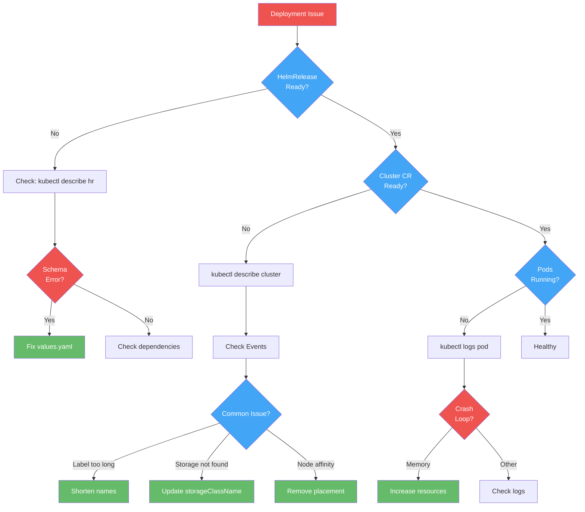

# Debugging Deployments

This guide documents common issues encountered when deploying databases in the playground environment and their solutions.

## Architecture Overview



## Common Issues & Solutions

### 1. Redpanda Memory Requirements

**Issue**: Redpanda crashes with memory check failure
```
ERROR Memory: '857735168' below recommended: '1073741824'
Crash loop detected. Too many consecutive crashes
```

**Root Cause**: Redpanda requires at least 2GB memory per core and validates this at startup.

**Solution**: Allocate proper resources
```yaml
resources:
  cpu:
    cores: 1
  memory:
    container:
      min: 2Gi
      max: 2Gi  # Must match for stability
```

**Key Points**:
- Minimum: 2GB per core (2.22 GiB recommended)
- Set min and max equal for QoS guaranteed class
- After crash loop, delete pod to clear crash history



**Reference**: [Redpanda Kubernetes Requirements](https://docs.redpanda.com/current/deploy/redpanda/kubernetes/k-requirements/)

### 2. Scylla Manager Configuration

**Issue**: Manager's internal Scylla cluster fails to deploy
```
Pod name "scylla-manager-scylla-manager-manager-dc-manager-rack-HASH"
exceeds 63 character limit
storageclass.storage.k8s.io "scylladb-local-xfs" not found
Nodes must have label scylla.scylladb.com/node-type=scylla
```

**Root Causes**:
1. Kubernetes label length limit (63 chars)
2. Missing storage class
3. Node affinity requirement

**Solution**: Configure internal cluster for home lab
```yaml
scylla:
  developerMode: true
  datacenter: dc1  # Short name
  racks:
    - name: rack1  # Short name
      members: 1
      storage:
        capacity: 2Gi
        storageClassName: ceph-block  # Use available storage
      resources:
        requests:
          cpu: 500m
          memory: 512Mi
        limits:
          cpu: 1000m
          memory: 1Gi
      placement: {}  # Remove node affinity
```

**Pod Name Construction**:
```
{helmrelease-name}-{datacenter}-{rack}-{hash}
scylla-manager-scylla-manager-dc1-rack1-84cc8b5966  # 46 chars ✓
```

```mermaid
flowchart TD
    subgraph manager[Scylla Manager Chart]
        mgr_pod[Manager Pod<br/>API: 5080<br/>Metrics: 5090]
        internal[Internal Scylla<br/>Cluster]
    end

    mgr_pod -->|Stores metadata| internal
    mgr_pod -->|Manages| playground[Playground<br/>Scylla Clusters]

    internal -->|Requires| storage[Storage Class<br/>ceph-block]
    internal -->|Placement| nodes[Any K8s Node<br/>placement: {}]

    classDef component fill:#7e57c2,color:white
    classDef resource fill:#42a5f5,color:white

    class mgr_pod,internal component
    class storage,nodes resource
```

**Reference**: [Scylla Operator Helm Installation](https://operator.docs.scylladb.com/stable/installation/helm.html)

### 3. Namespace-Scoped Operators

**Issue**: Redpanda operator doesn't see clusters in other namespaces
```
Redpanda cluster in 'playground' namespace status: "Waiting for controller"
```

**Root Cause**: Redpanda operator is namespace-scoped and only manages clusters in the same namespace.

**Solution**: Deploy clusters in the operator's namespace
```yaml
# Redpanda cluster must be in 'databases' namespace
spec:
  targetNamespace: databases  # Same as operator
```

**Operator Scope Comparison**:

| Operator | Scope | Cluster Location |
|----------|-------|-----------------|
| TiDB | Namespace-scoped | Any namespace (with ServiceAccount) |
| Dragonfly | Namespace-scoped | Same as operator |
| Redpanda | Namespace-scoped | Same as operator |
| Scylla | Cluster-scoped | Any namespace |



### 4. Storage Class Configuration

**Issue**: PVC stuck in Pending state
```
persistentvolumeclaim/data-scylla Pending
storageclass.storage.k8s.io "scylladb-local-xfs" not found
```

**Root Cause**: Chart defaults to production storage classes not available in home labs.

**Solution**: Override with available storage
```yaml
storage:
  capacity: 2Gi
  storageClassName: ceph-block  # Use default storage class
```

**Check Available Storage Classes**:
```bash
kubectl get storageclass
# NAME                   PROVISIONER
# ceph-block (default)   storage.rbd.csi.ceph.com
# ceph-filesystem        storage.cephfs.csi.ceph.com
```

### 5. Developer Mode for Testing

**Issue**: Production requirements too strict for playground

**Solution**: Enable developer mode
```yaml
scylla:
  developerMode: true  # Relaxes production requirements
```

**Developer Mode Disables**:
- XFS filesystem requirement
- CPU pinning checks
- Memory locking validation
- Strict I/O configuration
- Node tuning requirements

## Verification Commands

### Check All Clusters
```bash
# Playground clusters
kubectl get tidbcluster,dragonfly,scyllacluster -n playground

# Redpanda
kubectl get redpanda -n databases

# Scylla Manager
kubectl get scyllacluster,pods -n scylla-manager
```

### Pod Status
```bash
# All playground pods
kubectl get pods -n playground

# Operator pods
kubectl get pods -n databases

# Check specific pod logs
kubectl logs -n databases redpanda-playground-0 -c redpanda --tail=50
```

### Resource Status
```bash
# HelmReleases
flux get hr -A

# Kustomizations
flux get ks -A

# Storage
kubectl get pvc -A
```

## Resource Allocations

### Final Working Configuration

| Database | CPU | Memory | Storage | Notes |
|----------|-----|--------|---------|-------|
| TiDB (total) | ~2 cores | ~2Gi | 3Gi | 1 PD + 1 TiKV + 1 TiDB |
| Dragonfly | 100m | 256Mi | - | In-memory only |
| Scylla | 500m-1000m | 512Mi-1Gi | 2Gi | Developer mode |
| Redpanda | 1 core | 2Gi | 2Gi | Strict requirements |
| Scylla Manager | 500m-1000m | 512Mi-1Gi | 2Gi | Internal cluster |

**Total Playground Resources**: ~4.5 cores, ~7Gi RAM, 9Gi storage

## Troubleshooting Workflow



## Additional Resources

- [Redpanda Kubernetes Requirements](https://docs.redpanda.com/current/deploy/redpanda/kubernetes/k-requirements/)
- [Scylla Operator Installation](https://operator.docs.scylladb.com/stable/installation/overview.html)
- [TiDB Operator Documentation](https://docs.pingcap.com/tidb-in-kubernetes/stable)
- [Dragonfly Documentation](https://www.dragonflydb.io/docs)
